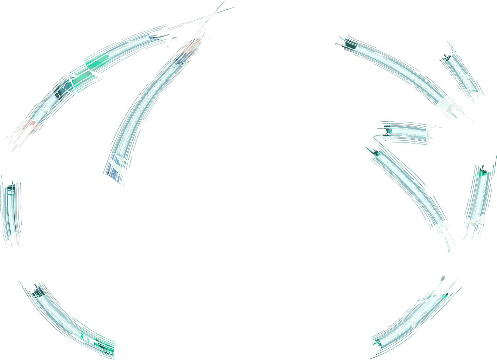
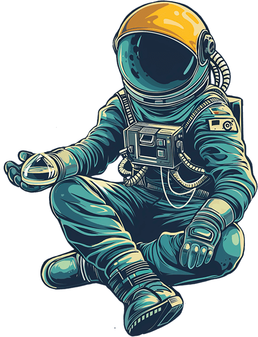

<!-- 占位以不显示标题 -->
<h1>首页</h1>
<section class="home-div" data-md-color-scheme="slate" style="height: min(100vh, 120vw); position: relative; margin-top:-2.4rem; padding: 0; overflow: hidden;">
        
        

            
            
            <a href="开始阅读/网站所有样式/demo">
                
                
                    样式展示
                
            </a>
            <a href="/">
                
                
                    诚实
                
            </a>
            <a href="/">
                
                
                    正直
                
            </a>
            <a href="/">
                
                
                    谦虚
                
            </a>
            <a href="/">
                
                
                    耐心
                
            </a>
            <a href="/">
                
                
                    责任
                
            </a>
            <a href="/">
                
                
                    感恩
                
                </a>
            <a href="/">
                
                
                    慷慨
                
                </a>
            <a href="/">
                
                
                    公正
                
            </a>
            <a href="/">
                
                
                  快乐
                
            </a>
            <a href="/">
                
                
                    珍惜
                
            </a>
            <a href="/">
                
                
                    享受
                
            </a>
            <a href="/">
                
                
                    思考
                
            </a>
            <a href="/">
                
                
                    怀疑
                
            </a>
        

        

            

                <a class="rounded-button" href="开始阅读/">
                    <svg viewbox="0 0 512 512" xmlns="http://www.w3.org/2000/svg"><path d="M160 96a96 96 0 1 1 192 0A96 96 0 1 1 160 96zm80 152V512l-48.4-24.2c-20.9-10.4-43.5-17-66.8-19.3l-96-9.6C12.5 457.2 0 443.5 0 427V224c0-17.7 14.3-32 32-32H62.3c63.6 0 125.6 19.6 177.7 56zm32 264V248c52.1-36.4 114.1-56 177.7-56H480c17.7 0 32 14.3 32 32V427c0 16.4-12.5 30.2-28.8 31.8l-96 9.6c-23.2 2.3-45.9 8.9-66.8 19.3L272 512z"></path></svg>
                
                    开始阅读
                
                </a>
            

            

                <svg fill="var(--md-default-fg-color)" height="2vh" viewbox="0 0 384 512" xmlns="http://www.w3.org/2000/svg"><path d="M169.4 470.6c12.5 12.5 32.8 12.5 45.3 0l160-160c12.5-12.5 12.5-32.8 0-45.3s-32.8-12.5-45.3 0L224 370.8 224 64c0-17.7-14.3-32-32-32s-32 14.3-32 32l0 306.7L54.6 265.4c-12.5-12.5-32.8-12.5-45.3 0s-12.5 32.8 0 45.3l160 160z"></path></svg>
            

        

</section>
