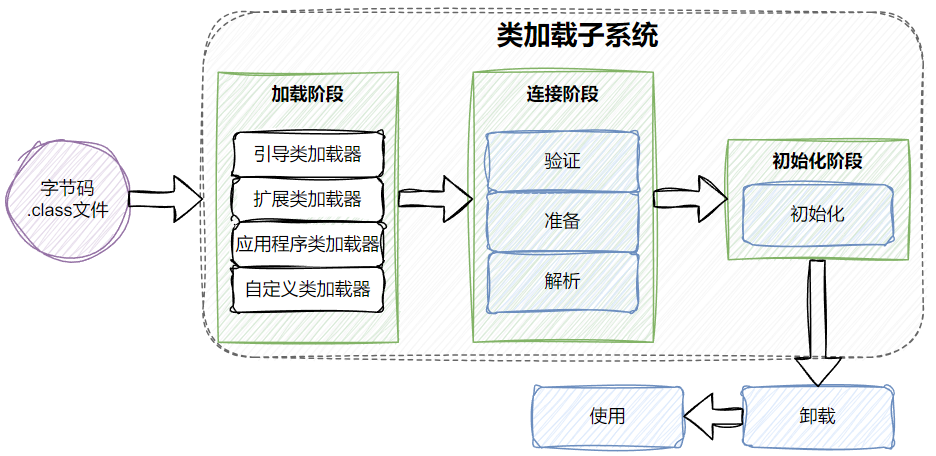
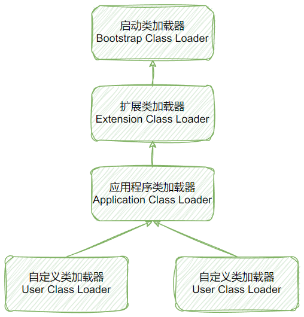

# 第七章-虚拟机类加载机制

## 7.1 概述

Java 虚拟机把描述类的数据从 Class 文件加载到内存，并对数据进行校验、转换解析和初始化，最终形成可以被虚拟机直接使用的 Java 类型，这个过程被称作虚拟机的类加载机制。

## 7.2 类加载的时机

一个类型从被加载到虚拟机内存中开始，到卸载出内存为止，它的整个生命周期将会经历`加载`（Loading）、`验证`（Verification）、
`准备`（Preparation）、`解析`（Resolution）、`初始化`（Initialization）、`使用`（Using）和`卸载`（Unloading）七个阶段，
其中<u>验证、准备、解析</u>三个部分统称为`连接`（Linking）。

<figure markdown="span">
  { width="500" }
  <figcaption>类的生命周期</figcaption>
</figure>

有六种情况必须对类进行初始化

!!! Note ""
    1. 遇到 new、getstatic、putstatic 或 invokestatic 这四条字节码指令时，如果类型没有进行过初始化，则需要先触发其初始化阶段。
    2. 使用 java.lang.reflect 包的方法对类型进行反射调用的时候，如果类型没有进行过初始化，则需要先触发其初始化。
    3. 当初始化类的时候，如果发现其父类还没有进行过初始化，则需要先触发其父类的初始化。
    4. 当虚拟机启动时，用户需要指定一个要执行的主类（包含 main()方法的那个类），虚拟机会先初始化这个主类。
    5. 当使用 JDK 7 新加入的动态语言支持时，如果一个java.lang.invoke.MethodHandle 实例最后的解析结果为 REF_getStatic、 REF_putStatic、
    REF_invokeStatic、REF_newInvokeSpecial 四种类型的方法句柄，并且这个方法句柄对应的类没有进行过初始化，则需要先触发其初始化。
    6. 当一个接口中定义了JDK8新加入的默认方法（被default关键字修饰的接口方法）时，如果有这个接口的实现类发生了初始化，那该接口要在其之前被初始化。

这六种场景中的行为称为对一个类型进行`主动引用`。除此之外，所有引用类型的方式都不会触发初始化，称为`被动引用`。

## 7.3 类加载过程

### 7.3.1 加载

在加载阶段，Java 虚拟机需要完成以下三件事情：

- 1) 通过一个类的全限定名来<u>获取定义此类的二进制字节流</u>。
- 2) 将这个字节流所代表的静态存储结构转化为方法区的运行时数据结构。
- 3) 在内存中生成一个代表这个类的 java.lang.Class 对象，作为方法区这个类的各种数据的访问入口。

??? Note "从哪里获取？如何获取？"
    - 从 ZIP 压缩包中读取，这很常见，最终成为日后 JAR、EAR、WAR 格式的基础。
    - 从网络中获取，这种场景最典型的应用就是 Web Applet。
    - 运行时计算生成，这种场景使用得最多的就是动态代理技术，在 java.lang.reflect.Proxy 中，
      就是用了 ProxyGenerator.generateProxyClass()来为特定接口生 成形式为“*$Proxy”的代理类的二进制字节流。
    - 由其他文件生成，典型场景是 JSP 应用，由 JSP 文件生成对应的 Class 文件。
    - 从数据库中读取，这种场景相对少见些，例如有些中间件服务器（如 SAP Netweaver）可以选择把程序安装到数据库中来完成程序代码在集群间的分发。
    - 可以从加密文件中获取，这是典型的防 Class 文件被反编译的保护措施，通过加载时解密 Class 文件来保障程序运行逻辑不被窥探。

加载后，验证前，Java 虚拟机外部的<u>二进制字节流就存储在方法区之中</u>了。类型数据妥善安置在方法区之后，
会在 Java 堆内存中实例化一个 java.lang.Class 类的对象，这个对象将作为程序访问方法区中的类型数据的外部接口。

### 7.3.2 验证

目的是确保 Class 文件的字节流中包含的信息符合《Java 虚拟机规范》的全部约束要求，保证这些信息被当作代码运行后不会危害虚拟机自身的安全。
验证阶段是非常重要的，这个阶段是否严谨，直接决定了 Java 虚拟机是否能承受恶意代码的攻击。

总共需要检验四部分：

#### 1️⃣文件格式验证

第一阶段要验证字节流是否符合 Class 文件格式的规范，并且能被当前版本的虚拟机处理。
验证阶段的<u>主要目的是保证输入的字节流能正确地解析并存储于方法区之内</u>，格式上符合描述一个 Java 类型信息的要求。

??? Note "具体的验证细节"
    - 是否以魔数 0xCAFEBABE 开头。
    - 主、次版本号是否在当前 Java 虚拟机接受范围之内。
    - 常量池的常量中是否有不被支持的常量类型（检查常量 tag 标志）。
    - 指向常量的各种索引值中是否有指向不存在的常量或不符合类型的常量。
    - CONSTANT_Utf8_info 型的常量中是否有不符合 UTF-8 编码的数据。
    - Class 文件中各个部分及文件本身是否有被删除的或附加的其他信息。

#### 2️⃣元数据验证

第二阶段是对字节码描述的信息进行语义分析，以保证其描述的信息符合《Java 语言规范》的要求，
第二阶段的<u>主要目的是对类的元数据信息进行语义校验</u>，保证不存在与《Java 语言规范》定义相悖的元数据信息。

??? Note "具体的验证细节"
    - 这个类是否有父类（除了 java.lang.Object 之外，所有的类都应当有父类）。
    - 这个类的父类是否继承了不允许被继承的类（被 final 修饰的类）。
    - 如果这个类不是抽象类，是否实现了其父类或接口之中要求实现的所有方法。
    - 类中的字段、方法是否与父类产生矛盾（例如覆盖了父类的 final 字段，或者出现不符合规则的方法重载，例如方法参数都一致，但返回值类型却不同等）。
    - ......

#### 3️⃣字节码验证

第三阶段就要对类的方法体（Class 文件中的 Code 属性）进行校验分析，保证被校验类的方法在运行时不会做出危害虚拟机安全的行为。
第三阶段的<u>主要目的是通过数据流分析和控制流分析，确定程序语义是合法的、符合逻辑的</u>。

??? Note "具体的验证细节"
    - 保证任意时刻操作数栈的数据类型与指令代码序列都能配合工作，例如不会出现类似于“在操作栈放置了一个 int 类型的数据，
      使用时却按 long 类型来加载入本地变量表中”这样的情况。
    - 保证任何跳转指令都不会跳转到方法体以外的字节码指令上。
    - 保证方法体中的类型转换总是有效的，例如可以把一个子类对象赋值给父类数据 类型，这是安全的，但是把父类对象赋值给子类数据类型，
      甚至把对象赋值给与它毫无继承关系、完全不相干的一个数据类型，则是危险和不合法的。
    - ......

#### 4️⃣符号引用验证

符号引用验证可以看作是对类自身以外（常量池中的各种符号引用）的各类信息进行匹配性校验，通俗来说就是，
该类是否缺少或者被禁止访问它依赖的某些外部类、方法、字段等资源。
符号引用验证<u>主要目的是确保解析行为能正常执行</u>。

??? Note "具体的验证细节"
    - 符号引用中通过字符串描述的全限定名是否能找到对应的类。
    - 在指定类中是否存在符合方法的字段描述符及简单名称所描述的方法和字段。
    - 符号引用中的类、字段、方法的可访问性（private、protected、public、 <package>）是否可被当前类访问。
    - ......

### 7.3.3 准备

准备阶段是正式<u>为类中定义的变量（即静态变量，被 static 修饰的变量）分配内存并设置类变量`初始值`的阶段</u>
（这里所说的初始值“通常情况”下是数据类型的零值，除去public static final类型）。这时候进行内存分配的仅包括类变量，但是不包括实例变量。

| 数据类型  | 零 值    | 数据类型    | 零 值  |
| ------   | ------   | ------     | ------ |
| int      |   0      | boolean    | false  |
| short    |   0L     | float      | 0.0f   |
| long     | (short)0 | double     | 0.0d   |
| char     | '\u0000' | reference  | null   |
| byte     | (byte)0   |           |        |

### 7.3.4 解析

解析阶段是 Java 虚拟机<u>将常量池内的符号引用替换为直接引用的过程</u>。

!!! Note "直接引用与符号引用的关联"
    - `符号引用`（Symbolic References）：符号引用以一组符号来描述所引用的目标，<u>符号可以是任何形式的字面量</u>，
      只要使用时能无歧义地定位到目标即可。符号引用与虚拟机实现的内存布局无关，引用的目标并不一定是已经加载到虚拟机内存当中的内容。
      各种虚拟机实现的内存布局可以各不相同，
      但是它们能接受的符号引用必须都是一致的，因为符号引用的字面量形式明确定义在《Java 虚拟机规范》的 Class 文件格式中。
    - `直接引用`（Direct References）：直接引用是<u>可以直接指向目标的指针、相对偏移量或者是一个能间接定位到目标的句柄</u>。
      直接引用是和虚拟机实现的内存布局直接相关 的，同一个符号引用在不同虚拟机实例上翻译出来的直接引用一般不会相同。
      如果有了直接引用，那引用的目标必定已经在虚拟机的内存中存在。

解析有四个阶段：

#### 1️⃣类或接口的解析

这又要分，分为三种情况：

1. 如果 C 不是一个数组类型，那虚拟机将会把代表 N 的全限定名传递给 D 的类加载 器去加载这个类 C。
2. 如果 C 是一个数组类型，并且数组的元素类型为对象，也就是 N 的描述符会是类似 “[Ljava/lang/Integer”的形式，
   那将会按照第一点的规则加载数组元素类型。
3. 还要进行符号引用验证，确认 D 是否具备对 C 的访问权限。

??? Note "一个 D 拥有 C 的访问权限，那就意味着以下 3 条规则中至少有其中一条"
    - 被访问类 C 是 public 的，并且与访问类 D 处于同一个模块。
    - 被访问类 C 是 public 的，不与访问类 D 处于同一个模块，但是被访问类 C 的模块允许被访问类 D 的模块进行访问。
    - 被访问类 C 不是 public 的，但是它与访问类 D 处于同一个包中。

#### 2️⃣字段解析

要解析一个未被解析过的字段符号引用，<u>首先将会对字段表内 class_index 项中索引的 CONSTANT_Class_info 符号引用进行解析</u>，
也就是字段所属的类或接口的符号引用。如果解析成功完成，按照如下后续步骤对 C 进行后续字段的搜索。

!!! Note ""
    1. 如果 C 本身就包含了简单名称和字段描述符都与目标相匹配的字段，则返回这个字段的直接引用，查找结束。
    2. 否则，如果在 C 中实现了接口，将会按照继承关系从下往上递归搜索各个接口和它 的父接口，
       如果接口中包含了简单名称和字段描述符都与目标相匹配的字段，则返回这个字段的直接引用，查找结束。
    3. 否则，如果 C 不是 java.lang.Object 的话，将会按照继承关系从下往上递归搜索其父类，
       如果在父类中包含了简单名称和字段描述符都与目标相匹配的字段，则返回这个字段的直接引用，查找结束。
    4. 否则，查找失败，抛出 java.lang.NoSuchFieldError 异常。

如果查找过程成功返回了引用，将会对这个字段进行权限验证，如果发现不具备对字段的访问权限，将抛出 java.lang.IllegalAccessError 异常。
以上解析规则能够确保 Java 虚拟机获得字段唯一的解析结果。

#### 3️⃣方法解析

一样需要先解析出方法表的 class_index 项中索引的方法所属的类或接口的符号引用，如果解析成功将会按照如下步骤进行后续的方法搜索：

??? Note "后续步骤"
    - 1) 由于 Class 文件格式中类的方法和接口的方法符号引用的常量类型定义是分开的，
         如果在类的方法表中发现 class_index 中索引的 C 是个接口的话，那就直接抛出 java.lang.IncompatibleClassChangeError 异常。
    - 2) 如果通过了第一步，在类 C 中查找是否有简单名称和描述符都与目标相匹配的方法，如果有则返回这个方法的直接引用，查找结束。
    - 3) 否则，在类 C 的父类中递归查找是否有简单名称和描述符都与目标相匹配的方法，如果有则返回这个方法的直接引用，查找结束。
    - 4) 否则，在类 C 实现的接口列表及它们的父接口之中递归查找是否有简单名称和描述符都与目标相匹配的方法，
         如果存在匹配的方法，说明类 C 是一个抽象类，这时候查找结束，抛出 java.lang.AbstractMethodError 异常。
    - 5) 否则，宣告方法查找失败，抛出 java.lang.NoSuchMethodError。

如果查找过程成功返回了直接引用，将会对这个方法进行权限验证，如果发现不具备对此方法的访问权限，将抛出 java.lang.IllegalAccessError 异常。

#### 4️⃣接口方法解析

一样先解析出接口方法表的 class_index 项中索引的方法所属的类或接口的符号引用，如果解析成功将会按照如下步骤进行后续的接口方法搜索：

??? Note "后续步骤"
    - 1) 与类的方法解析相反，如果在接口方法表中发现 class_index 中的索引 C 是个类而不是接口，
         那么就直接抛出 java.lang.IncompatibleClassChangeError 异常。
    - 2) 否则，在接口 C 中查找是否有简单名称和描述符都与目标相匹配的方法，如果有则返回这个方法的直接引用，查找结束。
    - 3) 否则，在接口 C 的父接口中递归查找，直到 java.lang.Object 类（接口方法的查找范围也会包括 Object 类中的方法）为止，
         看是否有简单名称和描述符都与目标相匹配的方法，如果有则返回这个方法的直接引用，查找结束。
    - 4) 对于规则 3，由于 Java 的接口允许多重继承，如果 C 的不同父接口中存有多个简单名称和描述符都与目标相匹配的方法，
         那将会从这多个方法中返回其中一个并结束查找。
    - 5) 否则，宣告方法查找失败，抛出 java.lang.NoSuchMethodError 异常。

### 7.3.5 初始化

初始化阶段会根据程序员通过程序编码制定的主观计划去初始化类变量和其他资源，即<u>初始化阶段就是执行类构造器<clinit\>()方法的过程</u>。

!!! Example "<clinit\>()方法如何产生？太细了，了解"

    - [x] <clinit\>()方法是由编译器自动收集类中的所有类变量的赋值动作和静态语句块 （static{}块）中的语句合并产生的

    ```java title="非法前向引用变量"
    public class Test {
        static {
            i = 0; // 给变量复制可以正常编译通过 
            System.out.print(i); // 这句编译器会提示“非法向前引用”
        }
        static int i = 1;
    }
    ```

    - [x] <clinit\>()方法与类的构造函数（即在虚拟机视角中的实例构造器<init\>()方法）不同，它不需要显式地调用父类构造器，
    Java 虚拟机会保证在子类的<clinit\>()方法执行
    - [x] 由于父类的<clinit\>()方法先执行，也就意味着父类中定义的静态语句块要优先于子类的变量赋值操作。

    ```java title="clinit()方法执行顺序"
    static class Parent {
        public static int A = 1;
    }

    static {
        A = 2;
    }

    static class Sub extends Parent {
        public static int B = A;
    }

    public static void main(String[] args) {
        System.out.println(Sub.B);
    }
    ```

    - [x] <clinit\>()方法对于类或接口来说并不是必需的，如果一个类中没有静态语句块，也没有对变量的赋值操作，那么编译器可以不为这个类生成<clinit\>()方法。
    - [x] 接口中不能使用静态语句块，但仍然有变量初始化的赋值操作，因此接口与类一样都会生成<clinit\>()方法。
    - [x] Java 虚拟机必须保证一个类的<clinit\>()方法在多线程环境中被正确地加锁同步，如果多个线程同时去初始化一个类，
    那么只会有其中一个线程去执行这个类的<clinit\>()方 法，其他线程都需要阻塞等待，直到活动线程执行完毕<clinit\>()方法。

    ```java title="字段解析"
    static class DeadLoopClass {
            static {
                // 如果不加上这个if语句，编译器将提示“Initializer does not complete normally”并拒绝编译
                if (true) {
                    System.out.println(Thread.currentThread() + "init DeadLoopClass");
                    while (true) {
                    }
                }
            }
        }

        public static void main(String[] args) {
            Runnable script = new Runnable() {
                public void run() {
                    System.out.println(Thread.currentThread() + "start");
                    DeadLoopClass dlc = new DeadLoopClass();
                    System.out.println(Thread.currentThread() + " run over");
                }
            };

            Thread thread1 = new Thread(script);
            Thread thread2 = new Thread(script);
            thread1.start();
            thread2.start();
        }
    ```

## 7.4 类加载器

### 7.4.1 类与类加载器

对于任意一个类，都必须由加载它的类加载器和这个类本身一起共同确立其在 Java 虚拟机中的唯一性，每一个类加载器，都拥有一个独立的类名称空间。
更通俗一些：比较两个类是否“相等”，只有在这两个类是<u>由同一个类加载器加载的前提下才有意义</u>，否则，即使这两个类来源于同一个 Class 文件，被同一个 Java 虚拟机加载，只要加载它们的类加载器不同，那这两个类就必定不相等。

!!! Note ""
    所指的“相等”，包括代表类的 Class 对象的 equals()方法、isAssignableFrom()方法、isInstance()方法的返回结果，
    也包括了使用 instanceof 关键字做对象所属关系判定等各种情况。

```java title="示例"
import java.io.IOException;
import java.io.InputStream;

/**
 * 类加载器与instanceof关键字演示
 *
 * @author zzm
 */
public class ClassLoaderTest {

    public static void main(String[] args) throws Exception {

        ClassLoader myLoader = new ClassLoader() {
            @Override
            public Class<?> loadClass(String name) throws ClassNotFoundException {
                try {
                    String fileName = name.substring(name.lastIndexOf(".") + 1) + ".class";
                    InputStream is = getClass().getResourceAsStream(fileName);
                    if (is == null) {
                        return super.loadClass(name);
                    }
                    byte[] b = new byte[is.available()];
                    is.read(b);
                    return defineClass(name, b, 0, b.length);
                } catch (IOException e) {
                    throw new ClassNotFoundException(name);
                }
            }
        };

        Object obj = myLoader.loadClass("org.fenixsoft.jvm.chapter7.ClassLoaderTest").newInstance();

        System.out.println(obj.getClass());
        System.out.println(obj instanceof org.fenixsoft.jvm.chapter7.ClassLoaderTest);
    }
}
```

运行结果：

```shell
class org.fenixsoft.jvm.chapter7.ClassLoaderTest
false
```

### 7.4.2 双亲委派模型

介绍三层类加载器

#### 1️⃣启动类加载器（Bootstrap Class Loader）

这个类加载器负责加载存放在 `<JAVA_HOME>\lib` 目录，或者被`-Xbootclasspath` 参数所指定的路径中存放的，
而且是 Java 虚拟机能够识别的（按照文件名识别，如 rt.jar、tools.jar，
名字不符合的类库即使放在 lib 目录中也不会被加载）类库加载到虚拟机的内存中。

#### 2️⃣扩展类加载器（Extension Class Loader）

在类 `sun.misc.Launcher$ExtClassLoader` 中以 Java 代码的形式实现的。
它负责加载` <JAVA_HOME>\lib\ext` 目录中，或者被 `java.ext.dirs` 系统变量所指定的路径中所有的类库。

#### 3️⃣应用程序类加载器（Application Class Loader）

由 `sun.misc.Launcher$AppClassLoader` 来实现，负责加载用户类路径（ClassPath）上所有的类库。

!!! Note ""
    还可以加入自定义的类加载器来进行拓展，典型的如增加除了磁盘位置之外的 Class 文件来源，或者通过类加载器实现类的隔离、重载等功能。

#### 4️⃣双亲委派模型

<figure markdown="span">
  { width="300" }
  <figcaption>类加载器双亲委派模型</figcaption>
</figure>

`双亲委派模型`要求除了顶层的启动类加载器外，其余的类加载器都应有自己的父类加载器。通常使用`组合`（Composition）关系来复用父加载器的代码。

`双亲委派模型`的工作过程是：如果一个类加载器收到了类加载的请求，它首先<u>不会自己去尝试加载这个类，而是把这个请求委派给父类加载器去完成</u>，
每一个层次的类加载器都是如此，因此所有的加载请求最终都应该传送到最顶层的启动类加载器中，
</u>只有当父加载器反馈自己无法完成这个加载请求（它的搜索范围中没有找到所需的类）时，子加载器才会尝试自己去完成加载</u>。

好处就是 Java 中的类随着它的<u>类加载器一起具备了一种带有优先级的层次关系</u>。

```java title="双亲委派模型实现源码(java1.8_351)"
protected Class<?> loadClass(String name, boolean resolve)
        throws ClassNotFoundException
    {
        synchronized (getClassLoadingLock(name)) {
            // First, check if the class has already been loaded
            // 首先，检查请求的类是否已经被加载过了
            Class<?> c = findLoadedClass(name);
            if (c == null) {
                long t0 = System.nanoTime();
                try {
                    if (parent != null) {
                        c = parent.loadClass(name, false);
                    } else {
                        c = findBootstrapClassOrNull(name);
                    }
                } catch (ClassNotFoundException e) {
                    // 如果父类加载器抛出 ClassNotFoundException
                    // 说明父类加载器无法完成加载请求
                }

                if (c == null) {
                    // 在父类加载器无法加载时
                    // 再调用本身的 findClass 方法来进行类加载
                    long t1 = System.nanoTime();
                    c = findClass(name);

                    // this is the defining class loader; record the stats
                    sun.misc.PerfCounter.getParentDelegationTime().addTime(t1 - t0);
                    sun.misc.PerfCounter.getFindClassTime().addElapsedTimeFrom(t1);
                    sun.misc.PerfCounter.getFindClasses().increment();
                }
            }
            if (resolve) {
                resolveClass(c);
            }
            return c;
        }
    }
```