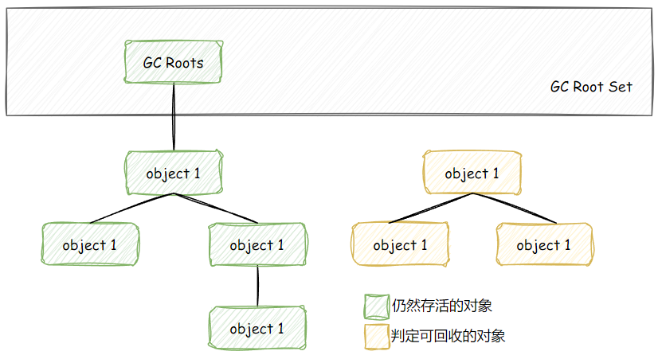
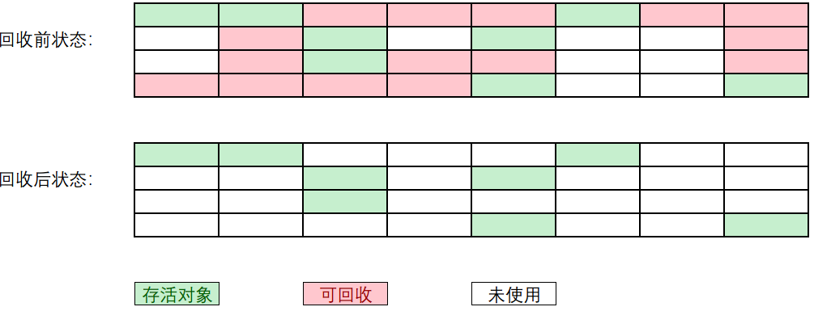
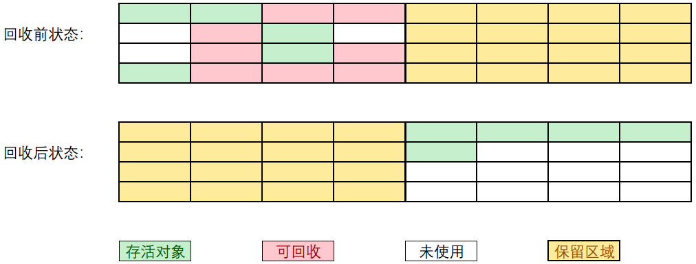
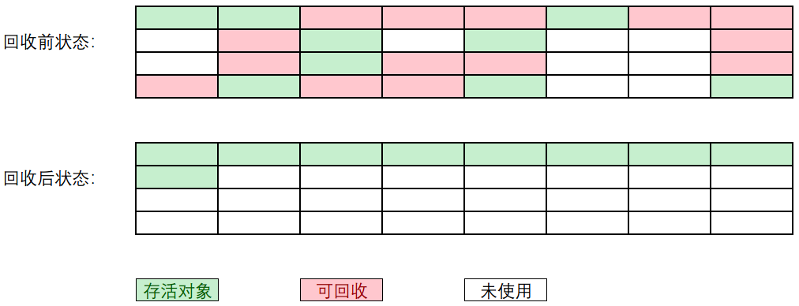
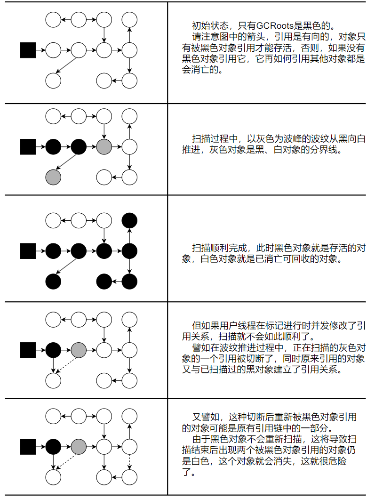
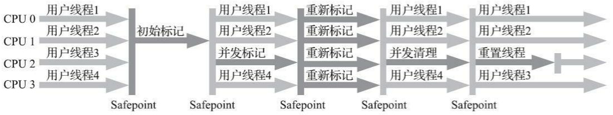
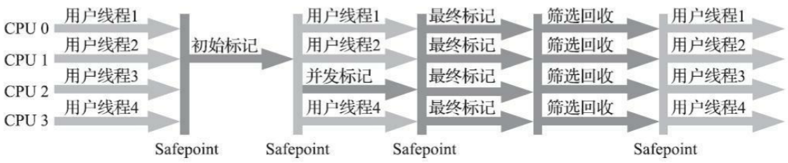
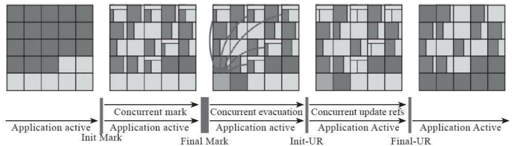
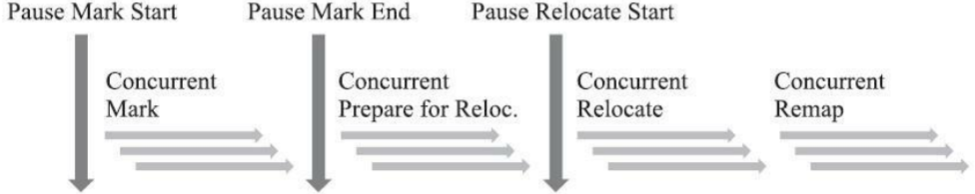

# 第三章-垃圾收集器与内存分配策略

## 3.1 概述

垃圾收集需要完成的三件事情：

- 哪些内存需要回收？
- 什么时候回收？
- 如何回收？

## 3.2 对象已死？

### 3.2.1 引用计数算法

&nbsp;&nbsp;&nbsp;&nbsp;&nbsp;&nbsp;&nbsp;&nbsp;
概念：在对象中添加一个引用计数器，每当有一个地方引用它时，计数器值就加一；当引用失效时，计数器值就减一；
任何时刻计数器为零的对象就是不可能再被使用的。

<u>优点</u>：原理简单，判定效率也很高<br>
<u>缺点</u>：占用了一些额外的内存空间来进行计数；有很多例外情况要考虑，必须要配合大量额外处理才能保证正确地工作。

!!! Note "引用计数法的缺陷举例：无法解决对象之间相互循环引用"

    注：这个例子只是展示，要运行出失败的例子要打开GC日志，IDEA是将 `-XX:+PrintGCDetails` 参数单独添加给运行类的vm option，
    其他工具就不知道了，书里面没说这点。但其实跑不跑都一样，懂这个例子要表达的引用计数算法的缺陷就行。

    === "代码"

        ```java
        /**
         * testGC()方法执行后，objA和objB会不会被GC呢？
         *
         * @author zzm
        */
        public class ReferenceCountingGC {

            public Object instance = null;

            private static final int _1MB = 1024 * 1024;

            /**
             * 这个成员属性的唯一意义就是占点内存，以便在能在GC日志中看清楚是否有回收过
             */
            private byte[] bigSize = new byte[2 * _1MB];

            public static void testGC() {
                ReferenceCountingGC objA = new ReferenceCountingGC();
                ReferenceCountingGC objB = new ReferenceCountingGC();
                objA.instance = objB;
                objB.instance = objA;

                objA = null;
                objB = null;

                // 假设在这行发生GC，objA和objB是否能被回收？
                System.gc();
            }
        }
        ```

    === "书上的运行结果"

        ```shell
        [Full GC (System) [Tenured: 0K->210K(10240K), 0.0149142 secs] 4603K->210K(19456K), [Perm : 2999K->2999K( Heap def new generation total 9216K, used 82K
        [0x00000000055e0000, 0x0000000005fe0000, 0x0000000005fe00 Eden space 8192K, 1% used 
        [0x00000000055e0000, 0x00000000055f4850, 0x0000000005de0000) from space 1024K, 0% used 
        [0x0000000005de0000, 0x0000000005de0000, 0x0000000005ee0000) to space 1024K, 0% used 
        [0x0000000005ee0000, 0x0000000005ee0000, 0x0000000005fe0000) tenured generation total 10240K, used 210K
        [0x0000000005fe0000, 0x00000000069e0000, 0x00000000069e the space 10240K, 2% used 
        [0x0000000005fe0000, 0x0000000006014a18, 0x0000000006014c00, 0x000000000 compacting perm gen total 21248K, used 3016K
        [0x00000000069e0000, 0x0000000007ea0000, 0x000000000bd the space 21248K, 14% used 
        [0x00000000069e0000, 0x0000000006cd2398, 0x0000000006cd2400, 0x000000000 No shared spaces configured.
        ```
    
    === "我自己跑的(jdk1.8.0_351)"

        ```shell
        [GC (System.gc()) [PSYoungGen: 11960K->824K(152576K)] 11960K->832K(500736K), 0.0015322 secs] [Times: user=0.00 sys=0.00, real=0.00 secs] 
        [Full GC (System.gc()) [PSYoungGen: 824K->0K(152576K)] [ParOldGen: 8K->641K(348160K)] 832K->641K(500736K), [Metaspace: 3245K->3245K(1056768K)], 0.0044283 secs] [Times: user=0.00 sys=0.00, real=0.00 secs] 
        Heap
        PSYoungGen      total 152576K, used 6554K [0x0000000716180000, 0x0000000720b80000, 0x00000007c0000000)
        eden space 131072K, 5% used [0x0000000716180000,0x00000007167e6808,0x000000071e180000)
        from space 21504K, 0% used [0x000000071e180000,0x000000071e180000,0x000000071f680000)
        to   space 21504K, 0% used [0x000000071f680000,0x000000071f680000,0x0000000720b80000)
        ParOldGen       total 348160K, used 641K [0x00000005c2400000, 0x00000005d7800000, 0x0000000716180000)
        object space 348160K, 0% used [0x00000005c2400000,0x00000005c24a0458,0x00000005d7800000)
        Metaspace       used 3286K, capacity 4564K, committed 4864K, reserved 1056768K
        class space    used 357K, capacity 388K, committed 512K, reserved 1048576K
        ```

    从书上的运行结果中可以清楚看到内存回收日志中包含“4603K->210K”，意味着虚拟机并没有因为这两个对象互相引用就放弃回收它们，
    这也从侧面说明了 Java 虚拟机并不是通过引用计数算法来判断对象是否存活的。

### 3.2.2 可达性分析算法

&nbsp;&nbsp;&nbsp;&nbsp;&nbsp;&nbsp;&nbsp;&nbsp;
这个算法的基本思路就是<wavy>通过一系列称为“`GC Roots`”的根对象作为起始节点集，从这些节点开始，根据引用关系向下搜索</wavy>，
搜索过程所走过的路径称为“`引用链`”（Reference Chain），<wavy>如果某个对象到 GC Roots 间没有任何引用链相连</wavy>，
或者用图论的话来说就是从 GC Roots 到这个对象不可达时，则证明此对象是不可能再被使用的。

<figure markdown="span">
  { width=500 }
  <figcaption>图：利用可达性分析算法判定对象是否可回收</figcaption>
</figure>

??? Note "了解：哪些对象可作为 GC Roots？"
    1️⃣在<u>虚拟机栈（栈帧中的本地变量表）中引用的对象</u>，譬如各个线程被调用的方法 堆栈中使用到的参数、局部变量、临时变量等。<br>
    2️⃣在<u>方法区中类静态属性引用的对象</u>，譬如 Java 类的引用类型静态变量。<br>
    3️⃣在<u>方法区中常量引用的对象</u>，譬如字符串常量池（String Table）里的引用。<br>
    4️⃣在<u>本地方法栈中 JNI（即通常所说的 Native 方法）引用的对象</u>。<br>
    5️⃣<u>Java 虚拟机内部的引用</u>，如基本数据类型对应的 Class 对象，一些常驻的异常对象（比如 NullPointExcepiton、OutOfMemoryError）等，还有系统类加载器。<br>
    6️⃣<u>所有被同步锁（synchronized 关键字）持有的对象</u>。<br>
    7️⃣反映 Java 虚拟机内部情况的 JMXBean、JVMTI 中注册的回调、本地代码缓存等

### 3.2.3 再谈引用

&nbsp;&nbsp;&nbsp;&nbsp;&nbsp;&nbsp;&nbsp;&nbsp;
引用分为`强引用`（Strongly Re-ference）、`软引用`（Soft Reference）、`弱引用`（Weak Reference）和`虚引用`（Phantom Reference）4 种。

- `强引用`是指在程序代码之中普遍存在的引用赋值，即类似“Object obj=new Object()”这种引用关系。<wavy>无论任何情况下，只要强引用关系还存在，垃圾收集器就永远不会回收掉被引用的对象</wavy>。
- `软引用`是用来描述一些还有用，但非必须的对象。<wavy>只被软引用关联着的对象，在系统将要发生内存溢出异常前，会把这些对象列进回收范围之中进行第二次回收</wavy>，如果这次回收还没有足够的内存，才会抛出内存溢出异常。
- `弱引用`也是用来描述那些非必须对象，但是它的强度比软引用更弱一些，被弱引用关联的对象只能生存到下一次垃圾收集发生为止。<wavy>当垃圾收集器开始工作，无论当前内存是否足够，都会回收掉只被弱引用关联的对象</wavy>。
- `虚引用`也称为“幽灵引用”或者“幻影引用”，它是最弱的一种引用关系。一个对象是否有虚引用的存在，完全不会对其生存时间构成影响，也无法通过虚引用来取得一个对象实例。<wavy>为一个对象设置虚引用关联的唯一目的只是为了能在这个对象被收集器回收时收到一个系统通知<wavy>。

### 3.2.4 生存还是死亡？

&nbsp;&nbsp;&nbsp;&nbsp;&nbsp;&nbsp;&nbsp;&nbsp;
要真正宣告一个对象死亡，至少要经历两次标记过程：
- 1️⃣如果对象在进行可达性分析后发现没有与 GC Roots 相连接的引用链，那它将会被第一次标记，<br>
- 2️⃣随后进行一次筛选，筛选的条件是此对象是否有必要执行finalize()方法。

&nbsp;&nbsp;&nbsp;&nbsp;&nbsp;&nbsp;&nbsp;&nbsp;
如何判断是否有必要执行finalize()方法？<wavy>看对象有没有覆盖 finalize()方法，或者 finalize()方法是否已经被虚拟机调用过</wavy>，
都没有，那么虚拟机将这两种情况都视为“没有必要执行”。

&nbsp;&nbsp;&nbsp;&nbsp;&nbsp;&nbsp;&nbsp;&nbsp;
如果一个对象被判定为确有必要执行 finalize() 方法，那么该对象将会被放置在一个名为 F-Queue 的队列之中，
并在稍后由一条由虚拟机自动建立的、低调度优先级的 Finalizer 线程去执行它们的 finalize() 方法。
finalize()方法是对象逃脱死亡命运的最后一次机会。

??? Note "一次对象自我拯救的演示"

    ```java
    /**
     * 此代码演示了两点：
     * 1.对象可以在被GC时自我拯救。
     * 2.这种自救的机会只有一次，因为一个对象的finalize()方法最多只会被系统自动调用一次
     *
     * @author zzm
     */
    public class FinalizeEscapeGC {

        public static FinalizeEscapeGC SAVE_HOOK = null;

        public void isAlive() {
            System.out.println("yes, i am still alive :)");
        }

        @Override
        protected void finalize() throws Throwable {
            super.finalize();
            System.out.println("finalize method executed!");
            FinalizeEscapeGC.SAVE_HOOK = this;
        }

        public static void main(String[] args) throws Throwable {
            SAVE_HOOK = new FinalizeEscapeGC();

            //对象第一次成功拯救自己
            SAVE_HOOK = null;
            System.gc();
            // 因为Finalizer方法优先级很低，暂停0.5秒，以等待它
            Thread.sleep(500);
            if (SAVE_HOOK != null) {
                SAVE_HOOK.isAlive();
            } else {
                System.out.println("no, i am dead :(");
            }

            // 下面这段代码与上面的完全相同，但是这次自救却失败了
            SAVE_HOOK = null;
            System.gc();
            // 因为Finalizer方法优先级很低，暂停0.5秒，以等待它
            Thread.sleep(500);
            if (SAVE_HOOK != null) {
                SAVE_HOOK.isAlive();
            } else {
                System.out.println("no, i am dead :(");
            }
        }
    }
    ```

### 3.2.5 回收方法区

&nbsp;&nbsp;&nbsp;&nbsp;&nbsp;&nbsp;&nbsp;&nbsp;
方法区垃圾收集的“性价比”通常也是比较低的,方法区回收囿于苛刻的判定条件，其区域垃圾收集的回收成果往往远低于此。

&nbsp;&nbsp;&nbsp;&nbsp;&nbsp;&nbsp;&nbsp;&nbsp;
方法区的垃圾收集主要回收两部分内容：`废弃的常量`和`不再使用的类型`。

判断常量是否回收：已经没有任何字符串对象引用常量池中的“java”常量，且虚拟机中也没有其他地方引用这个字面量。

判断类型是否回收：

- <u>该类所有的实例都已经被回收</u>，也就是 Java 堆中不存在该类及其任何派生子类的。
- <u>加载该类的类加载器已经被回收</u>，这个条件除非是经过精心设计的可替换类加载器的场景，如 OSGi、JSP 的重加载等，否则通常是很难达成的。
- <u>该类对应的 java.lang.Class 对象没有在任何地方被引用</u>，无法在任何地方通过反射访问该类的方法。

## 3.3 垃圾收集算法

### 3.3.1 分代收集理论

总共介绍了三种假说：前两种：<br>
`弱分代假说`（Weak Generational Hypothesis）：绝大多数对象都是朝生夕灭的。
`强分代假说`（Strong Generational Hypothesis）：熬过越多次垃圾收集过程的对象就越难以消亡。

&nbsp;&nbsp;&nbsp;&nbsp;&nbsp;&nbsp;&nbsp;&nbsp;
这两个分代假说都有一个设计原则：收集器应该将 Java 堆划分出不同的区域，
然后<wavy>将回收对象依据其年龄</wavy>（年龄即对象熬过垃圾收集过程的次数）<wavy>分配到不同的区域之中存储</wavy>。
这就同时兼顾了垃圾收集的时间开销和内存的空间有效利用。
由这个设计原则衍生出把 Java 堆划分为`新生代`（ Young Generati on ）和`老年代`（ Old Generation ）两个区域的应用[^1]。
其实分代收集并非只是简单划一下内存区域那么容易，它至少存在一个明显的困难：<wavy>对象不是孤立的，对象之间会存在跨代引用/<wavy>。
[^1]: 新生代（Young）、老年代（Old）是 HotSpot 虚拟机，也是现在业界主流的命名方式。在 IBM J9 虚拟机中对应
称为婴儿区（Nursery）和长存区（Tenured），名字不同但其含义是一样的。

&nbsp;&nbsp;&nbsp;&nbsp;&nbsp;&nbsp;&nbsp;&nbsp;
`跨代引用假说`（Intergenerational Reference Hypothesis）：跨代引用相对于同代引用来说仅占极少数。
按照前两条假说，存在互相引用关系的两个对象，是应该倾向于同时生存或者同时消亡的。
但是这个假说只需在新生代上建立一个全局的数据结构（该结构被称为“记忆集”，Remembered Set），这个结构把老年代划分成若干小块，标识出老年代的哪一块内存会存在跨代引用。此后当发生 Minor GC 时，只有包含了跨代引用的小块内存里的对象才会被加入到 GCRoots 进行扫描。

??? Warning "概念"
    为避免产生混淆，在这里统一定义

    - `部分收集`（Partial GC）：指目标不是完整收集整个 Java 堆的垃圾收集，其中又分为：
        - `新生代收集`（Minor GC/Young GC）：指目标只是新生代的垃圾收集。
        - `老年代收集`（Major GC/Old GC）：指目标只是老年代的垃圾收集。目前只有 CMS 收集器会有单独收集老年代的行为。
        另外请注意“Major GC”这个说法现在有点混淆，在不同资料上常有不同所指，读者需按上下文区分到底是指老年代的收集还是整堆收集行为。
        -`混合收集`（Mixed GC）：指目标是收集整个新生代以及部分老年代的垃圾收集。目前只有 G1 收集器会有这种行
    - `整堆收集`（Full GC）：收集整个 Java 堆和方法区的垃圾收集。

### 3.3.2 标记-清除算法

&nbsp;&nbsp;&nbsp;&nbsp;&nbsp;&nbsp;&nbsp;&nbsp;
算法分为“`标记`”和“`清除`”两个阶段：首先标记出所有需要回收的对象，在标记完成后，统一回收掉所有被标记的对象，也可以反过来。

缺点：

- <wavy>执行效率不稳定</wavy>，大量标记和清除的动作，导致标记和清除两个过程的执行效率都随对象数量增长而降低。
- <wavy>内存空间的碎片化问题</wavy>，标记、清除之后会产生大量不连续的内存碎片，空间碎片太多可能会导致当以后在程序运行过程中，
  需要分配较大对象时无法找到足够的连续内存而不得不提前触发另一次垃圾收集动作，甚至`内存泄露`。

<figure markdown="span">
  { width=500 }
  <figcaption>“标记-清除”算法示意图</figcaption>
</figure>

### 3.3.3 标记-复制算法

&nbsp;&nbsp;&nbsp;&nbsp;&nbsp;&nbsp;&nbsp;&nbsp;
它将可用内存按容量划分为大小相等的两块，每次只使用其中的一块。当这一块的内存用完了，
就将还存活着的对象复制到另外一块上面，然后再把已使用过的内存空间一次清理掉。一般用于新生代。

- 优点：实现简单，运行高效
- 缺点：可用内存缩小为了原来的一半，空间浪费。

<figure markdown="span">
  { width=500 }
  <figcaption>“标记-复制”算法示意图</figcaption>
</figure>

!!! Note ""
    改进：`Appel式回收`把新生代分为一块较大的 `Eden` 空间和两块较小的 `Survivor` 空间，
    每次分配内存只使用 `Eden` 和其中一块 `Survivor`。发生垃圾搜集时，
    将 `Eden` 和 `Survivor` 中仍然存活的对象一次性复制到另外一块 `Survivor` 空间上，
    然后直接清理掉 `Eden` 和已用过的那块 `Survivor` 空间。<wavy>HotSpot 虚拟机默认 `Eden` 和 `Survivor` 的大小比例是 8∶1</wavy>。

### 3.3.4 标记-整理算法

&nbsp;&nbsp;&nbsp;&nbsp;&nbsp;&nbsp;&nbsp;&nbsp;
一般用于老年代。其中的标记过程仍然与“标记-清除”算法一样，但后续步骤不是直接对可回收对象进行清理，
而是<wavy>让所有存活的对象都向内存空间一端移动，然后直接清理掉边界以外的内存</wavy>。

<figure markdown="span">
  { width=500 }
  <figcaption>“标记-整理”算法示意图</figcaption>
</figure>

&nbsp;&nbsp;&nbsp;&nbsp;&nbsp;&nbsp;&nbsp;&nbsp;
标记-清除算法与标记-整理算法的本质差异在于<wavy>是否需要移动对象</wavy>。如果移动存活对象，尤其是在老年代这种每次回收都有大量对象存活区域，
移动存活对象并更新所有引用这些对象的地方将会是一种极为负重的操作，而且这种对象移动操作必须全程暂停用户应用程序才能进行[^2]。
这两种算法各有优劣，无论好坏只能谈适合的场景。
[^2]: 通常标记-清除算法也是需要停顿用户线程来标记、清理可回收对象的，只是停顿时间相对而言要来的短而已。

## 3.4 HotSpot

&nbsp;&nbsp;&nbsp;&nbsp;&nbsp;&nbsp;&nbsp;&nbsp;
主要做一些前置知识铺垫，如果对这部分内容感到枯燥乏味或者疑惑，不妨先跳过去。就是一些概念的解释。

### 3.4.1 根节点枚举

&nbsp;&nbsp;&nbsp;&nbsp;&nbsp;&nbsp;&nbsp;&nbsp;
概念：就是可达性分析算法介绍的<wavy>从 GC Roots 集合找引用链</wavy>。<br>
迄今为止，所有收集器在根节点枚举这一步骤时都是必须暂停用户线程的。
主流 Java 虚拟机使用的都是`准确式垃圾收集`：在 HotSpot 的解决方案里，是使用一组称为 `OopMap` 的数据结构来达到这个目的。
一旦类加载动作完成的时候，HotSpot 就会把对象内什么偏移量上是什么类型的数据计算出来，在即时编译（见第 11 章）过程中，
也会在特定的位置记录下栈里和寄存器里哪些位置是引用。

### 3.4.2 安全点

&nbsp;&nbsp;&nbsp;&nbsp;&nbsp;&nbsp;&nbsp;&nbsp;
概念：因为 OopMap 可能导致引用关系变化，将会需要大量的额外存储空间，所以只是在“特定的位置”记录了这些信息，这些位置被称为`安全点`（Safepoint）。

&nbsp;&nbsp;&nbsp;&nbsp;&nbsp;&nbsp;&nbsp;&nbsp;
它决定了用户程序执行时并非在代码指令流的任意位置都能够停顿下来开始垃圾收集，而是<wavy>强制要求必须执行到达安全点后才能够暂停</wavy>。

&nbsp;&nbsp;&nbsp;&nbsp;&nbsp;&nbsp;&nbsp;&nbsp;
安全点的选定既不能太少以至于让收集器等待时间过长，也不能太过频繁以至于过分增大运行时的内存负荷。
安全点位置的选取基本上是以“是否具有让程序长时间执行的特征”为标准进行选定的。

??? Note "细节"
    还有一个是如何在垃圾收集发生时让所有线程（这里其实不包括执行 JNI 调用的线程）都跑到最近的安全点，然后停顿下来。<br>
    两种方案：

    - `抢先式中断`不需要线程的执行代码主动去配合，在垃圾收集发生时，系统首先把所有用户线程全部中断，
    如果发现有用户线程中断的地方不在安全点上，就恢复这条线程执行，让它一会再重新中断，直到跑到安全点上。
    - `主动式中断`的思想是当垃圾收集需要中断线程的时候，不直接对线程操作，仅仅简单地设置一个标志位，
    各个线程执行过程时会不停地主动去轮询这个标志，一旦发现中断标志为真时就自己在最近的安全点上主动中断挂起。

### 3.4.3 安全区域

&nbsp;&nbsp;&nbsp;&nbsp;&nbsp;&nbsp;&nbsp;&nbsp;
`安全区域`是指能够确保在某一段代码片段之中，引用关系不会发生变化，因此，在这个区域中任意地方开始垃圾收集都是安全的。[^3]
它解决了程序“不执行”的时候，没有分配处理器时间的问题。
[^3]: 病句吧？下定义是安全区域是指????的区域，少了宾语吧。

??? Note "具体怎么解决？"
    当用户线程执行到安全区域里面的代码时，首先会标识自己已经进入了安全区域，
    那样当这段时间里虚拟机要发起垃圾收集时就不必去管这些已声明自己在安全区域内的线程了。当线程要离开安全区域时，
    它要检查虚拟机是否已经完成了根节点枚举（或者 垃圾收集过程中其他需要暂停用户线程的阶段），
    如果完成了，那线程就当作没事发生过，继续执行；否则它就必须一直等待，直到收到可以离开安全区域的信号为止。

### 3.4.4 记忆集与卡表

&nbsp;&nbsp;&nbsp;&nbsp;&nbsp;&nbsp;&nbsp;&nbsp;
为解决对象跨代引用所带来的问题引入记忆集与卡表。<br.
`记忆集`是一种用于记录<wavy>从非收集区域指向收集区域的指针集合</wavy>的抽象数据结构，可以记录全部含跨代引用的对象。
收集器只需要通过记忆集判断出某一块非收集区域是否存在有指向了收集区域的指针就可以了。

&nbsp;&nbsp;&nbsp;&nbsp;&nbsp;&nbsp;&nbsp;&nbsp;
它有三种记忆精度：

- `字长精度`：每个记录精确到一个机器字长（就是处理器的寻址位数，如常见的 32 位或 64 位，这个精度决定了机器访问物理内存地址的指针长度），该字包含跨代指针。
- `对象精度`：每个记录精确到一个对象，该对象里有字段含有跨代指针。
- `卡精度`：每个记录精确到一块内存区域，该区域内有对象含有跨代指针。

&nbsp;&nbsp;&nbsp;&nbsp;&nbsp;&nbsp;&nbsp;&nbsp;
`卡表`就是按照`卡精度`来具体实现的一种记忆集。最简单的形式可以只是一个字节数组

### 3.4.5 写屏障

&nbsp;&nbsp;&nbsp;&nbsp;&nbsp;&nbsp;&nbsp;&nbsp;
`写屏障`是解决卡表元素如何维护的问题的。
卡表元素何时变脏？有其他分代区域中对象引用了本区域对象时，其对应的卡表元素就应该变脏；如何变脏？就是使用写屏障。

&nbsp;&nbsp;&nbsp;&nbsp;&nbsp;&nbsp;&nbsp;&nbsp;
写屏障可以看作<wavy>在虚拟机层面对 “引用类型字段赋值”这个动作的 AOP 切面，
在引用对象赋值时会产生一个环形 （Around）通知，供程序执行额外的动作</wavy>，也就是说赋值的前后都在写屏障的覆盖范畴内。
在赋值前的部分的写屏障叫作`写前屏障`（Pre-Write Barrier），在赋值后的则叫作`写后屏障`（Post-Write Barrier）。

&nbsp;&nbsp;&nbsp;&nbsp;&nbsp;&nbsp;&nbsp;&nbsp;
既然可能有更新操作，就有并发安全问题，就有“`伪共享`”（False Sharing）问题。一种简单的解决方案是不采用无条件的写屏障，
而是先检查卡表标记，只有当该卡表元素未被标记过时才将其标记为变脏，

### 3.4.6 并发的可达性分析

&nbsp;&nbsp;&nbsp;&nbsp;&nbsp;&nbsp;&nbsp;&nbsp;
垃圾收集器基本上都是依靠可达性分析算法来判定对象是否存活的，可达性分析算法理论上要求全过程都基于一个能保障一致性的快照中才能够进行分析，
这意味着<wavy>必须全程冻结用户线程的运行</wavy>。

&nbsp;&nbsp;&nbsp;&nbsp;&nbsp;&nbsp;&nbsp;&nbsp;
看看就行，了解高级知识：<br>
想解决或者降低用户线程的停顿，就要先搞清楚为什么必须在一个能保障一致性的快照上才能进行对象图的遍历？
为了能解释清楚这个问题，我们引入`三色标记`（Tricolor Marking）[^4]
作为工具来辅助推导，把遍历对象图过程中遇到的对象，按照“是否访问过”这个条件标记成以下三种颜色

[^4]: 三色标记的介绍可参见[.wikipedia：跟踪垃圾收集](https://en.wikipedia.org/wiki/Tracing_garbage_collection#Tri-color_marking)。

- 白色：表示对象<u>尚未被垃圾收集器访问过</u>。显然在可达性分析刚刚开始的阶段，所有的对象都是白色的，
  若在分析结束的阶段，仍然是白色的对象，即代表不可达。
- 黑色：表示对象<u>已经被垃圾收集器访问过</u>，且这个对象的所有引用都已经扫描过。黑色的对象代表已经扫描过，
  它是安全存活的，如果有其他对象引用指向了黑色对象，无须重新扫描一遍。黑色对象不可能直接（不经过灰色对象）指向某个白色对象。
- 灰色：表示对象<u>已经被垃圾收集器访问过</u>，但这个对象上至少存在一个引用还没有被扫描过。


<figure markdown="span">
  { width="500" }
  <figcaption>扫描过程中并发出现“对象消失”问题的示意图</figcaption>
</figure>

&nbsp;&nbsp;&nbsp;&nbsp;&nbsp;&nbsp;&nbsp;&nbsp;
Wilson 于 1994 年在理论上证明了，当且仅当以下两个条件同时满足时，会产生“对象消失”的问题，即原本应该是黑色的对象被误标为白色：

- 赋值器插入了一条或多条从黑色对象到白色对象的新引用；
- 赋值器删除了全部从灰色对象到该白色对象的直接或间接引用。

&nbsp;&nbsp;&nbsp;&nbsp;&nbsp;&nbsp;&nbsp;&nbsp;
因此，我们要解决并发扫描时的对象消失问题，只需破坏这两个条件的任意一个即可。
由此分别产生了两种解决方案：`增量更新`（Incremental Update）和`原始快照`（Snapshot At The Beginning， SATB）。

- `「增量更新」`要破坏的是第一个条件，当黑色对象插入新的指向白色对象的引用关系时，就将这个新插入的引用记录下来，
等并发扫描结束之后，再将这些记录过的引用关系中的黑色对象为根，重新扫描一次。这可以简化理解为，
黑色对象一旦新插入了指向 白色对象的引用之后，它就变回灰色对象了。<br>
- `「原始快照」`要破坏的是第二个条件，当灰色对象要删除指向白色对象的引用关系时，就将这个要删除的引用记录下来，在并发扫描结束之后，
再将这些记录过的引用关系中 的灰色对象为根，重新扫描一次。这也可以简化理解为，无论引用关系删除与否，
都会按照刚刚开始扫描那一刻的对象图快照来进行搜索。<br>

## 3.5 经典垃圾收集器
&nbsp;&nbsp;&nbsp;&nbsp;&nbsp;&nbsp;&nbsp;&nbsp;
具体垃圾收集器相关的介绍只介绍一些：<u>!!又臭又长!</u>!，也没必要了解那么细，以后看看有没有兴趣总结这部分。最新的GraalVM第十一章的第五部分有介绍一点。
### 3.5.1 Serial 收集器
### 3.5.2 ParNew 收集器
### 3.5.3 Parallel Scavenge 收集器
### 3.5.4 Serial Old 收集器
### 3.5.5 Parallel Old 收集器
### 3.5.6 CMS 收集器

&nbsp;&nbsp;&nbsp;&nbsp;&nbsp;&nbsp;&nbsp;&nbsp;
CMS（Concurrent Mark Sweep）收集器是一种以<u>获取最短回收停顿时间为目标</u>的收集器，基于`标记-清除`算法实现的。
适合较为关注服务的响应速度，希望系统停顿时间尽可能短，以给用户带来良好的交互体验的Java应用。

&nbsp;&nbsp;&nbsp;&nbsp;&nbsp;&nbsp;&nbsp;&nbsp;
整个过程分为四个步骤：其中`初始标记`、`重新标记`这两个步骤仍然需要“Stop The World”。

- 1️⃣`初始标记`（CMS initial mark）：仅仅只是标记一下 GC Roots 能直接关联到的对象，速度很快
- 2️⃣`并发标记`（CMS concurrent mark）：从 GC Roots 的 直接关联对象开始遍历整个对象图的过程，
  这个过程耗时较长但是不需要停顿用户线程，可以与垃圾收集线程一起并发运行
- 3️⃣`重新标记`（CMS remark）：为了修正并发标记期间，因用户程序继续运作而导致标记产生变动的那一部分对象的标记记录，
  这个阶段的停顿时间通常会比初始标记阶段稍长一些，但也远比并发标记阶段的时间短
- 4️⃣`并发清除`（CMS concurrent sweep）：清理删除掉标记阶段判断的已经死亡的对象，由于不需要移动存活对象，
  所以这个阶段也是可以与用户线程同时并发的

<figure markdown="span">
  { width="500" }
  <figcaption>Concurrent Mark Sweep 收集器运行示意图</figcaption>
</figure>

&nbsp;&nbsp;&nbsp;&nbsp;&nbsp;&nbsp;&nbsp;&nbsp;
优点：并发收集、 低停顿

&nbsp;&nbsp;&nbsp;&nbsp;&nbsp;&nbsp;&nbsp;&nbsp;
缺点：

- 1️⃣<u>CMS 收集器对处理器资源非常敏感</u>，会因为占用了一部分线程（或者说处理器的计算能力）而导致应用程序变慢，降低总吞吐量；
- 2️⃣<u>CMS 收集器无法处理“`浮动垃圾`”</u>（Floating Garbage），有可能出现 “Con-current Mode Failure”失败进而导致另一次完全
  “Stop The World”的 Full GC 的产生。在 CMS 的并发标记和并发清理阶段，用户线程是还在继续运行的，
  程序在运行自然就还会伴随有新的垃圾对象不断产生，但这一部分垃圾对象是出现在标记过程结束以 后，
  CMS 无法在当次收集中处理掉它们，只好留待下一次垃圾收集时再清理掉。这一部分垃圾就称为“`浮动垃圾`”；
- 3️⃣CMS 是一款基于“`标记-清除`”算法实 的收集器，就可能想到这意味着<u>收集结束时会有大量空间碎片产生</u>。


### 3.5.7 Garbage First 收集器

&nbsp;&nbsp;&nbsp;&nbsp;&nbsp;&nbsp;&nbsp;&nbsp;
G1 是一款主要面向服务端应用的垃圾收集器。因为经过多个版本的开发迭代后，
CMS（以及之 前几款收集器）的代码与 HotSpot 的内存管理、执行、编译、监控等子系统都有千丝万 缕的联系，这是历史原因导致的，
并不符合职责分离的设计原则。为此，规划 JDK 10 功能目标时，HotSpot 虚拟机提出了“统一垃圾收集器接口” ，将内存回收的“行为”与“实现”进行分离。

&nbsp;&nbsp;&nbsp;&nbsp;&nbsp;&nbsp;&nbsp;&nbsp;
`停顿时间模型`的意思是能够支持指定在一个长度为 M 毫秒的时间片段内，消耗在垃圾收集上的时间大概率不超过 N 毫秒这样的目标。

#### ①怎么做？

&nbsp;&nbsp;&nbsp;&nbsp;&nbsp;&nbsp;&nbsp;&nbsp;
在 G1 收集器出现之前的所有其他收集器，包括 CMS 在内，垃圾收集的目标范围要么是整个新生代（Minor GC），
要么就是整个老年代（Major GC），再要么就是整个 Java 堆（Full GC）。 而 G1 跳出了这个樊笼，
它可以<u>面向堆内存任何部分来组成回收集</u>（Collection Set，一 般简称 CSet）<u>进行回收</u>，衡量标准不再是它属于哪个分代，
而是哪块内存中存放的垃圾数量最多，回收收益最大，这就是 G1 收集器的 `Mixed GC` 模式。

&nbsp;&nbsp;&nbsp;&nbsp;&nbsp;&nbsp;&nbsp;&nbsp;
G1 开创的基于 Region 的堆内存布局是它能够实现这个目标的关键: G1 不再坚持固定大小以及固定数量的分代区域划分，
而是</u>把连续的 Java 堆划分为多个大小相等的独立区域（Region），每一个 Region 都可以根据需要，
扮演新生代的 Eden 空间、 Survivor 空间，或者老年代空间</u>。

&nbsp;&nbsp;&nbsp;&nbsp;&nbsp;&nbsp;&nbsp;&nbsp;
其中`Humongous区域`专门用来存储大对象。G1 认为只要大小超过了一个 Region 容量一半的对象即可判定为大对象。
每个 Region 的大小可以通过参数-XX：G1HeapRegionSize 设定，取值范围为 1MB～32MB，且应为 2 的 N 次幂。

&nbsp;&nbsp;&nbsp;&nbsp;&nbsp;&nbsp;&nbsp;&nbsp;
G1 收集器之所以能建立可预测的停顿时间模型，是因为<u>它将 Region 作为单次回收的最小单元</u>，即每次收集到的内存空间都是 Region 大小的整数倍，
这样可以有计划地避免在整个 Java 堆中进行全区域的垃圾收集。

??? Note "更具体的处理思路"
    让 G1 收集器去跟踪各个 Region 里面的垃圾堆积的“价值”大小，价值即回收所获得的空间大小以及回收所需时间的经验值，
    然后在后台维护一个优先级列表，每次根据用户设定允许的收集停顿时间（使用参数-XX：MaxGCPauseMillis 指定，默认值是 200 毫秒），
    优先处理回收价值收益最大的那些 Region，这也就是 “Garbage First”名字的由来。


#### ②原理介绍完了，这样的原理它还需要解决很多问题呢？

- 譬如，将 Java 堆分成多个独立 Region 后，Region 里面存在的跨 Region 引用对象如何解决？
思路：<u>每个 Region 都维护有自己的记忆集，这些记忆集会记录下别的 Region 指向自己的指针，并标记这些指针分别在哪些卡页的范围之内</u>。
G1 的记忆集在存储结构的本质上是一种哈希表， Key 是别的 Region 的起始地址，Value 是一个集合，里面存储的元素是卡表的索引号。 
这种“双向”的卡表结构（卡表是“我指向谁”，这种结构还记录了“谁指向我”）比原来的 卡表实现起来更复杂，
同时由于 Region 数量比传统收集器的分代数量明显要多得多， 因此 G1 收集器要比其他的传统垃圾收集器有着更高的内存占用负担。
根据经验，G1 至少要耗费大约相当于 Java 堆容量10%至20%的额外内存来维持收集器工作。

- 譬如，在并发标记阶段如何保证收集线程与用户线程互不干扰地运行？
G1 收集器则是通过`原始快照`（SATB）算法解决用户线程改变对象引用关系，<u>G1 为每一个Region设计了两个名为 `TAMS`（Top at Mark Start）的指针，
把 Region 中的一部分空间划分出来用于并发回收过程中的新对象分配，并发回收时新分配的对象地址都必须要在这两个指针位置以上</u>。
G1 收集器默认在这个地址以上的对象是被隐式标记过的，即默认它们是存活的，不纳入回收范围。如果内存回收的速度赶不上内存分配的速度， 
G1 收集器也要被迫冻结用户线程执行，导致 Full GC 而产生长时间“Stop The World”

- 譬如，怎样建立起可靠的停顿预测模型？
G1 收集器的停顿预测模型是以`衰减均值`（Decaying Average）为理论基础来实现的，在垃圾收集过程中，
G1 收集器会记录每个 Region 的回收耗时、每个 Region 记忆集里的脏卡数量等各个可测量的步骤花费的成本，
并分析得出平均值、标准偏差、置信度等统计信息。

#### ③不去计算用户线程运行过程中的动作情况下，G1垃圾收集器的运作过程

!!! Example ""
    - `初始标记`（Initial Marking）：<u>仅仅只是标记一下 GC Roots 能直接关联到的对象， 并且修改 TAMS 指针的值</u>，让下一阶段用户线程并发运行时，
    能正确地在可用的 Region 中分配新对象。这个阶段需要停顿线程，但耗时很短，而且是借用进行 Minor GC 的时候同步完成的，
    所以 G1 收集器在这个阶段实际并没有额外的停顿。
    - `并发标记`（Concurrent Marking）：<u>从 GC Root 开始对堆中对象进行可达性分析，递归扫描整个堆里的对象图，找出要回收的对象</u>，
    这阶段耗时较长，但可与用户程序并发执行。当对象图扫描完成以后，还要重新处理 SATB 记录下的在并发时有引用变动的对 象。
    - `最终标记`（Final Marking）：<u>对用户线程做另一个短暂的暂停，用于处理并发阶段结束后仍遗留下来的最后那少量的 SATB 记录</u>。
    - `筛选回收`（Live Data Counting and Evacuation）：<u>负责更新 Region 的统计数据，对各个 Region 的回收价值和成本进行排序</u>，
    根据用户所期望的停顿时间来制定回收计划，可以自由选择任意多个 Region 构成回收集，
    然后把决定回收的那一部分 Region 的存活对象复制到空的 Region 中，再清理掉整个旧 Region 的全部空间。这里的操作涉及存活对象的移动，
    是<u>必须暂停用户线程</u>，由多条收集器线程并行完成的。

<figure markdown="span">
  { width="500" }
  <figcaption>G1 收集器运行示意图</figcaption>
</figure>

&nbsp;&nbsp;&nbsp;&nbsp;&nbsp;&nbsp;&nbsp;&nbsp;
可以<u>由用户指定期望的停顿时间</u>是 G1 收集器很强大的一个功能，设置不同的期望停顿时间，
可使得 G1 在不同应用场景中取得关注吞吐量和关注延迟之间的最佳平衡。
如何设置？<br>
&nbsp;&nbsp;&nbsp;&nbsp;&nbsp;&nbsp;&nbsp;&nbsp;
<u>它默认的停顿目标为两百毫秒</u>，一般来说，回收阶段占到几十到一百甚至接近两百毫秒都很正常，但如果我们把停顿时间调得非常低，
譬如设置为二十毫秒，很可能出现的结果就是由于停顿目标时间太短，导致每次选出来的回收集只占堆内存很小的一部分，
收集器收集的速度逐渐跟不上分配器分配的速度，导致垃圾慢慢堆积。
<u>所以通常把期望停顿时间设置为一两百毫秒或者两三百毫秒会是比较合理的</u>

&nbsp;&nbsp;&nbsp;&nbsp;&nbsp;&nbsp;&nbsp;&nbsp;
从 G1 开始，最先进的垃圾收集器的设计导向都不约而同地<u>变为追求能够应付应用的`内存分配速率`（Allocation Rate）</u>,
只要收集的速度能跟得上对象分配的速度，那一切就能运作得很完美。

!!! Note "G1优点"
    - 可以指定最大停顿时间、分 Region 的内存布局、按收益动态确定回收集。
    - 单从最传统的算法理论上看，G1 也更有发展潜力：G1 从整体来看是基于“`标记-整理`”算法实现的收集器，
    但从局部（两个 Region 之间）上看又是基于“`标记-复制`”算法实现，无论如何，这两种算法都意味着<u> G1 运作期间不会产生内存空间碎片，
    垃圾收集完成之后能提供规整的可用内存</u>。这种特性<u>有利于程序长时间运行</u>，
    在程序为大对象分配内存时不容易因无法找到连续内存空间而提前触发下一次收集。
    - 原始快照搜索能够减少并发标记和重新标记阶段的消耗，避免 CMS 那样在最终标记阶段停顿时间过长的缺点。

!!! Note "G1缺点"
    - 就内存占用来说，G1 的卡表实现更为复杂，而且堆中每个 Region，无论扮演的是新生代还是老年代角色，都必须有一份卡表，
    这导致<u> G1 的记忆集（和其他内存消耗）可能会占整个堆容量的20%乃至更多的内存空间</u>；
    - 执行负载的角度上，G1 除了使用写后屏障来进行同样的（由于 G1 的卡表结构复杂，其实是更烦琐的）卡表维护操作外，
    为了实现`原始快照搜索`（SATB）算法，还需要使用写前屏障来跟踪并发时的指针变化情况，<u>G1 对写屏障的复杂操作要比 CMS 消耗更多的运算资源</u>，
    G1就不得不将其实现为类似于消息队列的结构，把写前屏障和写后屏障中要做的事情都放到队列里，然后再异步处理。

## 3.6 低延迟垃圾收集器

&nbsp;&nbsp;&nbsp;&nbsp;&nbsp;&nbsp;&nbsp;&nbsp;
衡量垃圾收集器的三项最重要的指标是：`内存占用`（Footprint）、`吞吐量`（Throughput）和`延迟`（Latency），三者共同构成了一个“不可能三角”[^5]。
[^5]: [不可能三角](https://zh.wikipedia.org/wiki/三元悖论)

### 3.6.1 Shenandoah 收集器

&nbsp;&nbsp;&nbsp;&nbsp;&nbsp;&nbsp;&nbsp;&nbsp;
Shenandoah 是一款只有 OpenJDK 才会包含，而 OracleJDK 里反而不存在的收集器。Shenandoah 相比起 G1 又有什么改进呢？
在管理堆内存方面，它与 G1 至少有三个明显的不同之处：

- 1️⃣<u>支持并发的整理算法</u>
- 2️⃣Shenandoah（目前）[^6]是<u>默认不使用分代收集的</u>，换言之，不会有专门的新生代 Region 或者老年代 Region 的存在
- 3️⃣Shenandoah 摒弃了在 G1 中耗费大量内存和计算资源去维护的记忆集，<u>改用名为“`连接矩阵`”（Connection Matrix）
  的全局数据结构来记录跨 Region 的引用关系</u>，降低了处理跨代指针时的记忆集维护消耗，也降低了伪共享问题的发生概率。
[^6]: 应该是2019年5月

#### Shenandoah 收集器的工作过程
一共九个[^7]
[^7]:论文地址：[点击下载](https://www.researchgate.net/publication/306112816_Shenandoah_An_opensource_concurrent_compacting_garbage_coll ector_for_OpenJDK)

!!! Example ""
    - 1️⃣`初始标记`（Initial Marking）：与 G1 一样，首先标记与 GC Roots 直接关联的对象，这个阶段仍是“Stop The World”的，
      但停顿时间与堆大小无关，只与 GC Roots 的数量相关。
    - 2️⃣`并发标记`（Concurrent Marking）：与 G1 一样，遍历对象图，标记出全部可达的对象，这个阶段是与用户线程一起并发的，
      时间长短取决于堆中存活对象的数量以及对象图的结构复杂程度。
    - 3️⃣`最终标记`（Final Marking）：与 G1 一样，处理剩余的 SATB 扫描，并在这个阶段统计出回收价值最高的 Region，
      将这些 Region 构成一组回收集（Collection Set）。最终标记阶段也会有一小段短暂的停顿。
    - 4️⃣`并发清理`（Concurrent Cleanup）：这个阶段用于<u>清理那些整个区域内连一个存活对象都没有找到的 Region</u>（这类 Region 被称为 Immediate Garbage Region）。
    - 5️⃣`并发回收`（Concurrent Evacuation）：并发回收阶段是 Shenandoah 与之前 HotSpot  其他收集器的核心差异。
      在这个阶段，<u>Shenandoah 要把回收集里面的存活对象先复制一份到其他未被使用的 Region 之中</u>。
      复制对象这件事情如果将用户线程冻结起来再做那是相当简单的，但如果两者必须要同时并发进行的话，就变得复杂起来了。
      其困难点是在移动对象的同时，用户线程仍然可能不停对被移动的对象进行读写访问，移动对象是一次性的行为，
      但移动之后整个内存中所有指向该对象的引用都还是旧对象的地址，这是很难一瞬间全部改变过来的。对于并发回收阶段遇到的这些困难，
      <u>Shenandoah 将会通过读屏障和被称为“`Brooks Pointers`”的`转发指针`来解决</u>。并发回收阶段运行的时间长短取决于回收集的大小。
    - 6️⃣`初始引用更新`（Initial Update Reference）：并发回收阶段复制对象结束后，
      还需要<u>把堆中所有指向旧对象的引用修正到复制后的新地址</u>，
      这个操作称为`引用更新`。引用更新的初始化阶段实际上并未做什么具体的处理，设立这个阶段只是为了建立一个线程集合点，
      确保所有并发回收阶段中进行的收集器线程都已完成分配给它们的对象移动任务而已。初始引用更新时间很短，会产生一个非常短暂的停顿。
    - 7️⃣`并发引用更新`（Concurrent Update Reference）：<u>真正开始进行引用更新操作</u>，这个阶段是与用户线程一起并发的，
      时间长短取决于内存中涉及的引用数量的多少。并发引 用更新与并发标记不同，它不再需要沿着对象图来搜索，只需要按照内存物理地址的顺序，
      线性地搜索出引用类型，把旧值改为新值即可。
    - 8️⃣`最终引用更新`（Final Update Reference）：解决了堆中的引用更新后，还要<u>修正存在于 GC Roots 中的引用</u>。
      这个阶段是 Shenandoah 的最后一次停顿，停顿时间只与 GC Roots 的数量相关。
    - 9️⃣`并发清理`（Concurrent Cleanup）：经过并发回收和引用更新之后，整个回收集中所有的 Region 已再无存活对象，
      这些 Region 都变成 Immediate Garbage Regions 了，<u>最后再调用一次并发清理过程来回收这些 Region 的内存空间</u>，供以后新对象分配使用。

<figure markdown="span">
  { width="500" }
  <figcaption>Shenandoah 收集器的工作过程</figcaption>
</figure>

### 3.6.2 ZGC 收集器

&nbsp;&nbsp;&nbsp;&nbsp;&nbsp;&nbsp;&nbsp;&nbsp;
与 Shenandoah 和 G1 一样，ZGC也采用基于 Region 的堆内存布局，但与它们不同的是，
ZGC 的 Region 具有动态性——<wavy>动态创建和销毁，以及动态的区域容量大小</wavy>。

- `小型 Region`（Small Region）：容量固定为 2MB，用于放置小于 256KB 的小对象。
- `中型 Region`（Medium Region）：容量固定为 32MB，用于放置大于等于 256KB 但小于 4MB 的对象。
- `大型 Region`（Large Region）：容量不固定，可以动态变化，但必须为 2MB 的整数倍，用于放置 4MB 或以上的大对象。

&nbsp;&nbsp;&nbsp;&nbsp;&nbsp;&nbsp;&nbsp;&nbsp;
ZGC 收集器有一个标志性的设计是它采用的`染色指针技术`

??? Note "解决的问题"
    对象存在被移动过的可能性，即不能保证对象访问能够成功；又或者有一些根本就不会去访问对象，
    但又希望得知该对象的某些信息的应用场景；从指针或者与对象内存无关的地方得到这些信息，譬如能够看出来对象被移动过。

&nbsp;&nbsp;&nbsp;&nbsp;&nbsp;&nbsp;&nbsp;&nbsp;
`染色指针`是一种直接将少量额外的信息存储在指针上的技术。Linux 下 64 位指针的高 18 位不能用来寻址，
但剩余的 46 位指针所能支持的 64TB 内存在今天仍然能够充分满足大型服务器的需要。
鉴于此，ZGC 的染色指针技术继续盯上了这剩下的 46 位指针宽度，<wavy>将其高 4 位提取出来存储四个标志信息</wavy>。
通过这些标志位，虚拟机可以直接从指针中看到其引用对象的三色标记状态、是否进入了重分配集（即被移动过）、是否只能通过 finalize()方法才能被访问到，

??? Warning "染色指针的前置问题"
    Java 虚拟机作为一个普普通通的进程，这样随意重新定义内存中某些指针的其中几位，操作系统是否支持？
    Linux/x86-64 平台上的 ZGC 使用了`多重映射`（Multi-Mapping）将多个不同的虚拟内存地址映射到同一个物理内存地址上，
    这是一种多对一映射，意味着 ZGC 在虚拟内存中看到的地址空间要比实际的堆内存容量来得更大。
    把染色指针中的标志位看作是地址的分段符，那只要将这些不同的地址段都映射到同一个物理内存空间，经过多重映射转换后，
    就可以使用染色指针正常进行寻址了。

!!! Note "优势"
    - 染色指针可以<wavy>使得一旦某个 Region 的存活对象被移走之后，这个 Region 立即就够被释放和重用掉</wavy>，
      而不必等待整个堆中所有指向该 Region 的引用都被修正后才能清理。
    - 染色指针可以<wavy>大幅减少在垃圾收集过程中内存屏障的使用数量，设置内存屏障</wavy>，尤其是写屏障的目的通常是为了记录对象引用的变动情况，
      如果将这些信息直接维护在指针中，显然就可以省去一些专门的记录操作。
    - 染色指针可以<wavy>作为一种可扩展的存储结构用来记录更多与对象标记、重定位过程相关的数据</wavy>，以便日后进一步提高性能。

&nbsp;&nbsp;&nbsp;&nbsp;&nbsp;&nbsp;&nbsp;&nbsp;
ZGC 的运作过程大致可划分为以下四个大的阶段：

- `并发标记`（Concurrent Mark）：与 G1、Shenandoah 一样，并发标记是<wavy>遍历对象图做可达性分析的阶段</wavy>。
  与 G1、Shenandoah 不同的是，ZGC 的标记是在指针上而不是在对象上进行的，标记阶段会更新染色指针中的 Marked 0、Marked 1 标志位。
- `并发预备重分配`（Concurrent Prepare for Relocate）：这个阶段<wavy>需要根据特定的查询条件统计得出本次收集过程要清理哪些 Region，
  将这些 Region 组成重分配集</wavy>（Relocation Set）。ZGC 每次回收都会扫描所有的 Region，
  用范围更大的扫描成本换取省去 G1 中记忆集的维护成本。
  因此，ZGC 的重分配集只是决定了里面的存活对象会被重新复制到其他的 Region 中，里面的 Region 会被释放，
  而并不能说回收行为就只是针对这个集合里面的 Region 进行，因为标记过程是针对全堆的。
- `并发重分配`（Concurrent Relocate）：重分配是 ZGC 执行过程中的核心阶段，这个过程要<wavy>把重分配集中的存活对象复制到新的 Region 上，
  并为重分配集中的每个 Region 维护一个`转发表`（Forward Table）</wavy>，记录从旧对象到新对象的转向关系。
- `并发重映射`（Concurrent Remap）：重映射所做的就是修正整个堆中指向重分配集中旧对象的所有引用。

<figure markdown="span">
  { width="500" }
  <figcaption>ZGC 运作过程</figcaption>
</figure>

## 3.7 选择合适的垃圾收集器

### 3.7.1 Epsilon 收集器
### 3.7.2 收集器的权衡
### 3.7.3 虚拟机及垃圾收集器日志
### 3.7.4 垃圾收集器参数总结

## 3.8 实战：内存分配与回收策略

&nbsp;&nbsp;&nbsp;&nbsp;&nbsp;&nbsp;&nbsp;&nbsp;
这一节要是调试代码，记得添加VM参数：+XX:UseSerialGC。自己就不贴我的输出结果了。

### 3.8.1 对象优先在 Eden 分配

&nbsp;&nbsp;&nbsp;&nbsp;&nbsp;&nbsp;&nbsp;&nbsp;
大多数情况下，对象在新生代 Eden 区中分配。当 Eden 区没有足够空间进行分配时，虚拟机将发起一次 Minor GC。
HotSpot 虚拟机提供了`-XX: +PrintGCDetails` 这个收集器日志参数，告诉虚拟机在发生垃圾收集行为时打印内存回收日志，
并且在进程退出的时候输出当前的内存各区域分配情况。

```java
private static final int _1MB = 1024 * 1024;
    /**
     * VM参数：-verbose:gc -Xms20M -Xmx20M -Xmn10M -XX:+PrintGCDetails -XX:SurvivorRatio=8
     */
    public static void testAllocation() {
        byte[] allocation1, allocation2, allocation3, allocation4;
        allocation1 = new byte[2 * _1MB];
        allocation2 = new byte[2 * _1MB];
        allocation3 = new byte[2 * _1MB];
        allocation4 = new byte[4 * _1MB];  // 出现一次Minor GC
    }
```

### 3.8.2 大对象直接进入老年代

&nbsp;&nbsp;&nbsp;&nbsp;&nbsp;&nbsp;&nbsp;&nbsp;
大对象就是指需要大量连续内存空间的 Java 对象，最典型的大对象便是那种很长的字符串，或者元素数量很庞大的数组，
本节例子中的 byte[] 数组就是典型的大对象。HotSpot虚拟机提供了`-XX: PretenureSizeThreshold` 参数，指定大于该设置值的对象直接在老年代分配。

```java
private static final int _1MB = 1024 * 1024;

/**
* VM参数：-verbose:gc -Xms20M -Xmx20M -Xmn10M -XX:+PrintGCDetails -XX:SurvivorRatio=8
* -XX:PretenureSizeThreshold=3145728
*/
public static void testPretenureSizeThreshold() {
    byte[] allocation;
    allocation = new byte[4 * _1MB];  //直接分配在老年代中
}
```

### 3.8.3 长期存活的对象将进入老年代

&nbsp;&nbsp;&nbsp;&nbsp;&nbsp;&nbsp;&nbsp;&nbsp;
对象通常在 Eden 区里诞生，如果经过第一次 Minor GC 后仍然存活，并且能被 Survivor 容纳的话，该对象会被移动到 Survivor 空间中，
并且将其对象年龄设为 1 岁。对象在 Survivor 区中每熬过一次 Minor GC，年龄就增加 1 岁，当它的年龄增加到 一定程度（默认为 15），
就会被晋升到老年代中。对象晋升老年代的年龄 阈值，可以通过参数`-XX: MaxTenuringThreshold` 设置。

```java
private static final int _1MB = 1024 * 1024;

/**
* VM参数：-verbose:gc -Xms20M -Xmx20M -Xmn10M -XX:+PrintGCDetails -XX:SurvivorRatio=8 -XX:MaxTenuringThreshold=1
* -XX:+PrintTenuringDistribution
*/
public static void testTenuringThreshold() {
    byte[] allocation1, allocation2, allocation3;
    allocation1 = new byte[_1MB / 4];  // 什么时候进入老年代决定于XX:MaxTenuringThreshold设置
    allocation2 = new byte[4 * _1MB];
    allocation3 = new byte[4 * _1MB];
    allocation3 = null;
    allocation3 = new byte[4 * _1MB];
}
```

### 3.8.4 动态对象年龄判定

&nbsp;&nbsp;&nbsp;&nbsp;&nbsp;&nbsp;&nbsp;&nbsp;
如果在 Survivor 空间中相同年龄所有对象大小的总和大于 Survivor 空间的 一半，年龄大于或等于该年龄的对象就可以直接进入老年代，
无须等到`XX: MaxTenuringThreshold` 中要求的年龄。

```java
private static final int _1MB = 1024 * 1024;

/**
* VM参数：-verbose:gc -Xms20M -Xmx20M -Xmn10M -XX:+PrintGCDetails -XX:SurvivorRatio=8 -XX:MaxTenuringThreshold=15
* -XX:+PrintTenuringDistribution
*/
public static void testTenuringThreshold2() {
    byte[] allocation1, allocation2, allocation3, allocation4;
    allocation1 = new byte[_1MB / 4];   // allocation1+allocation2大于survivo空间一半
    allocation2 = new byte[_1MB / 4];
    allocation3 = new byte[4 * _1MB];
    allocation4 = new byte[4 * _1MB];
    allocation4 = null;
    allocation4 = new byte[4 * _1MB];
}
```

### 3.8.5 空间分配担保

&nbsp;&nbsp;&nbsp;&nbsp;&nbsp;&nbsp;&nbsp;&nbsp;
在发生 Minor GC 之前，虚拟机必须先检查老年代最大可用的连续空间是否大于新生代所有对象总空间，如果这个条件成立，
那这一次 Minor GC 可以确保是安全的。如果不成立，则虚拟机会先查看`-XX: HandlePromotionFailure` 参数的设置值是否允许担保失败
（Handle Promotion Failure）；如果允许，那会继续检查老年代最大可用的连续空间是否大于历次晋升到老年代对象的平均大小，
如果大于，将尝试进行一次 Minor GC，尽管这次 Minor GC 是有风险的；如果小于，或者`-XX: HandlePromotionFailure` 设置不允许冒险，
那这时就要改为进行一次 Full GC。

```java
private static final int _1MB = 1024 * 1024;

/**
* VM参数：-Xms20M -Xmx20M -Xmn10M -XX:+PrintGCDetails -XX:SurvivorRatio=8 -XX:-HandlePromotionFailure
*/
public static void testHandlePromotion() {
    byte[] allocation1, allocation2, allocation3, allocation4, allocation5, allocation6, allocation7;
    allocation1 = new byte[2 * _1MB];
    allocation2 = new byte[2 * _1MB];
    allocation3 = new byte[2 * _1MB];
    allocation1 = null;
    allocation4 = new byte[2 * _1MB];
    allocation5 = new byte[2 * _1MB];
    allocation6 = new byte[2 * _1MB];
    allocation4 = null;
    allocation5 = null;
    allocation6 = null;
    allocation7 = new byte[2 * _1MB];
}
```