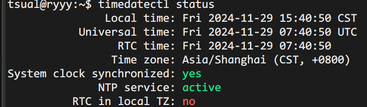
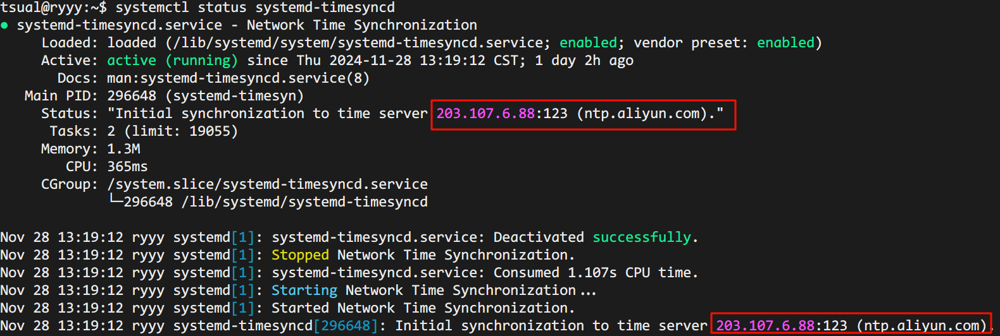

## 1.解决Ubuntu root用户下java -version无法获取java环境变量解决办法，普通用户可以bug

```properties title="Java环境变量配置"
export JAVA_HOME=/usr/local/java/jdk1.8.0_351
export JRE_HOME=${JAVA_HOME}/jre
export CLASSPATH=.:$JAVA_HOME/lib:$JRE_HOME/lib:$CLASSPATH
export PATH=$JAVA_HOME/bin:$JRE_HOME/bin:$PATH
```

```properties title="解决方式"
sudo ln -s /你的jdk路径/bin/jar /bin/jar 
sudo ln -s /你的jdk路径/bin/java /bin/java 
sudo ln -s /你的jdk路径/bin/javac /bin/javac 
sudo ln -s /你的jdk路径/bin/javah /bin/javah 
sudo ln -s /你的jdk路径/bin/javadoc /bin/javadoc
```

## 2.Ubuntu下的Redis配置远程连接,测试机可以配

#### 1️⃣先编辑redis.conf，默认安装的话就在/etc/redis/redis.conf，自定义安装的就在对应目录下，找找看。
```shell
sudo vim /etc/redis/redis.conf
```

#### 2️⃣找到 bind 配置项。默认情况下，Redis 只监听本地连接，即 bind 127.0.0.1

里面的只是可能很多，使用vim，输入 /你要查找的字符 ，按下n可以选择下一个，把对应的bind端口改一下,
同时，在它下面不远处，把保护模式关闭。

```shell
bind 0.0.0.0
protected-mode no
```

#### 3️⃣配置防火墙

把对应端口的防火墙打开，这个视情况而定，测试机可以开

```shell
sudo ufw allow 6379/tcp
```

## Ubuntu系统的时间同步

查看系统时间,看到 `System clock synchronized: yes`，表示已经开启同步，改一下时区即可

```shell
timedatectl status
```



```shell
sudo timedatectl set-timezone Asia/Shanghai
```

查看系统时间同步情况，里面会显示同步的时间和服务器，不对就是要改的

```shell
# 检查状态
systemctl status systemd-timesyncd
# 开启同步
sudo timedatectl set-ntp on
```



去修改同步时间的文件，添加同步用的服务器，可用于国内的，原来默认的是 `ntp.ubuntu.com`，不灵

```shell
vim /etc/systemd/timesyncd.conf
```

原来都是注释的

```properties
[Time]
NTP=ntp.aliyun.com
FallbackNTP=ntp.tencent.com,ntp1.tencent.com,ntp2.tencent.com,ntp3.tencent.com,ntp.ubuntu.com
RootDistanceMaxSec=5
PollIntervalMinSec=32
PollIntervalMaxSec=2048
```

之后重启生效，线上的服务打印的日志也要重启后才可以获取到新的

```shell
sudo systemctl restart systemd-timesyncd
```