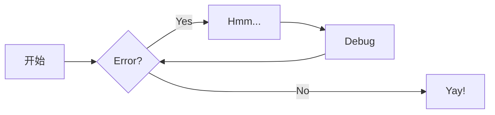
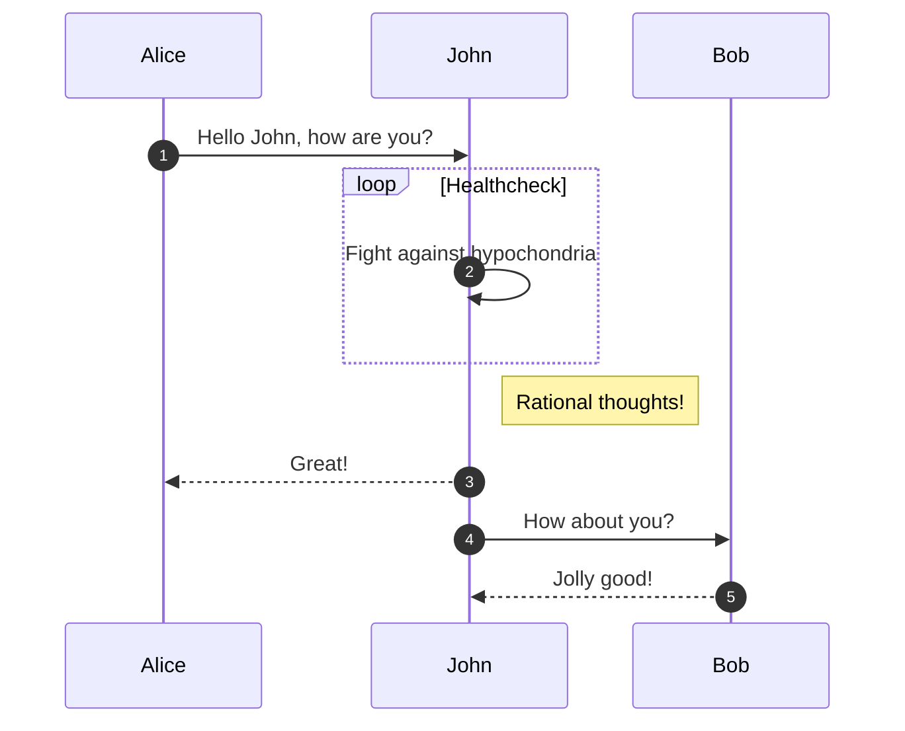
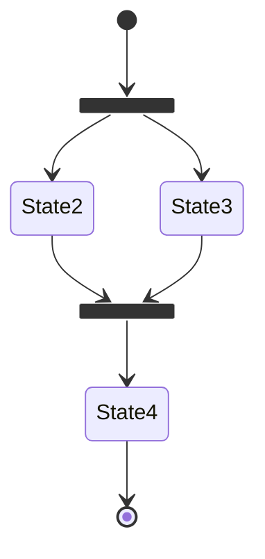
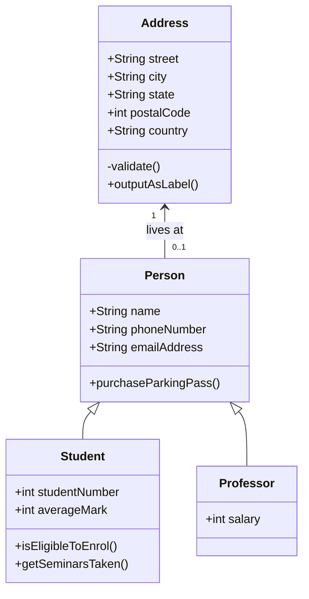
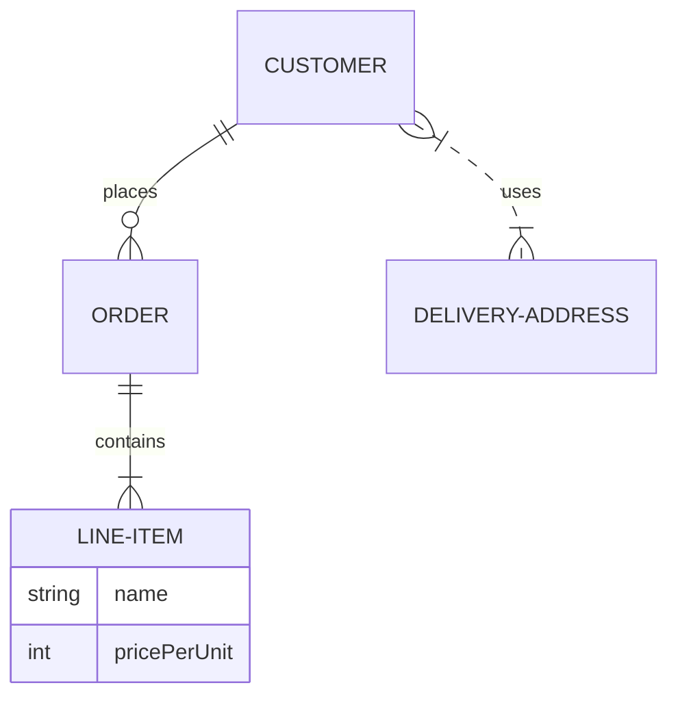

# 一切都看最原始的官网 
[https://squidfunk.github.io/mkdocs-material/getting-started/](https://squidfunk.github.io/mkdocs-material/getting-started/)

# 一级标题

## 二级标题

### 三级标题

#### 四级标题

##### 五级标题

###### 六级标题

正常的文字

**加粗的文字**

*斜体字*

<u>加下划线的文字</u>

<span style="text-decoration: underline wavy;">这里是下划波浪线文本</span>

<span style="border-bottom: 2px dashed;">这是带有虚线下划线的文本。1</span><br>
<span style="border-bottom: 2px dotted;">这是带有虚线下划线的文本。2</span><br>
<span style="border-bottom: 4px double;">这是带有虚线下划线的文本。3</span><br>

[这是本站的超链接](https://971230.github.io/)

[鼠标放上来](https://example.com "就会有提示，还可以点击")

- ==This was marked (highlight)==
- ^^This was inserted (underline)^^
- ~~This was deleted (strikethrough)~~

- H~2~O
- A^T^A

++ctrl+alt+del++

<!-- 有bug，有些按钮点击后导航栏的高亮颜色不随之改变 -->
<div class="mdx-switch">
  <button data-md-color-primary="red"><code style="background-color: #EF5552;color: white;">red</code></button>
  <button data-md-color-primary="pink"><code style="background-color: #E92063;color: white">pink</code></button>
  <button data-md-color-primary="purple"><code style="background-color: #AB47BD;color: white">purple</code></button>
  <button data-md-color-primary="deep-purple"><code style="background-color: #7E56C2;color: white">deep purple</code></button>
  <button data-md-color-primary="indigo"><code style="background-color: #4051B5;color: white">indigo</code></button>
  <button data-md-color-primary="blue"><code style="background-color: #2094F3;color: white">blue</code></button>
  <button data-md-color-primary="light-blue"><code style="background-color: #02A6F2;color: white">light blue</code></button>
  <button data-md-color-primary="cyan"><code style="background-color: #00BDD6;color: white">cyan</code></button>
  <button data-md-color-primary="teal"><code style="background-color: #009485;color: white">teal</code></button>
  <button data-md-color-primary="green"><code style="background-color: #4CAE4F;color: white">green</code></button>
  <button data-md-color-primary="light-green"><code style="background-color: #8BC34B;color: white">light green</code></button>
  <button data-md-color-primary="lime"><code style="background-color: #CBDC38;color: black">lime</code></button>
  <button data-md-color-primary="yellow"><code style="background-color: #FFEC3D;color: black">yellow</code></button>
  <button data-md-color-primary="amber"><code style="background-color: #FFC105;color: black">amber</code></button>
  <button data-md-color-primary="orange"><code style="background-color: #FFA724;color: black">orange</code></button>
  <button data-md-color-primary="deep-orange"><code style="background-color: #FF6E42;color: white">deep orange</code></button>
  <button data-md-color-primary="brown"><code style="background-color: #795649;color: white">brown</code></button>
  <button data-md-color-primary="grey"><code style="background-color: #757575;color: white">grey</code></button>
  <button data-md-color-primary="blue-grey"><code style="background-color: #546D78;color: white">blue grey</code></button>
  <button data-md-color-primary="black"><code style="background-color: #14151A;color: white">black</code></button>
  <button data-md-color-primary="white"><code style="background-color: #FFFFFF;color: black">white</code></button>
</div>
<script>
  var buttons = document.querySelectorAll("button[data-md-color-primary]")
  buttons.forEach(function(button) {
    button.addEventListener("click", function() {
      var attr = this.getAttribute("data-md-color-primary")
      document.body.setAttribute("data-md-color-primary", attr)
      var name = document.querySelector("#__code_1 code span.l")
      name.textContent = attr.replace("-", " ")
    })
  })
</script>

------

> 这是一段引用

1. 有序列表一
2. 有序列表二
3. 有序列表三

------

- 无须列表
- 无序列表
- 无须列表

------

- [x] 任务列表
- [ ] 任务列表
- [ ] 任务列表

------


<!-- 想让这个图片变成它原来的样子，就设置width:auto -->
<figure markdown="span">
  { width="300" }
  <figcaption>图片标题</figcaption>
</figure>

这是一个带有脚注的句子[^1]。
[^1]: 这是一段脚注-不是很会使用脚注

[链接引用]: 971230.github.com	"链接引用的标题"

------

水平分割线就是使用五个-符号就行了 ------

------

表格，感觉不好看

| 标题1  | 标题二 | 标题三 |
| ------ | ------ | ------ |
| 字段一 | text   | text   |
| 字段二 | text   | text   |
| 字段三 | text   | text   |

------

- [x] Lorem ipsum dolor sit amet, consectetur adipiscing elit
- [ ] Vestibulum convallis sit amet nisi a tincidunt
    * [x] In hac habitasse platea dictumst
    * [x] In scelerisque nibh non dolor mollis congue sed et metus
    * [ ] Praesent sed risus massa
- [ ] Aenean pretium efficitur erat, donec pharetra, ligula non scelerisque

-----

`Lorem ipsum dolor sit amet`

:   Sed sagittis eleifend rutrum. Donec vitae suscipit est. Nullam tempus
    tellus non sem sollicitudin, quis rutrum leo facilisis.

`Cras arcu libero`

:   Aliquam metus eros, pretium sed nulla venenatis, faucibus auctor ex. Proin
    ut eros sed sapien ullamcorper consequat. Nunc ligula ante.

    Duis mollis est eget nibh volutpat, fermentum aliquet dui mollis.
    Nam vulputate tincidunt fringilla.
    Nullam dignissim ultrices urna non auctor.

-----

代码片段
```java title="HelloWorld.java"
public class HelloWorld {
    public static void main(String[] args) {
        System.out.println("Hello, World!");
    }
}
```

```java title="HelloWorld.java" linenums="1" hl_lines="2 3 4"
public class HelloWorld {
    public static void main(String[] args) {
        System.out.println("Hello, World!");
    }
}
```

``` java
public class demo {
    public static void main(String[] args) {
        System.out.println("Hello，World!"); // (1)!
    }
}
```

1.  特别的注释；特别的注释；特别的注释；特别的注释；

    Lorem ipsum dolor sit amet, consectetur adipiscing elit.

-----

欧拉公式

$$ e^{i\pi} + 1 = 0 $$

傅里叶变换

$$
F(\omega) = \mathcal{F}\{f(t)\} = \int_{-\infty}^{\infty} f(t) e^{-i \omega t} \, dt
$$


内容目录

[TOC]

-----

=== "C"

    ``` c
    #include <stdio.h>
    
    int main(void) {
      printf("Hello world!\n");
      return 0;
    }
    ```

=== "C++"

    ``` c++
    #include <iostream>
    
    int main(void) {
      std::cout << "Hello world!" << std::endl;
      return 0;
    }
    ```

=== "java"

    ```java
    public class Hello {
      public static void main(String[] args) {
        System.out.println("Hello, World!");
      }
    }
    ```

-----

=== "无序列表"

    * 这是一段样例文字
    * 这是一段样例文字
    * 这是一段样例文字

=== "有序列表"

    1. 这是一段样例文字
    2. 这是一段样例文字
    3. 这是一段样例文字

-----

!!! example

    === "无序列表1"

        ``` markdown
        * 这是一段样例文字
        * 这是一段样例文字
        * 这是一段样例文字
        ```

    === "有序列表1"

        ``` markdown
        1. 这是一段样例文字
        2. 这是一段样例文字
        3. 这是一段样例文字
        ```

!!! Abstract
    参天大树充满生命力，根深叶茂，分枝扶疏。它为我们展现了数据分治的生动形态。

!!! Abstract ""
    参天大树充满生命力，根深叶茂，分枝扶疏。它为我们展现了数据分治的生动形态。

!!! Abstract "参天大树充满生命力"
    参天大树充满生命力，根深叶茂，分枝扶疏。它为我们展现了数据分治的生动形态。

!!! Tip
    参天大树充满生命力，根深叶茂，分枝扶疏。它为我们展现了数据分治的生动形态。

!!! Note
    参天大树充满生命力，根深叶茂，分枝扶疏。它为我们展现了数据分治的生动形态。

!!! Info
    参天大树充满生命力，根深叶茂，分枝扶疏。它为我们展现了数据分治的生动形态。

!!! Success
    参天大树充满生命力，根深叶茂，分枝扶疏。它为我们展现了数据分治的生动形态。

!!! Question
    参天大树充满生命力，根深叶茂，分枝扶疏。它为我们展现了数据分治的生动形态。

!!! Warning
    参天大树充满生命力，根深叶茂，分枝扶疏。它为我们展现了数据分治的生动形态。

!!! Failure
    参天大树充满生命力，根深叶茂，分枝扶疏。它为我们展现了数据分治的生动形态。

!!! Danger
    参天大树充满生命力，根深叶茂，分枝扶疏。它为我们展现了数据分治的生动形态。

!!! Bug
    参天大树充满生命力，根深叶茂，分枝扶疏。它为我们展现了数据分治的生动形态。

!!! Example
    参天大树充满生命力，根深叶茂，分枝扶疏。它为我们展现了数据分治的生动形态。

!!! Quote
    参天大树充满生命力，根深叶茂，分枝扶疏。它为我们展现了数据分治的生动形态。

-----

!!! info inline end "右提示"

    参天大树充满生命力，根深叶茂，分枝扶疏。它为我们展现了数据分治的生动形态。

参天大树充满生命力，根深叶茂，分枝扶疏。它为我们展现了数据分治的生动形态。<br>
参天大树充满生命力，根深叶茂，分枝扶疏。它为我们展现了数据分治的生动形态。<br>
参天大树充满生命力，根深叶茂，分枝扶疏。它为我们展现了数据分治的生动形态。<br>
参天大树充满生命力，根深叶茂，分枝扶疏。它为我们展现了数据分治的生动形态。

-----

!!! info inline "左提示"

    参天大树充满生命力，根深叶茂，分枝扶疏。它为我们展现了数据分治的生动形态。

参天大树充满生命力，根深叶茂，分枝扶疏。它为我们展现了数据分治的生动形态。<br>
参天大树充满生命力，根深叶茂，分枝扶疏。它为我们展现了数据分治的生动形态。<br>
参天大树充满生命力，根深叶茂，分枝扶疏。它为我们展现了数据分治的生动形态。<br>
参天大树充满生命力，根深叶茂，分枝扶疏。它为我们展现了数据分治的生动形态。

-----

=== "一"
    !!! info inline end "右提示"
        参天大树充满生命力，根深叶茂，分枝扶疏。它为我们展现了数据分治的生动形态。
    参天大树充满生命力，根深叶茂，分枝扶疏。它为我们展现了数据分治的生动形态。<br>
    参天大树充满生命力，根深叶茂，分枝扶疏。它为我们展现了数据分治的生动形态。<br>
    参天大树充满生命力，根深叶茂，分枝扶疏。它为我们展现了数据分治的生动形态。<br>
    参天大树充满生命力，根深叶茂，分枝扶疏。它为我们展现了数据分治的生动形态。

=== "二"
    !!! info inline "左提示"
        参天大树充满生命力，根深叶茂，分枝扶疏。它为我们展现了数据分治的生动形态。
    参天大树充满生命力，根深叶茂，分枝扶疏。它为我们展现了数据分治的生动形态。<br>
    参天大树充满生命力，根深叶茂，分枝扶疏。它为我们展现了数据分治的生动形态。<br>
    参天大树充满生命力，根深叶茂，分枝扶疏。它为我们展现了数据分治的生动形态。<br>
    参天大树充满生命力，根深叶茂，分枝扶疏。它为我们展现了数据分治的生动形态。


??? example "Expand to show alternate icon sets"

    === ":octicons-mark-github-16: Octicons"

        ``` yaml
        theme:
          icon:
            admonition:
              note: octicons/tag-16
              abstract: octicons/checklist-16
              info: octicons/info-16
              tip: octicons/squirrel-16
              success: octicons/check-16
              question: octicons/question-16
              warning: octicons/alert-16
              failure: octicons/x-circle-16
              danger: octicons/zap-16
              bug: octicons/bug-16
              example: octicons/beaker-16
              quote: octicons/quote-16
        ```


    === ":fontawesome-brands-font-awesome: FontAwesome"

        ``` yaml
        theme:
          icon:
            admonition:
              note: fontawesome/solid/note-sticky
              abstract: fontawesome/solid/book
              info: fontawesome/solid/circle-info
              tip: fontawesome/solid/bullhorn
              success: fontawesome/solid/check
              question: fontawesome/solid/circle-question
              warning: fontawesome/solid/triangle-exclamation
              failure: fontawesome/solid/bomb
              danger: fontawesome/solid/skull
              bug: fontawesome/solid/robot
              example: fontawesome/solid/flask
              quote: fontawesome/solid/quote-left
        ```


-----

[这是一个大按钮](#){ .md-button }
[这是一个大按钮](#){ .md-button .md-button--primary }

-----
[把鼠标放到这里](https://example.com "就有一个提示信息"){ .md-button .md-button--primary }
[把鼠标放到这里](https://example.com "就有一个提示信息")

<a href="https://www.example.com" target="_blank">
<div class="btn-animate btn-animate__around">
    <svg><rect x="0" y="0" fill="none" width="100%" height="100%"></rect></svg>
    按钮
</div>
</a>

-----
流程图


------
时序图


-----
状态图


-----
类图


-----
实体关系图


-----

<div class="grid cards" markdown>

- :fontawesome-brands-html5: __HTML__ for content and structure
- :fontawesome-brands-js: __JavaScript__ for interactivity
- :fontawesome-brands-css3: __CSS__ for text running out of boxes
- :fontawesome-brands-internet-explorer: __Internet Explorer__ ... huh?

</div>

-----

<div class="grid cards" markdown>

-   :material-clock-fast:{ .lg .middle } __Set up in 5 minutes__

    ---

    Install [`mkdocs-material`](#) with [`pip`](#) and get up
    and running in minutes

    [:octicons-arrow-right-24: Getting started](#)

-   :fontawesome-brands-markdown:{ .lg .middle } __It's just Markdown__

    ---

    Focus on your content and generate a responsive and searchable static site

    [:octicons-arrow-right-24: Reference](#)

-   :material-format-font:{ .lg .middle } __Made to measure__

    ---

    Change the colors, fonts, language, icons, logo and more with a few lines

    [:octicons-arrow-right-24: Customization](#)

-   :material-scale-balance:{ .lg .middle } __Open Source, MIT__

    ---

    Material for MkDocs is licensed under MIT and available on [GitHub]

    [:octicons-arrow-right-24: License](#)

</div>

-----

表情包 :smile: :fontawesome-regular-face-laugh-wink: 

要改颜色需要到extra.css里面修改
:fontawesome-brands-youtube: :fontawesome-brands-youtube:{ .youtube }

有动画的表情包

:octicons-heart-fill-24:{ .heart }

<div class="btn-animate__stars">
    ♡
</div>

:material-arch:


