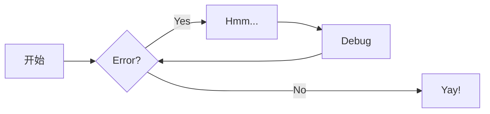
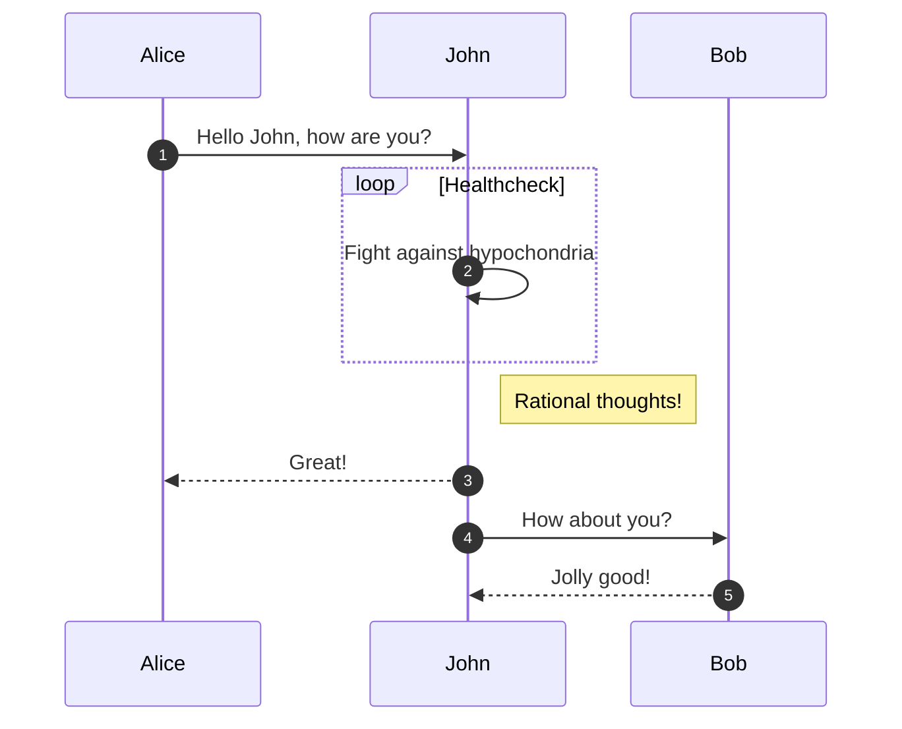
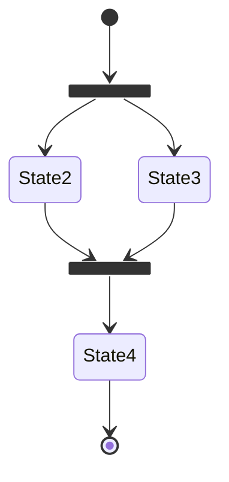
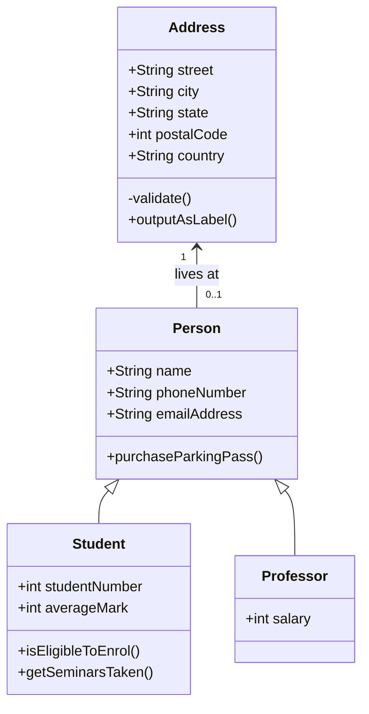
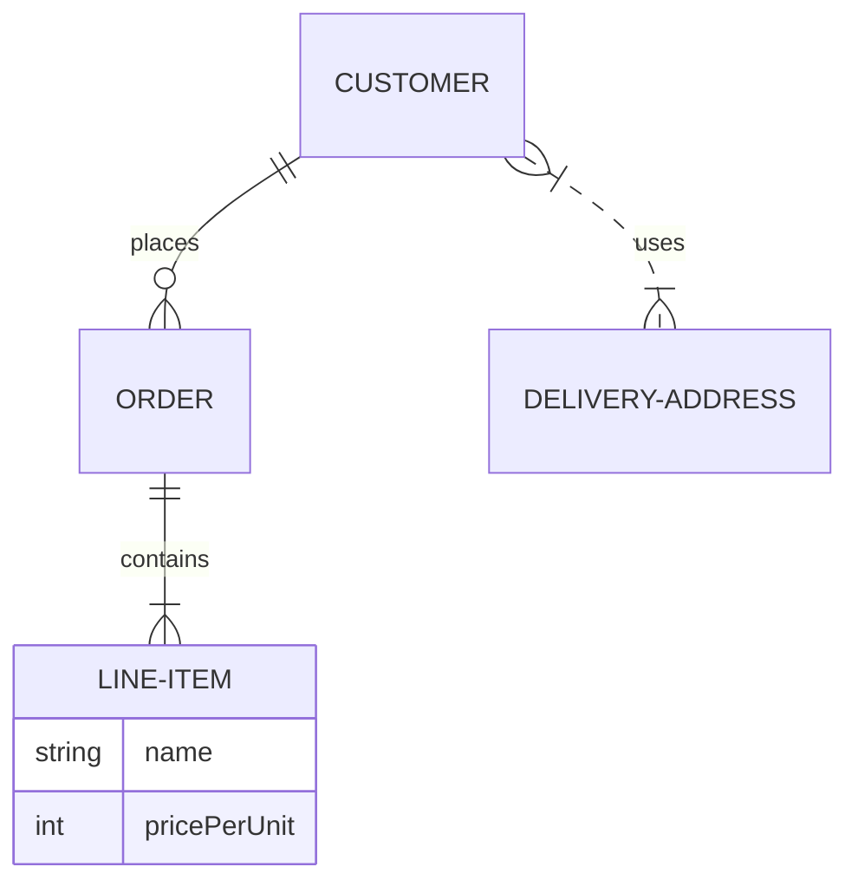

# 一切都看最原始的官网 
[https://squidfunk.github.io/mkdocs-material/getting-started/](https://squidfunk.github.io/mkdocs-material/getting-started/)

# 一级标题

## 二级标题

### 三级标题

#### 四级标题

##### 五级标题

###### 六级标题

正常的文字

**加粗的文字**

*斜体字*

<u>加下划线的文字</u>

<span style="text-decoration: underline wavy;">这里是下划波浪线文本</span>

[这是本站的超链接](https://971230.github.io/)

[鼠标放上来](https://example.com "就会有提示，还可以点击")

------

> 这是一段引用

1. 有序列表一
2. 有序列表二
3. 有序列表三

------

- 无须列表
- 无序列表
- 无须列表

------

- [x] 任务列表
- [ ] 任务列表
- [ ] 任务列表

------


这是一个带有脚注的句子[^1]。
[^1]: 这是一段脚注-不是很会使用脚注

[链接引用]: 971230.github.com	"链接引用的标题"

------

###水平分割线就是使用五个-符号就行了 ------

------

表格，感觉不好看

| 标题1  | 标题二 | 标题三 |
| ------ | ------ | ------ |
| 字段一 | text   | text   |
| 字段二 | text   | text   |
| 字段三 | text   | text   |

------

- [x] Lorem ipsum dolor sit amet, consectetur adipiscing elit
- [ ] Vestibulum convallis sit amet nisi a tincidunt
    * [x] In hac habitasse platea dictumst
    * [x] In scelerisque nibh non dolor mollis congue sed et metus
    * [ ] Praesent sed risus massa
- [ ] Aenean pretium efficitur erat, donec pharetra, ligula non scelerisque

-----

代码片段
```java
public class Hello {
    public static void main(String[] args) {
        System.out.println("Hello, World!");
    }
}
```

``` java
public class demo {
    public static void main(String[] args) {
        System.out.println("Hello，World!"); // (1)!
    }
}
```

1.  特别的注释；特别的注释；特别的注释；特别的注释；

    Lorem ipsum dolor sit amet, consectetur adipiscing elit.

-----

欧拉公式

$$ e^{i\pi} + 1 = 0 $$


内容目录

[TOC]

-----


=== "C"

    ``` c
    #include <stdio.h>
    
    int main(void) {
      printf("Hello world!\n");
      return 0;
    }
    ```

=== "C++"

    ``` c++
    #include <iostream>
    
    int main(void) {
      std::cout << "Hello world!" << std::endl;
      return 0;
    }
    ```

=== "java"

    ```java
    public class Hello {
      public static void main(String[] args) {
        System.out.println("Hello, World!");
      }
    }
    ```

-----

=== "无序列表"

    * 这是一段样例文字
    * 这是一段样例文字
    * 这是一段样例文字

=== "有序列表"

    1. 这是一段样例文字
    2. 这是一段样例文字
    3. 这是一段样例文字

-----

!!! example

    === "无序列表1"

        ``` markdown
        * 这是一段样例文字
        * 这是一段样例文字
        * 这是一段样例文字
        ```

    === "有序列表1"

        ``` markdown
        1. 这是一段样例文字
        2. 这是一段样例文字
        3. 这是一段样例文字
        ```

!!! Abstract
    参天大树充满生命力，根深叶茂，分枝扶疏。它为我们展现了数据分治的生动形态。

!!! Abstract "参天大树充满生命力"
    参天大树充满生命力，根深叶茂，分枝扶疏。它为我们展现了数据分治的生动形态。

!!! Tip
    参天大树充满生命力，根深叶茂，分枝扶疏。它为我们展现了数据分治的生动形态。

!!! Note
    参天大树充满生命力，根深叶茂，分枝扶疏。它为我们展现了数据分治的生动形态。

!!! Info
    参天大树充满生命力，根深叶茂，分枝扶疏。它为我们展现了数据分治的生动形态。

!!! Success
    参天大树充满生命力，根深叶茂，分枝扶疏。它为我们展现了数据分治的生动形态。

!!! Question
    参天大树充满生命力，根深叶茂，分枝扶疏。它为我们展现了数据分治的生动形态。

!!! Warning
    参天大树充满生命力，根深叶茂，分枝扶疏。它为我们展现了数据分治的生动形态。

!!! Failure
    参天大树充满生命力，根深叶茂，分枝扶疏。它为我们展现了数据分治的生动形态。

!!! Danger
    参天大树充满生命力，根深叶茂，分枝扶疏。它为我们展现了数据分治的生动形态。

!!! Bug
    参天大树充满生命力，根深叶茂，分枝扶疏。它为我们展现了数据分治的生动形态。

!!! Example
    参天大树充满生命力，根深叶茂，分枝扶疏。它为我们展现了数据分治的生动形态。

!!! Quote
    参天大树充满生命力，根深叶茂，分枝扶疏。它为我们展现了数据分治的生动形态。

-----

!!! info inline end "右提示"

    参天大树充满生命力，根深叶茂，分枝扶疏。它为我们展现了数据分治的生动形态。

参天大树充满生命力，根深叶茂，分枝扶疏。它为我们展现了数据分治的生动形态。<br>
参天大树充满生命力，根深叶茂，分枝扶疏。它为我们展现了数据分治的生动形态。<br>
参天大树充满生命力，根深叶茂，分枝扶疏。它为我们展现了数据分治的生动形态。<br>
参天大树充满生命力，根深叶茂，分枝扶疏。它为我们展现了数据分治的生动形态。

-----

!!! info inline "左提示"

    参天大树充满生命力，根深叶茂，分枝扶疏。它为我们展现了数据分治的生动形态。

参天大树充满生命力，根深叶茂，分枝扶疏。它为我们展现了数据分治的生动形态。<br>
参天大树充满生命力，根深叶茂，分枝扶疏。它为我们展现了数据分治的生动形态。<br>
参天大树充满生命力，根深叶茂，分枝扶疏。它为我们展现了数据分治的生动形态。<br>
参天大树充满生命力，根深叶茂，分枝扶疏。它为我们展现了数据分治的生动形态。

-----

=== "一"
    !!! info inline end "右提示"
        参天大树充满生命力，根深叶茂，分枝扶疏。它为我们展现了数据分治的生动形态。
    参天大树充满生命力，根深叶茂，分枝扶疏。它为我们展现了数据分治的生动形态。<br>
    参天大树充满生命力，根深叶茂，分枝扶疏。它为我们展现了数据分治的生动形态。<br>
    参天大树充满生命力，根深叶茂，分枝扶疏。它为我们展现了数据分治的生动形态。<br>
    参天大树充满生命力，根深叶茂，分枝扶疏。它为我们展现了数据分治的生动形态。

=== "二"
    !!! info inline "左提示"
        参天大树充满生命力，根深叶茂，分枝扶疏。它为我们展现了数据分治的生动形态。
    参天大树充满生命力，根深叶茂，分枝扶疏。它为我们展现了数据分治的生动形态。<br>
    参天大树充满生命力，根深叶茂，分枝扶疏。它为我们展现了数据分治的生动形态。<br>
    参天大树充满生命力，根深叶茂，分枝扶疏。它为我们展现了数据分治的生动形态。<br>
    参天大树充满生命力，根深叶茂，分枝扶疏。它为我们展现了数据分治的生动形态。


??? example "Expand to show alternate icon sets"

    === ":octicons-mark-github-16: Octicons"

        ``` yaml
        theme:
          icon:
            admonition:
              note: octicons/tag-16
              abstract: octicons/checklist-16
              info: octicons/info-16
              tip: octicons/squirrel-16
              success: octicons/check-16
              question: octicons/question-16
              warning: octicons/alert-16
              failure: octicons/x-circle-16
              danger: octicons/zap-16
              bug: octicons/bug-16
              example: octicons/beaker-16
              quote: octicons/quote-16
        ```


    === ":fontawesome-brands-font-awesome: FontAwesome"

        ``` yaml
        theme:
          icon:
            admonition:
              note: fontawesome/solid/note-sticky
              abstract: fontawesome/solid/book
              info: fontawesome/solid/circle-info
              tip: fontawesome/solid/bullhorn
              success: fontawesome/solid/check
              question: fontawesome/solid/circle-question
              warning: fontawesome/solid/triangle-exclamation
              failure: fontawesome/solid/bomb
              danger: fontawesome/solid/skull
              bug: fontawesome/solid/robot
              example: fontawesome/solid/flask
              quote: fontawesome/solid/quote-left
        ```


-----

[这是一个大按钮](#){ .md-button }
[这是一个大按钮](#){ .md-button .md-button--primary }

-----
[把鼠标放到这里](https://example.com "就有一个提示信息"){ .md-button .md-button--primary }
[把鼠标放到这里](https://example.com "就有一个提示信息")

-----
流程图


------
时序图


-----
状态图


-----
类图


-----
实体关系图


-----

<div class="grid cards" markdown>

- :fontawesome-brands-html5: __HTML__ for content and structure
- :fontawesome-brands-js: __JavaScript__ for interactivity
- :fontawesome-brands-css3: __CSS__ for text running out of boxes
- :fontawesome-brands-internet-explorer: __Internet Explorer__ ... huh?

</div>

-----

<div class="grid cards" markdown>

-   :material-clock-fast:{ .lg .middle } __Set up in 5 minutes__

    ---

    Install [`mkdocs-material`](#) with [`pip`](#) and get up
    and running in minutes

    [:octicons-arrow-right-24: Getting started](#)

-   :fontawesome-brands-markdown:{ .lg .middle } __It's just Markdown__

    ---

    Focus on your content and generate a responsive and searchable static site

    [:octicons-arrow-right-24: Reference](#)

-   :material-format-font:{ .lg .middle } __Made to measure__

    ---

    Change the colors, fonts, language, icons, logo and more with a few lines

    [:octicons-arrow-right-24: Customization](#)

-   :material-scale-balance:{ .lg .middle } __Open Source, MIT__

    ---

    Material for MkDocs is licensed under MIT and available on [GitHub]

    [:octicons-arrow-right-24: License](#)

</div>

-----

表情包 :smile: :fontawesome-regular-face-laugh-wink: 

要改颜色需要到extra.css里面修改
:fontawesome-brands-youtube: :fontawesome-brands-youtube:{ .youtube }

有动画的表情包
:octicons-heart-fill-24:{ .heart }

:material-arch:
