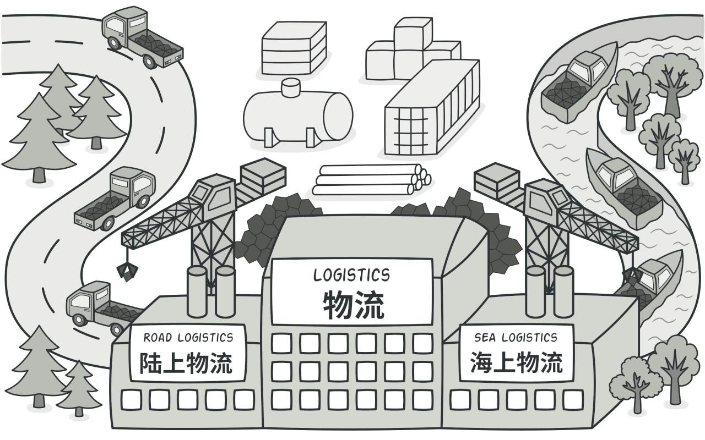
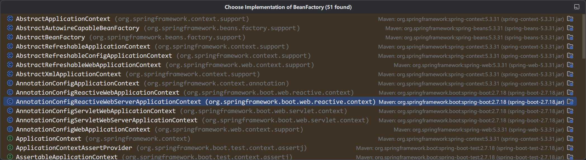
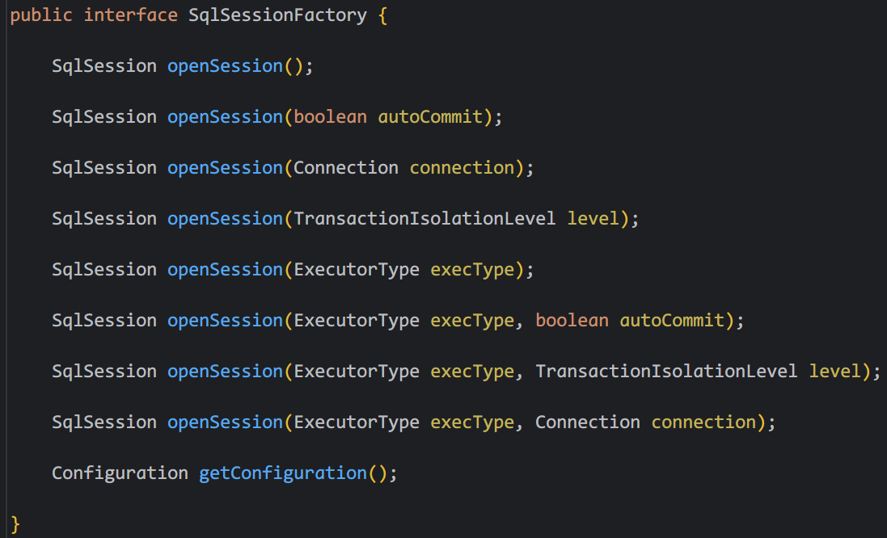
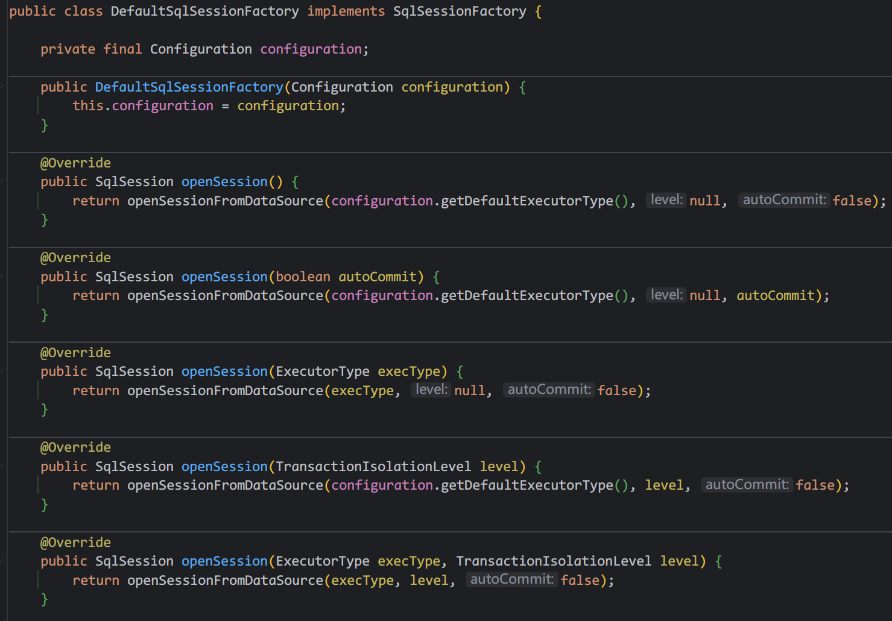
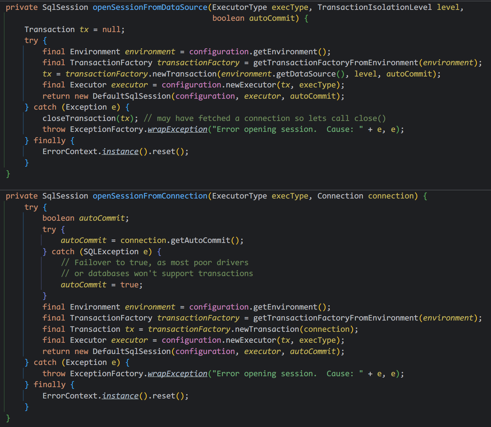

# 工厂方法模式



## ➊先介绍一下工厂方法模式

这个名字的样子，一看就是需要去创造东西，工厂工厂🏭，生产东西才是一个工厂的作用。那么工厂方法是要生产什么呢？
没错，就是对象，它是创建型模式的一种。对象的创建为什么这么重要？Java作为面向对象语言的典范，没有对象就是没有运行的基础。

### 1️⃣首先工厂方法，一定要有工厂和产品两个大头

按照业内标准都是接口或抽象类，都是需要有具体的实现的，不然没有具体的功能。

=== "定义工厂的生产标准"

    ```java
    /**
     * 定义抽象工厂类，用于生产图形。
     */
    public abstract class ShapeFactory {
        /**
         * 创建图形的类，一定需要被子类继承,不然工厂生产了个寂寞。
         */
        public abstract Shape createShape();
    }
    ```

=== "定义产品的功能标准"

    ```java
    /**
     * 你要生产的东西的接口，在这里定义产品的功能，也就是对象要做的事情的标准。
     */
    public interface Shape {
        void draw();
    }
    ```

### 2️⃣你要生产的东西的实现

其实就是你要创建的对象有哪些，现在一个个写出来，功能改加的加，要做的事情在这里做，加很多功能后，在new。

=== "圆形对象"

    ```java
    /**
     * 一般一个对象的功能有很多，还有各种属性和参数
     */
    public class Circle implements Shape {
        @Override
        public void draw() {
            System.out.println("正在画圆");
        }
    }
    ```

=== "矩形对象"

    ```java
    public class Rectangle implements Shape {
        @Override
        public void draw() {
            System.out.println("正在画矩形");
        }
    }
    ```

=== "正方形对象"

    ```java
    public class Square implements Shape {
        @Override
        public void draw() {
            System.out.println("正在画正方形");
        }
    }
    ```

### 3️⃣接下来就是提供工厂的具体生产过程了

这个生产过程demo代码很简单，具体怎么创建，也要根据具体的业务和需求来做抉择，而一般框架的实现都是会复杂很多。


=== "圆形工厂"

    ```java
    /**
     * 生产圆的工厂
     */
    public class CircleFactory extends ShapeFactory {
        @Override
        public Shape createShape() {
            return new Circle();
        }
    }
    ```

=== "矩形工厂"

    ```java
    /**
     * 生产矩形的工厂
     */
    public class RectangleFactory extends ShapeFactory {
        @Override
        public Shape createShape() {
            return new Rectangle();
        }
    }
    ```

=== "正方形工厂"

    ```java
    /**
     * 生产正方形的工厂
     */
    public class SquareFactory extends ShapeFactory {
        @Override
        public Shape createShape() {
            return new Square();
        }
    }
    ```

### 4️⃣怎么用

就是你要用那个对象就去创建哪一个就可以了, 指定了哪一个实现，工厂就开始生产对应的对象。
当然demo太简单 ，不大容易体现它的一些好处。

```java
public static void main(String[] args) {
        // 创建各自的工厂去生产图形
        ShapeFactory circleFactory = new CircleFactory();
        ShapeFactory rectangleFactory = new RectangleFactory();
        ShapeFactory squareFactory = new SquareFactory();

        Shape circle = circleFactory.createShape();
        Shape rectangle = rectangleFactory.createShape();
        Shape square = squareFactory.createShape();

        circle.draw();
        rectangle.draw();
        square.draw();
    }
```

## ➋我们为啥要用它？
在创建对象的过程中，就有种种的麻烦，比如你要关心怎么创建，创建什么对象，有时候你都不知道创建的对象到底是啥，
那么工厂方法模式就是一种可以不关心创建过程的，不关心创建对象具体类型的一种设计模式，至于它的代码复用，啥“开闭原则”，
就有点理论和八股文了，好像设计模式多少都沾一点这些好处。简单来说就是你只管去创建对象吧，你只用下单，其它的交给工厂就行，
作为调用者来说，几乎只有一行代码就可以完成对象创建，new对象不也是一行？但是那么多的对象所携带的功能呢，人家给你写好了。

## ➌利弊权衡
工厂方法模式也不是万能的，正如多数设计模式一样，它会增加系统的复杂度，啥意思？就是你写了好多类，一个一个看很烦，而且看懂它，
我还要花时间，后面维护我还要耗费精力，这个权衡完全看你自己。而且这个模式它在创建对象的时候，只能创建一些简单的对象，涉及到多个步骤或依赖关系，
他就不大行，可能需要引入别的设计模式了，比如建造者模式。然后就是工厂方法模式一般都有接口，你要去创建对象，一般使用的接口的方法，
如果需要访问具体产品类中的特殊方法或属性，就需要进行类型转换，这可能会引入一些不便，这个就特别需要注意，看看你要创建的对象，
到底是不是会出现这种情况。

## ➍一些经典实现介绍

### 1️⃣BeanFactory
那么遇到具体的场景了，怎么看怎么判断？确实只要经验了，说再多就不如自己去写写，用用，到底啥是啥。比如：Spring框架中，
`BeanFactory`，这个够经典了吧 ，他就是工厂方法的一种，是spring创建对象的工厂，容器中的对象都是它创建的。
像里面的`getBean`有很多重载入的方法，用于获取对象，它的设计思想完全可以看看它的注释，很多很多。它的实现类太多了。



### 2️⃣SqlSessionFactory
还有就是MyBatis创建sqlSession的工厂类`SqlSessionFactory`，它的一个实现`DefaultSqlSessionFactory`，
里面就是具体生产数据库会话的方法了。其他的一个`openSession()`也是，但是框架嘛，为了功能多会封装好多的重载方法，
归根还是图里两个方法在做事情。而且这里还有一个`SqlSessionManager`，还用到了建造者模式来解决工厂模式只能生产简单对象的缺点。






