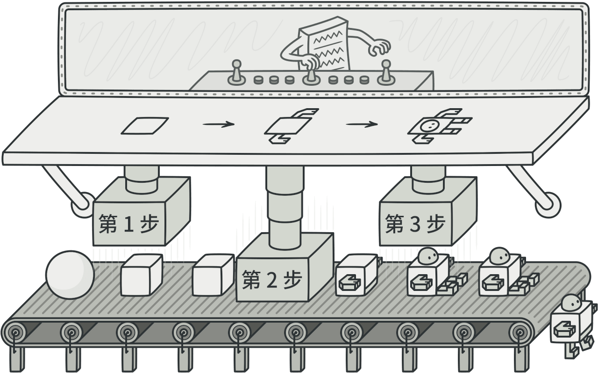

# 建造者模式




如果你有使用过 Hutool 工具类库，你可能使用过 GenericBuilder 这个构建工具，它是建造者模式的完美体现。
它主要就是可以创建对象，「将对象的构建过程与其表示进行分离，当一个对象的构建过程非常复杂，
包含多个步骤或需要多个参数时，建造者模式可以将这些步骤分解，使得构建过程更加清晰和易于管理。」[^1]
[^1]: 来自于DeepSeek AI

但是它有代码的重复，构建顺序也是固定的。


### 🏀代码样例

这个例子其实还是太“理论”了，只是将将可以说清楚啥是建造者模式而已。

```java
@ToString
public class Computer {
    private String cpu;
    private String memory;
    private String hardDisk;
    private String monitor;

    /* 私有构造函数，防止直接实例化 */
    private Computer() {
    }

    /* 静态内部类作为建造者 */
    public static class Builder {
        private String cpu;
        private String memory;
        private String hardDisk;
        private String monitor;

        /* 这里的set方法返回this才可以达到链式效果 */
        public Builder setCpu(String cpu) {
            this.cpu = cpu;
            return this;
        }

        public Builder setMemory(String memory) {
            this.memory = memory;
            return this;
        }

        public Builder setHardDisk(String hardDisk) {
            this.hardDisk = hardDisk;
            return this;
        }

        public Builder setMonitor(String monitor) {
            this.monitor = monitor;
            return this;
        }

        public Computer build() {
            Computer computer = new Computer();
            computer.cpu = this.cpu;
            computer.memory = this.memory;
            computer.hardDisk = this.hardDisk;
            computer.monitor = this.monitor;
            return computer;
        }
    }
}
```

### 🐔使用方式

```java
public class Test {
    public static void main(String[] args) {
        // 使用建造者模式创建Computer对象
        Computer computer = new Computer.Builder()
            .setCpu("Intel i7")
            .setMemory("16GB")
            .setHardDisk("1TB SSD")
            .setMonitor("27-inch 4K")
            .build();
        // 输出Computer对象
        System.out.println(computer);
    }
}
```

### 🌠更好的例子

于是针对这种偏理论化的例子，这里就有一个 hutool 的 GenericBuilder 工具的简化版本，这样其实更能明白，
这个例子细节很多，用到函数式接口，对象创建的过程也有各种支持。[^2]
[^2]: 例子最早来自于前项目，当时项目里因安全问题不允许使用hutool工具


=== "Builder"

    ```java
    public class Builder<T> implements Build<T> {
        private static final long serialVersionUID = 123456789L;

        private final Supplier<T> constructor;

        private final List<Consumer<T>> modifiers1 = new ArrayList<>();

        private final List<Consumer<T>> modifiers2 = new ArrayList<>();

        public Builder(Supplier<T> supplier) {
            this.constructor = supplier;
        }

        public static <T> Builder<T> of(Supplier<T> supplier) {
            return new Builder<>(supplier);
        }

        public <U> Builder<T> with(BiConsumer<T, U> consumer, U value) {
            Consumer<T> tmpConsumer = instance -> consumer.accept(instance, value);
            modifiers1.add(tmpConsumer);
            return this;
        }

        public <U> Builder<T> with(Function<T, List<U>> function, U value) {
            Consumer<T> tmpConsumer = instance -> function.apply(instance).add(value);
            modifiers1.add(tmpConsumer);
            return this;
        }

        public <K, V> Builder<T> with(KeyValueConsumer<T, K, V> consumer, K key, V value) {
            Consumer<T> tmpConsumer = instance -> consumer.accept(instance, key, value);
            modifiers2.add(tmpConsumer);
            return this;
        }

        @Override
        public T build() {
            T value = constructor.get();
            modifiers1.forEach(instance -> instance.accept(value));
            modifiers2.forEach(instance -> instance.accept(value));
            modifiers1.clear();
            modifiers2.clear();
            return value;
        }
    }
    ```

=== "Build"

    ```java
    public interface Build<T> extends Serializable {
        T build();
    }
    ```

=== "KeyValueConsumer"

    ```java
    @FunctionalInterface
    public interface KeyValueConsumer<T, K, V> {

        /**
         * 接收数据
         *
         * @param t     数据对象
         * @param key   key
         * @param value value
         */
        void accept(T t, K key, V value);


        /**
         * And then key value consumer.
         *
         * @param after the after
         * @return the key value consumer
         */
        default KeyValueConsumer<T, K, V> andThen(
            KeyValueConsumer<? super T, ? super K, ? super V> after) {
            Objects.requireNonNull(after);

            return (t, k, v) -> {
                accept(t, k, v);
                after.accept(t, k, v);
            };
        }
    }
    ```

## ⛅ 使用

使用上面其实大差不差，主要是封装的细节和完成度。

```java
public class TestBuilder {
    public static void main(String[] args) {
        Computer computer = Builder.of(Computer::new)
                .with(Computer::setCpu, "AMD R7-5800H")
                .with(Computer::setMemory, "32GB")
                .with(Computer::setHardDisk, "1TB SSD")
                .with(Computer::setMonitor, "27-inch 4K Samsung")
                .build();
        System.out.println(computer);
    }
}
```