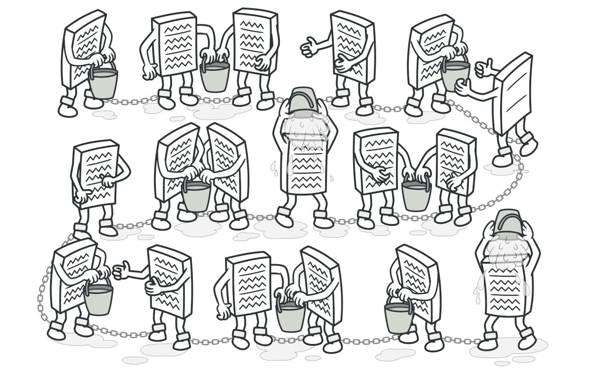

# 责任链模式



<P style="text-indent:2em;">
责任链模式适合业务需要按步骤执行，业务具有很明显的流程性、顺序性，任务发送者和接受者需要松耦合的情况，
专门对流程控制和处理来使用。
它主要是还是松耦合，和大多数设计模式一样，扩展性好又灵活，当然如果流程很长，责任链中请求的处理时间过长，可能会影响性能，
中间那里有问题了，你找起来还麻烦。
</p>

<P style="text-indent:2em;">
这个模式在各大开源框架都有广泛使用，比如spring-cloud-gateway有一个FilteringWebHandler，
Spring Security有一个FilterChainProxy。
简单一点，举个例子：SaaS系统里有一个请假流程，公司的要求可能是要达成怎样的步骤，
最终你才可以成功。
</p>


<P style="text-indent:2em;">
又或者有一个接口，你要校验很多东西，你要检验参数、黑名单，你又要检验规则拦截、做安全校验，正常是如下：
</p>

```java
@PostMapping("/xxx")
public void 业务接口(参数 参数) {
    // 1.检验参数
    // 2.校验安全
    // 3.校验黑名单
    // 4.内部规则
    // 可能还有其它
}
```

<P style="text-indent:2em;">
那这样是普通的写法，它能用，但是违背开闭原则，即当我们扩展功能的时候需要去修改主流程，无法做到对修改关闭、对扩展开放。
而且如果要修改顺序，还要改业务接口里面的代码。
</p>

### 🏀代码样例

那如何改一下呢？首先要有一个抽象类，把校验或拦截的动作抽出来。

```java
@Getter
@Setter
public abstract class AbstractHandler {
    // 责任链中的下一个对象
    private AbstractHandler nextHandler;

    /**
     * 具体参数拦截逻辑,给子类去实现,参数就是你要校验或拦截的东西,就是责任链要操作的对象
     */
    public void filter(int a, int b) {
        doFilter(a, b);
        if (getNextHandler() != null) {
            getNextHandler().filter(a, b);
        }
    }

    abstract void doFilter(int a, int b);
}
```

那么每一个要校验的对象，就是一个实现类，对应如下：

=== "参数校验对象"

    ```java
    @Component
    @Order(1) // 顺序排第1，最先校验
    public class CheckParamFilterObject extends AbstractHandler {
        @Override
        void doFilter(int a, int b) {
            System.out.println("比如非空参数检查...");
        }
    }
    ```

=== "安全校验对象"

    ```java
    @Component
    @Order(2) // 校验顺序排第2
    public class CheckSecurityFilterObject extends AbstractHandler {
        @Override
        void doFilter(int a, int b) {
            System.out.println("安全调用校验");
        }
    }
    ```

=== "黑名单校验对象"

    ```java
    @Component
    @Order(3) // 校验顺序排第3
    public class CheckBlackFilterObject extends AbstractHandler {
        @Override
        void doFilter(int a, int b) {
            System.out.println("校验黑名单");
        }
    }
    ```

=== "规则拦截对象"

    ```java
    @Component
    @Order(4) // 校验顺序排第4
    public class CheckRuleFilterObject extends AbstractHandler {
        @Override
        void doFilter(int a, int b) {
            System.out.println("内部规则");
        }
    }
    ```

最后就是将它们放到list里面，便利一下执行就可以了。

```java
@Component("ChainPatternDemo")
public class ChainPatternDemo {
    // 自动注入各个责任链的对象
    @Autowired
    private List<AbstractHandler> abstractHandleList;

    @Getter
    @Setter
    private AbstractHandler abstractHandler;

    // spring注入后自动执行，责任链的对象连接起来
    @PostConstruct
    public void initializeChainFilter() {
        for (int i = 0; i < abstractHandleList.size(); i++) {
            if (i == 0) {
                abstractHandler = abstractHandleList.get(0);
            } else {
                AbstractHandler currentHander = abstractHandleList.get(i - 1);
                AbstractHandler nextHander = abstractHandleList.get(i);
                currentHander.setNextHandler(nextHander);
            }
        }
    }

    // 直接调用这个方法使用
    public String exec(int a, int b) {
        abstractHandler.filter(a, b);
        return "返回你想返回的东西,在责任链走完后";
    }
}
```

### 🐔使用方式

那里要校验，就直接注入这个demo，走一下`exec()`方法就行了。这个参数看需求添加。

```java
@RequestMapping
@RestController
@RequiredArgsConstructor
public class TestDutyChain {
    private final ChainPatternDemo chainPatternDemo;
    
    @PostMapping("/xxx")
    public void test(Example example) {
        chainPatternDemo.exec(example.arg1, example.arg2);
    }
}
```
