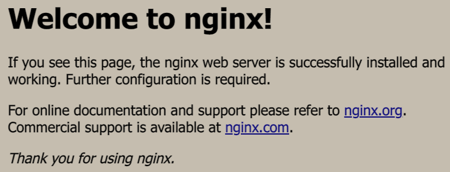

# Nginx配置文件怎么写

!!! Note ""
    只是个人实战经验，牵涉的东西不是那么全面，完整

## 介绍

Nginx("engine x")就是一个服务器反响代理的工具，因为性能好，占用小，负载均衡能力强，被广泛使用，这东西截至写文前已经20年了，
是俄罗斯老哥Igor Sysoev写的。

<a href="https://nginx.org" target="_blank">
<button class="link_button">
    官网
</button>
</a>

## 反向代理

其实就是一句话，正向代理代理客户端，反向代理代理服务器，正向代理如VPN，反向代理就是Nginx了。[^1]
[^1]: 参考帖子:(https://cloud.tencent.com/developer/article/1418457)


## 启动、关闭和重启服务等常用命令

一般默认安装的Nginx，如Ubuntu使用命令 `apt-get install nginx` ，安装好就是开启状态，直接访问本机IP,会出现如下画面：



没有启动可以使用命令 `systemctl start nginx` 启动，如果你是官网下载的，则需要自己编译configure文件，下载好相应的依赖库编译安装好后，
执行主目录下的 `./sbin/nginx` 就可以启动，但是这个很麻烦，我自己不熟悉这块，有bug要百度。

=== "启动"

    ``` shell
    systemctl start nginx
    ```

=== "安全关闭"

    ``` shell
    nginx -s quit
    ```

=== "快速关闭"

    ``` shell
    nginx -s stop
    ```

=== "重载配置"

    ``` shell
    nginx -s reload
    ```

=== "检查配置文件"

    ``` shell
    nginx -t
    ```

=== "重新打开日志文件"

    ``` shell
    nginx -s reopen
    ```

当然你要关闭服务也可以直接 `ps -ef | grep nginx` 找出进程号， `kill -s QUIT 进程号`，也是一样的。

## 配置文件结构

这个自己都有一些不清楚，以后在写，指不定啥时候。