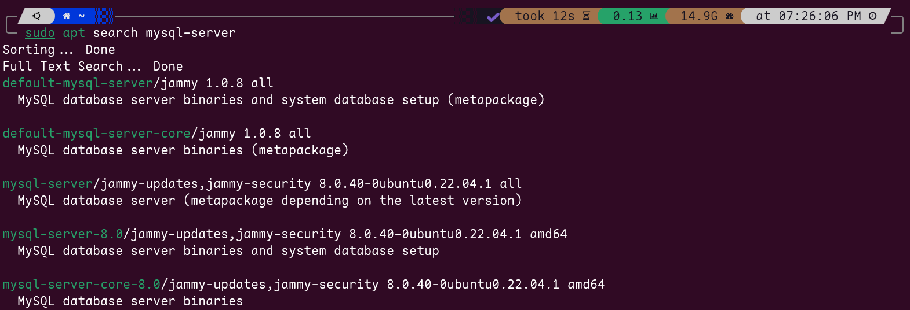
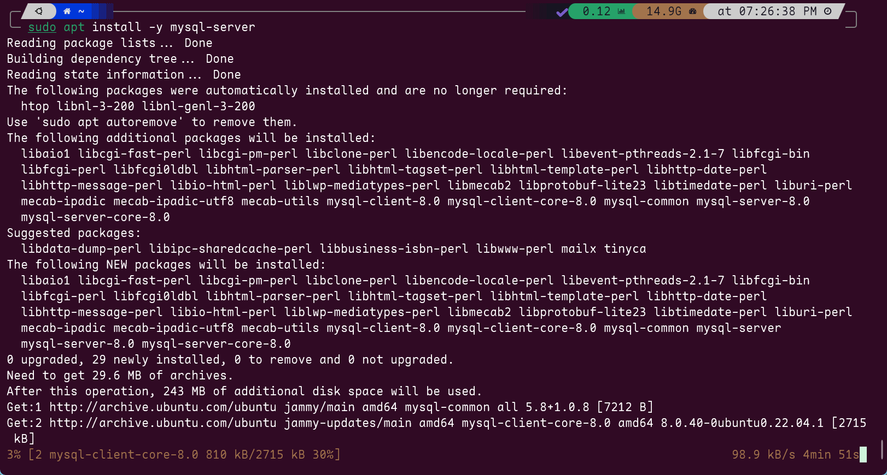
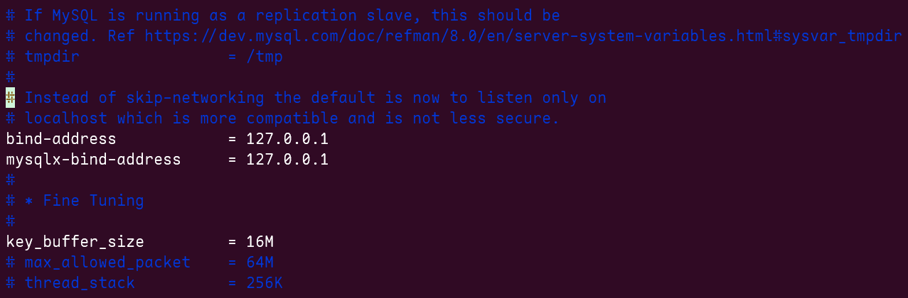

# Ubuntu 22.04 LTS 上安装MySQL

!!! Warning "提醒自己"
    安装教程只能是参考，看教程的时间不一样、数据库操作系统依赖库版本不一样、是否是虚拟环境云环境wsl环境，都会造成不一样的执行效果，
    只能是参考，表示这个时间节点，这样做是可以成功安装的。其实这类的东西只能记录一下，确实无法当作教程，实战实在太不一样了。

## 安装前先更新依赖

``` shell
sudo apt update
```

## 查看可使用的安装包

``` shell
sudo apt search mysql-server
```



## 开始安装

``` shell
# 安装最新版本
sudo apt install -y mysql-server
# 安装指定版本
sudo apt install -y mysql-server-8.0
```



## 启动MySQL服务

``` shell
sudo systemctl start mysql
# 开机自启
sudo systemctl enable mysql
```

## 检查MySQL状态

``` shell
sudo systemctl status mysql
```

## 修改密码、权限

``` shell
# 登录mysql，在默认安装时如果没有让我们设置密码，则直接回车就能登录成功。
sudo mysql -uroot -p
# 设置密码 mysql8.0
ALTER USER 'root'@'localhost' IDENTIFIED WITH mysql_native_password BY '新密码';
# 设置密码 mysql5.7
set password=password('新密码');
# 配置IP 5.7
grant all privileges on *.* to root@"%" identified by "密码";
# 刷新缓存
flush privileges;
```

## 开启远程连接

``` shell
#MySQL8.0！！！
sudo vim /etc/mysql/mysql.conf.d/mysqld.cnf 
#MySQL5.7！！！
sudo vim /etc/my.cnf 
```

### 把下面的语句打开,原来是被注释的

``` shell
bind-address = 127.0.0.1
```



### 重启一下

``` shell
sudo systemctl restart mysql
```

## MySQL修改用户密码

```shell
# 语法
mysqladmin -u username -h hostname -p password "新密码"
# 示例
mysqladmin -u root -h localhost -p password "new_password"
```

## MySQL创建新用户并设置权限

```shell
# 语法
create user [用户名]@[访问地址] identified by [密码]
# 创建仅支持本地连接的用户
CREATE USER 'ach'@'localhost' IDENTIFIED BY 'password123';
# 创建可远程连接的用户，%表示支持任何地址的连接
CREATE USER 'ach'@'%' IDENTIFIED BY 'password123';
```

授予权限的语法就复杂一些，你要受哪些权限，如增删改查，授予哪些库的哪些表的权限[^1]
[^1]: 参考链接：https://cloud.tencent.com/developer/article/1656008

```shell
# 看你的类型支不支持远程连接，这里是所有权限
GRANT ALL PRIVILEGES ON *.* TO 'ach'@'localhost' WITH GRANT OPTION;
GRANT ALL PRIVILEGES ON *.* TO 'ach'@'%' WITH GRANT OPTION;
```

!!! Danger ""

    一定要记得刷新权限!
    ```shell
    FLUSH PRIVILEGES;
    ```