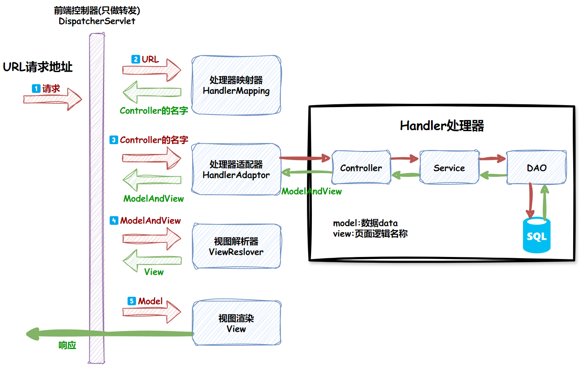

## 26.HashTable和HashMap的区别

#### 1.继承父类不同

Hashtable继承自Dictionary类，而HashMap继承自AbstractMap类；但 **二者都实现了Map接口** 。

#### 2.线程的安全性

1. **HashTable是同步**(方法中使用了Synchronized)的；**而HashMap是未同步**（方法中缺省Synchronized）的。
2. **Hashtable 线程安全**，因为它每个方法中都加入了Synchronize，在多线程并发的环境下，可以直接使用Hashtable，不需自己在加同步；
3. **HashMap线程不安全**，因为HashMap底层是一个Entry数组，当发生hashmap冲突的时候，hashmap是采用链表的方式来解决的，在对应的数组位置存放链表的头结点。对链表而言，新加入的节点会从头结点加入。

#### 3.是否有contains方法

1. HashTable有一个contains(Object value)方法，功能和containsValue方法(Object value)功能一样。
2. HashMap把Hashtable的contains方法去掉了，改成containsValue和containsKey。

#### 4.可否允许有null值

key、value都是对象，但是不能拥有重复key值，value值可以重复出现。

1. **Hashtable中，key和value都不允许出现null值。**
2. **HashMap允许null值(key和value都可以)，因为在HashMap中null可以作为健，而它对应的值可以有多个null。**

#### 5.遍历方式内部实现不同

HashTable使用Enumeration，HashMap使用Iterator。

#### 6.hash值不一样

1.HashTable直接使用对象的hashCode，如下：

```java
//hashCode是jdk根据对象的地址或者字符串或者数字算出来的int类型的数值
int hash = key.hashCode();
int index = (hash & 0x7FFFFFFF) % tab.length;
```

2.HashMap要重新计算key值和hash值，如下：

```java
int hash = hash(k);
int i = indexFor(hash, table.length);

static int hash(Object x) {
　　int h = x.hashCode();

　　h += ~(h << 9);
　　h ^= (h >>> 14);
　　h += (h << 4);
　　h ^= (h >>> 10);
　　return h;
}
static int indexFor(int h, int length) {
　　return h & (length-1);
}
```

#### 7.数组初始化和扩容不同

1.HashTable中hash数组默认大小是11，增加的方式是 arr*2+1。

2.HashMap中hash数组的默认大小是16，而且一定是2的指数。

## 27.BeanFactory和FactoryBean的区别

!!! Note "区别"
    **BeanFactory是个Factory**，也就是IOC容器或对象工厂，**FactoryBean是个Bean**。在Spring中，<u>所有的Bean都是由BeanFactory(也就是IOC容器)来进行管理的</u>。但对FactoryBean而言，这个Bean不是简单的Bean，<u>而是一个能生产或者修饰对象生成的工厂Bean</u>，它的实现与设计模式中的工厂模式和修饰器模式类似。

## 28.Java线程通信方式

**①、同步**

**②、while轮询的方式**

**③、wait/notify机制**

**④、管道通信** 就是使用java.io.PipedInputStream 和 java.io.PipedOutputStream进行通信

## 29.Spring依赖注入方式

## 30.springMVC执行流程



## 31.如何保证线程安全

## 32.mysql优化方式

## 33.MySQL引擎innodb优势

MySQL 有多种存储引擎，每种存储引擎有各自的优缺点，可以择优选择使用

!!! Note "有哪些引擎"
    MyISAM、InnoDB、MERGE、MEMORY(HEAP)、BDB(BerkeleyDB)、EXAMPLE、FEDERATED、ARCHIVE、CSV、BLACKHOLE

1. **事务支持：** InnoDB 提供了对事务的完整支持，包括 ACID（原子性、一致性、隔离性、持久性）属性。这使得 InnoDB 适用于需要高度数据一致性和可靠性的应用程序，如金融系统和在线交易系统。
2. **行级锁定：** <wavy>InnoDB 使用行级锁定来进行并发控制</wavy>，而不是表级锁定。这意味着多个事务可以同时操作同一表的不同行，提高了并发性和性能。行级锁定还减小了死锁的风险，相对于表级锁定更灵活。
3. **外键约束：** InnoDB 支持外键，这是关系型数据库中重要的特性之一。外键用于维护表与表之间的关系完整性，确保引用完整性和一致性。
4. **崩溃恢复：** InnoDB 提供了崩溃恢复机制，通过事务日志（transaction log）和重做日志（redo log）来确保数据库在发生故障或崩溃时可以恢复到一致的状态。
5. **自动增长列：** InnoDB 支持自动增长列，使得在插入数据时不必手动指定主键的值。这简化了开发人员的工作，并提高了应用程序的易用性。
6. **热备份：** InnoDB 支持热备份（Hot Backup），可以在数据库运行的同时进行备份，而不需要停止数据库服务。这有助于提高数据库的可用性和灵活性。
7. **MVCC（多版本并发控制）：** InnoDB 使用 MVCC 来支持并发控制，允许读取操作不被写入操作阻塞。每个事务在执行时都会创建一个快照，从而允许并发读取，而不会造成读取脏数据。
8. **自适应哈希索引和全文本索引：** <wavy>InnoDB 引擎支持自适应哈希索引</wavy>，这有助于提高查询性能。此外，它还支持全文本索引，用于进行全文搜索操作。

## 34.spring事务机制

## 35.数据库事务隔离

**`脏读`**：所谓的脏读，其实就是读到了别的事务回滚前的脏数据。比如事务B执行过程中修改了数据X，在未提交前，事务A读取了X，而事务B却回滚了，这样事务A就形成了脏读。也就是说，<wavy>**当前事务读到的数据是别的事务想要修改成为的但是没有修改成功的数据**</wavy>。

**`不可重复读`**：事务A首先读取了一条数据，然后执行逻辑的时候，事务B将这条数据改变了，然后事务A再次读取的时候，发现数据不匹配了，就是所谓的不可重复读了。也就是说，<wavy>**当前事务先进行了一次数据读取，然后再次读取到的数据是别的事务修改成功的数据，导致两次读取到的数据不匹配**</wavy>，也就照应了不可重复读的语义。

**`幻读`**：事务A首先根据条件索引得到N条数据，然后事务B改变了这N条数据之外的M条或者增添了M条符合事务A搜索条件的数据，导致事务A再次搜索发现有N+M条数据了，就产生了幻读。也就是说，<wavy>**当前事务读第一次取到的数据比后来读取到数据条目不一致**</wavy>。

## 36.什么是偏向锁，锁的升级过程

## TCP/IP三次握手四次挥手

### 三次握手

假设发送端为客户端，接收端为服务端。开始时客户端和服务端的状态都是CLOSED。


!!! Note ""
    - **第一次握手**：客户端向服务端发起建立连接请求，客户端会随机生成一个起始序列号x，客户端向服务端发送的字段中包含标志位SYN=1，序列号seq=x。第一次握手前客户端的状态为CLOSE，第一次握手后客户端的状态为SYN-SENT。此时服务端的状态为LISTEN。

    - **第二次握手**：服务端在收到客户端发来的报文后，会随机生成一个服务端的起始序列号y，然后给客户端回复一段报文，其中包括标志位SYN=1，ACK=1，序列号seq=y，确认号ack=x+1。第二次握手前服务端的状态为LISTEN，第二次握手后服务端的状态为SYN-RCVD，此时客户端的状态为SYN-SENT。（其中SYN=1表示要和客户端建立一个连接，ACK=1表示确认序号有效）

    - **第三次握手**：客户端收到服务端发来的报文后，会再向服务端发送报文，其中包含标志位ACK=1，序列号seq=x+1，确认号ack=y+1。第三次握手前客户端的状态为SYN-SENT，第三次握手后客户端和服务端的状态都为ESTABLISHED。

    - **此时连接建立完成**。

### 两次握手可以吗？

<wavy>第三次握手主要为了防止已失效的连接请求报文段突然又传输到了服务端，导致产生问题</wavy>。

- 比如客户端A发出连接请求，可能因为网络阻塞原因，A没有收到确认报文，于是A再重传一次连接请求。
- 连接成功，等待数据传输完毕后，就释放了连接。
- 然后A发出的第一个连接请求等到连接释放以后的某个时间才到达服务端B，此时B误认为A又发出一次新的连接请求，于是就向A发出确认报文段。
- 如果不采用三次握手，只要B发出确认，就建立新的连接了，此时A不会响应B的确认且不发送数据，则B一直等待A发送数据，浪费资源。

### 四次挥手


1. A的应用进程先向其TCP发出连接释放报文段（FIN=1，seq=u），并停止再发送数据，主动关闭TCP连接，进入FIN-WAIT-1（终止等待1）状态，等待B的确认。
2. B收到连接释放报文段后即发出确认报文段（ACK=1，ack=u+1，seq=v），B进入CLOSE-WAIT（关闭等待）状态，此时的TCP处于半关闭状态，A到B的连接释放。
3. A收到B的确认后，进入FIN-WAIT-2（终止等待2）状态，等待B发出的连接释放报文段。
4. B发送完数据，就会发出连接释放报文段（FIN=1，ACK=1，seq=w，ack=u+1），B进入LAST-ACK（最后确认）状态，等待A的确认。
5. A收到B的连接释放报文段后，对此发出确认报文段（ACK=1，seq=u+1，ack=w+1），A进入TIME-WAIT（时间等待）状态。此时TCP未释放掉，需要经过时间等待计时器设置的时间2MSL（最大报文段生存时间）后，A才进入CLOSED状态。B收到A发出的确认报文段后关闭连接，若没收到A发出的确认报文段，B就会重传连接释放报文段。 

### 第四次挥手为什么要等待2MSL？

**保证A发送的最后一个ACK报文段能够到达B**。这个ACK报文段有可能丢失，B收不到这个确认报文，就会超时重传连接释放报文段，然后A可以在2MSL时间内收到这个重传的连接释放报文段，接着A重传一次确认，重新启动2MSL计时器，最后A和B都进入到CLOSED状态，若A在TIME-WAIT状态不等待一段时间，而是发送完ACK报文段后立即释放连接，则无法收到B重传的连接释放报文段，所以不会再发送一次确认报文段，B就无法正常进入到CLOSED状态。

**防止已失效的连接请求报文段出现在本连接中**。A在发送完最后一个ACK报文段后，再经过2MSL，就可以使这个连接所产生的所有报文段都从网络中消失，使下一个新的连接中不会出现旧的连接请求报文段。

### 为什么是四次挥手？

因为当Server端收到Client端的SYN连接请求报文后，可以直接发送SYN+ACK报文。**但是在关闭连接时，当Server端收到Client端发出的连接释放报文时，很可能并不会立即关闭SOCKET**，所以Server端先回复一个ACK报文，告诉Client端我收到你的连接释放报文了。只有等到Server端所有的报文都发送完了，这时Server端才能发送连接释放报文，之后两边才会真正的断开连接。故需要四次挥手。

------

## 37.shiro中SSO实现过程

## 38.你负责的什么模块，怎么样的模块你可以胜任，你的技术长处优势是什么？就是你感觉自己的哪些技术是别人达不到的

## 39.MySQL底层的数据结构是什么，说一下？

B+树：

## 40.MySQL与Redis如何保证数据一致

当Redis和MySQL之间出现消息不一致的情况时，可以考虑以下几种解决方案： 

### 1️⃣只读缓存
在这种模式下，更新数据时先更新数据库，然后删除缓存中的对应条目。这样，当缓存被删除后，下次读取该数据时会触发缓存缺失，从而从数据库中重新加载数据。

!!! Note ""
    **优点：** 简单易实现。减少了缓存与数据库之间的一致性问题。

    **缺点：** 如果删除缓存失败，可能会导致数据不一致。可能会导致缓存穿透问题，即缓存中没有的数据却不断地被请求，导致每次都去数据库中查询。

!!! Info "解决策略"
    **延时双删**：<u>删除redis &#8611; 更新数据库 &#8611; 延时500毫秒 &#8611; 删除redis</u>。这可以确保数据库操作已经完成并持久化，从而减少数据不一致的风险。

    **消息队列+异步重试**：使用消息队列来异步更新缓存，可以减少对用户请求的影响。当数据库更新后，发送一条更新缓存的消息到消息队列，由另一个进程监听消息队列并更新缓存。

### 2️⃣读写缓存
在这种模式下，更新数据时同时更新数据库和缓存。这种方法要求更新操作具有原子性，以确保数据库和缓存同时被更新或同时失败。

!!! Note ""
    **优点：** 数据一致性更好。

    **缺点：** 实现复杂度较高。如果缓存更新失败，可能会导致数据不一致。

!!! Info "解决策略"
    **同步直写**：使用事务来保证缓存和数据库更新的原子性。

    **分布式锁**：在更新数据时，使用分布式锁来确保同一时间只有一个线程可以更新数据库和缓存。

### 3️⃣基于消息队列的异步更新
这种方法通过消息队列来异步更新缓存，可以减少对用户请求的影响。当数据库更新后，发送一条更新缓存的消息到消息队列，由另一个进程监听消息队列并更新缓存。

!!! Note ""
    **优点：** 可以减少对用户请求的影响。可以通过重试机制来保证数据的一致性。

    **缺点：** 需要确保消息不会因为网络等原因丢失。高并发情况下需要处理消息积压的问题。

### 4️⃣订阅 MySQL 的 Binlog
利用 MySQL 的 Binlog（二进制日志）来异步同步数据。这种方法可以减少数据不一致的时间窗口，但仍然存在极小的延迟。

!!! Note ""
    **优点：** 可以减少数据不一致的时间窗口。实现较为复杂，需要额外的维护成本。

    **缺点：** 实现较为复杂，需要额外的维护成本。可能存在一定的延迟。

!!! Example "简短一点好记"
    1. **数据同步机制**：可以通过定时任务或者触发器等方式，**定期将MySQL中的数据同步到Redis中**，确保数据的一致性。这种方式适用于数据量较小且对实时性要求不高的场景。(订阅binlog)
    2. **双写模式**：在写入MySQL数据时，同时写入Redis中，确保数据的一致性。这种方式可以在应用层面实现，但需要考虑并发写入的问题，如使用分布式锁来保证数据的一致性。
    3. **异步队列**：将MySQL的变更操作写入消息队列，然后由消费者异步处理并更新Redis中的数据。这种方式可以降低对MySQL的写入压力，并提高系统的可扩展性和容错性。
    4. **读写分离**：将读操作从Redis中获取数据，写操作则直接操作MySQL，通过将读写分离可以减少对Redis和MySQL之间的数据一致性要求。但需要注意同步问题，即写入MySQL后需要及时更新Redis中的数据。
    5. **使用分布式事务**：如果业务场景中需要保证强一致性，可以考虑使用<u>分布式事务</u>来确保Redis和MySQL的数据一致性。可以使用分布式事务框架，如Seata、TCC等来实现。
    6. **采用延迟双删策略**：<u>删除redis &#8611; 更新数据库 &#8611; 延时500毫秒 &#8611; 删除redis</u>
    7. **消息队列方式**

## 41.MySQL一二级缓存，和缓存实现

## 42.说一下线程池中的阻塞队列

## 43.数据库的复合索引

https://www.begtut.com/mysql/mysql-tutorial.html

## 44.怎么把一张表的数据插入到另一张表

## 45.你在项目中遇到过的最大的难点是什么

------

## 46.乐观锁和悲观锁的区别

**悲观锁**：悲观锁在操作数据时比较悲观，认为别人会同时修改数据。因此<wavy>**操作数据时直接把数据锁住，直到操作完成后才会释放锁；上锁期间其他人不能修改数据**</wavy>。**适合写操作比较多的场景，写可以保证写操作时数据正确**

!!! Note ""
    假定会发生并发冲突，屏蔽一切可违反数据完整性的操作，同一时刻只能有一个线程执行写操作

    悲观锁认为竞争总是会发生，因此每次对某资源进行操作时，都会持有一个独占的锁,就像synchronized,不管三七二十一，直接上了锁就操作资源了。

    例如：synchronized，Lock，WriteReadLock

**乐观锁**：乐观锁在操作数据时非常乐观，认为别人不会同时修改数据。因此<wavy>**乐观锁操作数据不会上锁，只是在执行更新的时候判断一下在此期间别人是否修改了数据：如果别人修改了数据则放弃操作，否则执行操作**</wavy>。**适合读操作比较多的场景，不加锁的特点可以使其读操作的性能大幅提升**

!!! Note ""
    假设不发生冲突，只在提交操作时检查是否违反数据完整性，多个线程可以并发执行写操作，但是只能有一个线程执行写操作成功。

    乐观锁认为竞争不总是会发生，因此它不需要持有锁，将”比较-替换”这两个动作作为一个原子操作尝试去修改内存中的变量，如果失败则表示发生冲突，那么就应该有相应的重试逻辑。

    例如：Java中的CAS算法(依赖硬件CPU)、AtomicInteger

------

## 47.volatile相关

**被volatile修饰的变量能够保证每个线程能够获取该变量的最新值，从而避免出现数据脏读的现象。**

一旦一个共享变量（类的成员变量、类的静态成员变量）被volatile修饰之后，那么就具备了两层语义：

#### ①、保证了不同线程对共享变量进行操作时的可见性(尤其是多核和多CPU场景下)，即一个线程修改了某个变量的值，这新值对其他线程来说是立即可见的。

!!! Note ""
    （1）当写一个volatile变量时，JMM会把该线程本地内存中的变量强制刷新到主内存中去；<br>
    （2）这个写会操作会导致其他线程中的volatile变量缓存无效。

#### ②、禁止进行指令重排序，可以保证步骤的执行顺序是一定的，即有序性。(例如count++底层会有三个步骤)JVM底层执行时会对指令进行重排序的优化。

重排序是指编译器和处理器为了优化程序性能而对指令序列进行排序的一种手段。重排序需要遵守一定规则：

 * （1）**<u>重排序操作不会对存在数据依赖关系的操作进行重排序。</u>**

   比如：a=1;b=a; 这个指令序列，由于第二个操作依赖于第一个操作，所以在编译时和处理器运行时这两个操作不会被重排序。

 * （2）**<u>重排序是为了优化性能，但是不管怎么重排序，单线程下程序的执行结果不能被改变</u>**

   比如：a=1;b=2;c=a+b这三个操作，第一步（a=1)和第二步(b=2)由于不存在数据依赖关系，所以可能会发生重排序，但是c=a+b这个操作是不会被重排序的，因为需要保证最终的结果一定是c=a+b=3。重排序在单线程下一定能保证结果的正确性，但是在多线程环境下，可能发生重排序，影响结果

#### ③、不保证原子性(例如不能保证一个线程执行完count++的所有指令后其它线程才能执行)

#### ④、volatile原理

volatile可以保证线程可见性且提供了一定的有序性，但是无法保证原子性。

在JVM底层volatile是采用"<u>内存屏障</u>"来实现的。观察加入volatile关键字和没有加入volatile关键字时所生成的汇编代码发现，**加入volatile关键字时，会多出一个lock前缀指令，lock前缀指令实际上相当于一个内存屏障（也成内存栅栏）**，内存屏障会提供3个功能;

!!! Note ""
    （1）它确保指令重排序时不会把其后面的指令排到内存屏障之前的位置，也不会把前面的指令排到内存屏障的后面;即在执行到内存屏障这句指令时，在它前面的操作已经全部完成;<br>
    （2）它会强制将对缓存的修改操作立即写入主存;<br>
    （3）如果是写操作，它会导致其他CPU中对应的缓存行无效。

------

## 48.*SQL语句优化(选择几条) 

遇到性能慢的sql语句，不要一上来就想着等价改写，<wavy>先通过索引进行优化，合理的索引能解决90%的性能问题</wavy>。如果索引都解决不了的情况下，才去尝试使用等价改写来进行优化sql，一般来说等价改写能解决剩下5%的问题。如果连等价改写都解决不了剩下的5%的性能问题话，就要尝试改业务，或者改数据库技术栈来解决问题了，这种通常来说成本会非常高。

!!! Danger "常考重要"
    1、Where 子句中：**where 表之间的连接必须写在其他 Where 条件之前**，那些可以过滤掉最大数量记录的条件必须写在 Where 子句的末尾.HAVING 最后<br>
    2、**用 `EXISTS` 替代 `IN`、用 `NOT EXISTS` 替代 `NOT IN`**<br>
    3、**避免在索引列上进行计算或使用函数，因为这将导致索引不被使用**<br>
    4、**避免在索引列上使用 `IS NULL` 和 `IS NOT NULL`**<br>
    5、对查询进行优化，应尽量避免全表扫描，首先应<u>**考虑在 where 及 order by 涉及的列上建立索引**</u><br>
    6、应尽量避免在 where 子句中对字段进行 null 值判断，否则将导致引擎放弃 使用索引而进行全表扫描<br>
    7、应尽量避免在 where 子句中对字段进行表达式操作，这将导致引擎放弃使用索引而进行全表扫描<br>
    8、**使用`连接（JOIN）`替代子查询**：子查询的性能较差，可以尝试使用连接（JOIN）来替代子查询，以提高查询性能。<br>
    9、**使用LIMIT限制结果集大小**：在查询时使用`LIMIT`来限制结果集的大小，避免返回过多的数据。<br>
    10、**避免使用`SELECT*`**<br>
    11、**避免过多的连接和嵌套查询**：过多的连接和嵌套查询会导致查询性能下降，可以考虑优化查询逻辑，减少连接和嵌套查询的使用。<br>
    12、**隐式类型转换造成不使用索引**<br>
    13、**尽量避免使用 `or`，会导致数据库引擎放弃索引进行全表扫描**<br>
    14、**尽量避免在字段开头模糊查询，会导致数据库引擎放弃索引进行全表扫描。**<br>
    ```sql
    SELECT ？？？ FROM 表名 WHERE username LIKE '%陈%'
    ```
    优化方式：尽量在字段后面使用模糊查询。如下：<br>
    ```sql
    SELECT ？？？ FROM 表名 WHERE username LIKE '陈%'
    ```

[相关链接🔗收藏!](https://juejin.cn/post/7379816515552641050)

### Mysql Explain使用分析


- ①【id】：查询的标识符，表示查询的执行顺序。
- ②【select_type】：查询类型，如 `SIMPLE`（简单查询），`PRIMARY`（主查询），`UNION`（联合查询的一部分），`SUBQUERY`（子查询）。
- ③【table】：查询涉及的表
- ④【type】：连接类型，表示MySQL如何查找行。常见类型按效率从高到低排列为：
    - `system`：表只有一行（常见于系统表）。
    - `const`：表最多有一个匹配行（索引为主键或唯一索引）。
    - `eq_ref`：对于每个来自前一个表的行，表中最多有一个匹配行。
    - `ref`：对于每个来自前一个表的行，表中可能有多个匹配行。
    - `range`：使用索引查找给定范围的行。
    - `index`：全表扫描索引。
    - `ALL`：全表扫描。
- ⑤【possible_keys】：查询中可能使用的索引。
- ⑥【key】：实际使用的索引。
- ⑦【key_len】：使用的索引键长度。
- ⑧【ref】：使用的列或常量，与索引比较。
- ⑨【rows】：MySQL 估计的要读取的行数。
- ⑩【filtered】：经过表条件过滤后的行百分比。
- ⑪【Extra】：额外的信息，如 `Using index`（覆盖索引），`Using where`（使用 WHERE 子句过滤），`Using filesort`（文件排序），`Using temporary`（使用临时表）。

------

## 49.聚簇索引与非聚簇索引
**聚簇索引**:找到了索引就找到了需要的数据，那么这个索引就是聚簇索引，所以<wavy>主键就是聚簇索引</wavy>，修改聚簇索引其实就是修改主键。<br>
**非聚簇索引**:索引的存储和数据的存储是分离的，也就是说<wavy>找到了索引但没找到数据，需要根据索引上的值(主键)再次回表查询,非聚簇索引也叫做辅助索引</wavy>。

比如有一张表：
```sql
create table student (
    id bigint,
    no varchar(20) ,
    name varchar(20) ,
    address varchar(20) ,
    PRIMARY KEY (`branch_id`) USING BTREE,
    UNIQUE KEY `idx_no` (`no`) USING BTREE
)ENGINE=InnoDB DEFAULT CHARSET=utf8 ROW_FORMAT=DYNAMIC;
```

第一种，直接根据主键查询获取所有字段数据，此时主键是聚簇索引，因为主键对应的索引叶子节点存储了id=1的所有字段的值。
```sql
select * from student where id = 1
```

第二种，根据编号查询编号和名称，编号本身是一个唯一索引，但查询的列包含了学生编号和学生名称，当命中编号索引时，
该索引的节点的数据存储的是主键ID，需要根据主键ID重新查询一次，所以这种查询下no不是聚簇索引。
```sql
select no,name from student where no = 'test'
```

第三种，我们根据编号查询编号（有人会问知道编号了还要查询？要，你可能需要验证该编号在数据库中是否存在），
这种查询命中编号索引时，直接返回编号，因为所需要的数据就是该索引，不需要回表查询，这种场景下no是聚簇索引
```sql
select no from student where no = 'test'
```

## 50.spring bean提供了哪些拓展接口

**FactoryBean、BeanPostProcessor、BeanFactoryPostProcessor、 InitialingBean和DisposableBean BeanNameAware、ApplicationContextAware和BeanFactoryAware、InstantiationAwareBeanPostProcessor**

[查看详细解释](https://www.cnblogs.com/xrq730/p/5721366.html)
