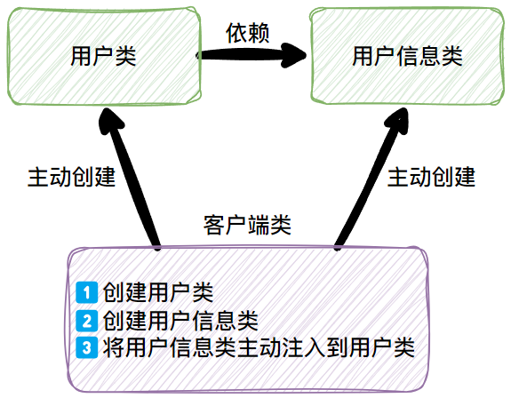
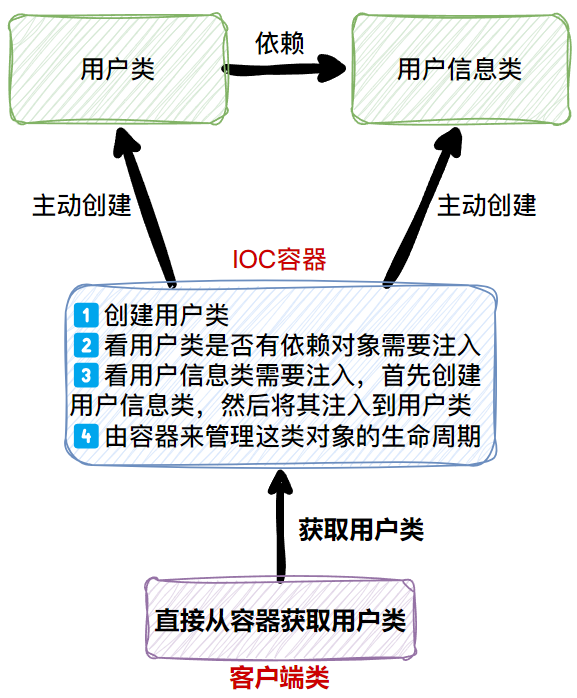

## 51.消息队列(Kafka)的应用场景

传统的消息队列的主要应用场景：<u>**缓存/消峰、解耦和异步通信**</u>

!!! Note ""
    1. **缓冲/消峰**：有助于控制和优化数据流经过系统的速度，解决生产消息和消费消息的处理速度不一致的情况。
    2. **解耦**：允许你独立的扩展或修改两边的处理过程，只要确保它们遵守同样的接口约束
    3. **异步通信**：允许用户把一个消息放入队列，但并不立即处理它，然后在需要的时候再去处理它们

------

## 52.消息队列的两种模式

1. **点对点模式**：消费者主动拉取数据，消息收到后清除消息

2. **发布/订阅模式**：

- 可以有多个topic主题（`分期信息上送同步流水号至订单系统返回`、`调用订单系统保存申请编码`、`请求订单系统获取材料信息`、`银数影像上送`、`获取金融网关服务编码`）
- 消费者消费数据之后，不删除数据
- 每个消费者相互独立，都可以消费到数据

------

## 53.kafka消息堆积怎么解决

1️⃣、理论上：当Kafka消息堆积时，可能会导致消费者无法及时处理消息，影响系统的性能和可用性。以下是一些解决堆积问题的常见方法：

1. **增加消费者数量**：可以通过增加消费者的数量来提高消息的处理速度。每个消费者可以并行处理多个分区的消息，从而提高整体的消费能力。 
2. **调整分区数量**：可以根据消息的产生速率和消费能力调整Kafka的分区数量。增加分区数量可以增加消息的并行处理能力，减少单个分区的消息堆积。 
3. **提高消费者的处理能力**：可以优化消费者的处理逻辑，提高消费者的处理能力。例如，使用多线程或多进程来并行处理消息，优化消费者的算法和性能等。 
4. **增加Kafka的吞吐量和性能**：可以通过调整Kafka的配置参数来提高其吞吐量和性能。例如，增加Kafka的副本数量、调整消息的批处理大小、调整Kafka的缓冲区大小等。 
5. **设置适当的消息超时时间**：可以设置适当的消息超时时间，当消息在一定时间内没有被消费者处理时，可以进行重试或其他处理，避免消息长时间堆积。 
6. **监控和报警**：可以设置监控和报警机制，及时发现消息堆积的情况，并采取相应的措施进行处理。 需要根据具体的业务场景和需求来选择合适的解决方法。

同时，还需要综合考虑系统的 **硬件资源、网络带宽、数据量** 等因素，以及平衡消费者的处理能力和Kafka的吞吐量，以达到合理的消息处理效率。

2️⃣、根据生产经验：数据积压（消费者如何提高吞吐量）

1. 如果是Kafka消费能力不足，则可以考虑 **增加Topic的分区数** ，并且同时提升消费组的消费者
2. 如果是下游的数据处理不及时：**提高每批次拉取的数量**。批次拉取数据过少（拉取数据/处理时间 < 生产速度），使处理的数据小于生产的数据，也会造成数据积压。

------

## 54.kafka重复消费怎么解决

Kafka的重复消费问题是指消费者在处理消息时，由于一些原因（如消费者故障、网络问题等）导致消息被重复消费。以下是一些解决Kafka重复消费问题的方法： 

1. **设置消费者的消费位移提交方式（自动提交->手动提交）**：Kafka提供了两种消费位移提交方式，分别是自动提交和手动提交。如果使用自动提交方式，当消费者处理完消息后，Kafka会自动提交消费位移。但如果消费者在处理消息之后发生故障，可能会导致消息被重复消费。因此，建议使用手动提交方式，即消费者在处理完消息后手动提交消费位移，确保消息被正确处理。 
2. **设置消费者的消费位移存储方式**：Kafka支持将消费位移存储在ZooKeeper或者Kafka自身的__consumer_offsets主题中。如果使用ZooKeeper来存储消费位移，可以通过设置合适的ZooKeeper会话超时时间和心跳间隔来减少重复消费的可能性。 
3. **使用幂等消费**：Kafka 0.11版本及以上的版本支持幂等消费，即消费者可以通过设置enable.idempotence=true来确保消息的幂等性。这样即使消费者在处理消息时发生重试，也不会导致消息被重复消费。 
4. **使用唯一标识符进行消息去重**：在消费者处理消息时，可以为每条消息生成一个唯一的标识符，并将该标识符与已消费的消息进行比对，避免重复消费。
5. **使用消息的业务主键进行去重**：如果消息中包含有业务主键，可以通过在消费者端维护一个已处理的业务主键列表，避免重复消费相同的业务主键对应的消息。
6. **监控和报警**：可以设置监控和报警机制，及时发现重复消费的情况，并采取相应的措施进行处理。

需要根据具体的业务场景和需求来选择合适的解决方法，并综合考虑消息处理的幂等性、性能开销等因素。

------

## 55.Kafka消息乱序怎么办

当Kafka消息乱序时，可以采取以下几种方法来解决： 

1. **使用消息的时间戳**：在消息中添加时间戳，消费者可以根据时间戳来对消息进行排序和处理。这种方法适用于消息的时间戳与消息的顺序相关的场景。
2. **使用消息的序列号**：在消息中添加序列号，消费者可以根据序列号来对消息进行排序和处理。这种方法适用于消息的序列号与消息的顺序相关的场景。
3. **使用分区**：将消息分发到不同的分区中，每个分区只能由一个消费者进行消费。这样可以保证每个分区内的消息是有序的，但不同分区之间的消息可能是乱序的。
4. **使用全局顺序**：将所有消息发送到同一个分区中，这样可以保证所有消息的全局顺序。但是这种方法可能会导致性能瓶颈，因为只有一个消费者可以消费该分区。
5. **使用有序消息中间件**：使用支持有序消息的中间件，如RocketMQ等。这些中间件可以保证消息的有序性，但是需要引入新的中间件。

总之，根据具体的业务场景和需求，可以选择适合的方法来解决Kafka消息乱序的问题。

------

## 56.Kafka消息丢失怎么办

------

## 57.说说MySQL中的B+树

1. <wavy>**所有叶子节点包含数据**</wavy>：在 B+Tree 中，所有的数据都存储在叶子节点上，而非叶子节点仅用于索引和导航。
2. <wavy>**叶子节点通过指针相连**</wavy>：这使得范围查询更加高效，因为可以沿着指针遍历叶子节点。
3. <wavy>**多路平衡查找树**</wavy>：每个节点可以拥有多个子节点，这减少了树的高度，从而减少了磁盘 I/O 的次数。
4. <wavy>**自平衡**</wavy>：在插入或删除节点时，B+树会通过分裂或合并节点来保持树的平衡。

!!! Note "B+树的优点"
    - **减少磁盘 I/O**：B+树的每个节点可以存储更多的键值对，从而减少了树的高度，进而减少了磁盘 I/O 次数。
    - **范围查询高效**：叶子节点之间的链接使得范围查询非常高效。
    - **自平衡**：B+树通过分裂和合并节点保持平衡，从而保证了查询效率。

#### InnoDB 存储引擎中的B+树

在 MySQL 的 InnoDB 存储引擎中，B+树主要用于实现各种索引，包括主键索引、唯一索引和普通索引等。

!!! Note ""
    **主键索引**：InnoDB 表的<wavy>主键索引是一个B+树，存储了表中的所有行</wavy>。在 InnoDB 中，主键索引也被称为聚集索引，因为数据行实际存储在主键索引的叶子节点上。<br>
    **辅助索引**：除了主键索引外，InnoDB 还可以创建其他索引，这些索引称为辅助索引或二级索引（Secondary Indexes）。辅助索引的叶子节点存储了主键值和索引列的值。

------

## 58.Redis缓存击穿、穿透、雪崩概念及解决方案

### 缓存击穿的概念

<wavy>​缓存击穿是指一个请求要访问的数据，**缓存中没有，但数据库中有**</wavy>。

<wavy>这种情况一般来说就是缓存过期了</wavy>。但是这时由于并发访问这个缓存的用户特别多，**这是一个热点key**，这么多用户的请求同时过来，在缓存里面都没有取到数据，所以又同时去访问数据库取数据，引起数据库流量激增，压力瞬间增大，直接崩溃给你看。

​所以一个数据有缓存，每次请求都从缓存中快速的返回了数据，但是某个时间点缓存失效了，某个请求在缓存中没有请求到数据，这时候我们就说这个请求就"击穿"了缓存。


### 缓存击穿的解决方案

#### 1、方案一 互斥锁

互斥锁方案的思路就是如果从redis中没有获取到数据，就让一个线程去数据库查询数据，然后构建缓存，其他的线程就等着，过一段时间后再从redis中去获取。


伪代码如下:

```java
String get(String ycf) {
    String music = redis.get(ycf);
    if (music == null) {
        //nx的方式设置一个key=ycf_lock,
        //value=y_lock的数据，60秒后过期
        if (redis.set("ycf_lock", "y_lock","nx",60)) {
            //从数据库里获取数据
            music = db.query(ycf);
            //构建数据,24*60*60s后过期
            redis.set(ycf, music,24*60*60);
            //构建成功，可以删除互斥锁
            redis.delete("ycf_lock");
        } else {
            //其他线程休息100ms后重试
            Thread.sleep(100);
            //再次获取数据，如果前面在100ms内设置成功,则有数据
            music = redis.get(ycf);
        }
    }
}
```

这个方案能解决问题，但是一个线程构建缓存的时候，另外的线程都在睡眠或者轮询。

而且在这个四处宣讲高并发,低延时的时代，你居然让你的用户等待了宝贵的100ms。有可能别人比你快100ms，就抢走了大批用户。

#### 2、方案二 后台续命

后台续命方案的思想就是，**后台开一个定时任务，专门主动更新即将过期的数据。**

比如程序猿设置jay这个热点key的时候，同时设置了过期时间为60分钟，那后台程序在第55分钟的时候，会去数据库查询数据并重新放到缓存中，同时再次设置缓存为60分钟。

#### 3、方案三 永不过期

这个方案就有点简单粗暴了。

见名知意，如果结合实际场景你用脚趾头都能想到这个key是一个热点key，会有大量的请求来访问这个数据。对于这样的数据你还设置过期时间干什么？直接放进去，永不过期。


但是具体情况具体分析，没有一套方案走天下的。

​比如，如果这个key是属于被各种"自来水"活生生的炒热的呢？就像哪吒一样，你预想不到这个key会闹出这么大的动静。这种情况你这么处理？

​所以，具体情况，具体分析。但是思路要清晰，最终方案都是常规方案的组合或者变种。

## 二、缓存穿透

### 缓存穿透的概念

 缓存穿透是指一个请求要访问的数据，**缓存和数据库中都没有**，而用户短时间、高密度的发起这样的请求，每次都打到数据库服务上，给数据库造成了压力。一般来说这样的请求属于恶意请求。


 根据图片显示的，缓存中没有获取到数据，然后去请求数据库，没想到数据库里面也没有。

### 缓存穿透的解决方案

#### 1、方案一 缓存空对象

 缓存空对象就是在数据库即使查到的是空对象，我们也把这个空对象缓存起来。


缓存空对象，下次同样请求就会命中这个空对象，缓存层就处理了这个请求，不会对数据库产生压力。

​这样实现起来简单，开发成本很低。但这样随之而来的问题必须要注意一下：

!!! Question "第一个问题"
    **如果在某个时间，缓存为空的记录，在数据库里面有值了，你怎么办？**

​我知道三个解决方法：

!!! Note ""
    解决方法一：设置缓存的时候，同时设置一个过期时间，这样过期之后，就会重新去数据库查询最新的数据并缓存起来。<br>
    解决方法二：如果对实时性要求非常高的话，那就写数据库的时候，同时写缓存。这样可以保障实时性。<br>
    解决方法三：如果对实时性要求不是那么高，那就写数据库的时候给消息队列发一条数据，让消息队列再通知处理缓存的逻辑去数据库取出最新的数据。

!!! Question "第二个问题"
    **对于恶意攻击，请求的时候key往往各不相同，且只请求一次，那你要把这些key都缓存起来的话，因为每个key都只请求一次，那还是每次都会请求数据库，没有保护到数据库呀？**

​    这个时候，你就告诉他:"布隆过滤器，了解一下"。

#### 2、方案二  布隆过滤器

!!! Question "​什么是布隆过滤器?""
    <wavy>本质上布隆过滤器是一种数据结构</wavy>，比较巧妙的概率型数据结构，特点是高效地插入和查询，可以用来告诉你 “某样东西一定不存在或者可能存在”。<br>
    相比于传统的 List、Set、Map 等数据结构，<wavy>它更高效、占用空间更少，但是缺点是其返回的结果是概率性的，而不是确切的</wavy>。


!!! Danger ""
    <wavy>**当布隆过滤器说某个值存在时，这个值可能不存在；当它说不存在时，那就肯定不存在。**</wavy>

​所以布隆过滤器返回的结果是概率性的，所以它能缓解数据库的压力，并不能完全挡住，这点必须要明确。<br>
​guava组件可以开箱即用的实现一个布隆过滤器，但是guava是基于内存的，所以不太适用于分布式环境下。<br>
​要在分布式环境下使用布隆过滤器，那还得redis出马，redis可以用来实现布隆过滤器。<br>
看到了吗，redis不仅仅是拿来做缓存的。这就是一个知识点呀。

## 三、缓存雪崩

### 缓存雪崩的概念

​缓存雪崩是指缓存中 **大多数的数据** 在同一时间到达过期时间，而查询数据量巨大，这时候，又是 **缓存中没有，数据库中有** 的情况了。请求都打到数据库上，引起数据库流量激增，压力瞬间增大，直接崩溃给你看。

​和前面讲的缓存击穿不同的是，<wavy>缓存击穿指大量的请求并发查询同一条数据。</wavy>

​<wavy>缓存雪崩是不同数据都到了过期时间，导致这些数据在缓存中都查询不到，</wavy>


或是缓存服务直接挂掉了，所以缓存都没有了。


### 缓存雪崩的解决方案

#### 1、方案一 加互斥锁

​如果是大量缓存在同一时间过期的情况，那么我们可以加互斥锁。<br>
​等等，互斥锁不是前面介绍过了吗？<br>
​是的，缓存雪崩可以看成多个缓存击穿，所以也可以使用互斥锁的解决方案，这里就不再赘述。

#### 2、方案二 "错峰"过期

​如果是大量缓存在同一时间过期的情况，我们还有一种解决方案就是在设置key过期时间的时候，在加上一个短的随机过期时间，这样就能避免大量缓存在同一时间过期，引起的缓存雪崩。<br>
比如设置一类key的过期时间是10分钟，在10分钟的基础上再加上60秒的随机事件，就像这样：

```java
redis.set(key,value,10*60+RandomUtils.nextInt(0, 60),TimeUnit.SECONDS)
```

#### 3、方案三  缓存集群

​如果对于缓存服务挂掉的情况，大多原因是单点应用。那么我们可以引入redis集群，使用主从加哨兵。用Redis Cluster部署集群很方便的，可以了解一下。<br>
当然这是属于一种事前方案，在使用单点的时候，你就得考虑服务宕机后引起的问题。所以，事前部署集群，提高服务的可用性。

#### 4、方案四   限流器+本地缓存

​那你要说如果Cluster集群也挂了怎么办呢？其实这就是对服务鲁棒性的考虑：

!!! Note inline end ""
    **鲁棒性**（robustness）就是<wavy>系统的健壮性</wavy>。它是指一个程序中对可能导致程序崩溃的各种情况都充分考虑到，并且作相应的处理，在程序遇到异常情况时还能正常工作，而不至于死机。

​这个时候，可以考虑一下 **引入限流器**，比如 **Hystrix**，然后实现服务降级。
​假设你的限流器设置的一秒钟最多5千个请求，那么这个时候来了8千个请求，多出来的3000个就走降级流程，对用户进行友好提示。
​进来的这5000个请求，如果redis挂了，还是有可能会干翻数据库的，那么这个时候我们在加上如果redis挂了，
就查询类似于echcache或者guava cache本地缓存的逻辑，则可以帮助数据库减轻压力，挺过难关。

#### 5、方案五  尽快恢复

​这个没啥说的了吧?大哥，你服务挂了诶？赶紧恢复服务啊。

## 59.Redis持久化机制

### 1️⃣RDB
#### RDB优点

!!! Note ""
    1. **体积更小**：相同的数据量rdb数据比aof的小，因为rdb是紧凑型文件。
    2. **恢复更快**：因为rdb是数据的快照，基本上就是数据的复制，不用重新读取再写入内存。
    3. **性能更高**：父进程在保存rdb时候只需要fork一个子进程，无需父进程的进行其他io操作，也保证了服务器的性能。

#### RDB缺点

!!! Note ""
    1. **故障丢失**：因为rdb是全量的，我们一般是使用shell脚本实现30分钟或者1小时或者每天对redis进行rdb备份，（注，也可以是用自带的策略），但是最少也要5分钟进行一次的备份，所以当服务死掉后，最少也要丢失5分钟的数据。
    2. **耐久性差**：相对aof的异步策略来说，因为rdb的复制是全量的，即使是fork的子进程来进行备份，当数据量很大的时候对磁盘的消耗也是不可忽视的，尤其在访问量很高的时候，fork的时间也会延长，导致cpu吃紧，耐久性相对较差。

### 2️⃣AOF
#### AOF的优点

!!! Note ""
    1. **数据保证**：我们可以设置fsync策略，一般默认是everysec，也可以设置每次写入追加，所以即使服务死掉了，也最多丢失一秒数据
    2. **自动缩小**：当aof文件大小到达一定程度的时候，后台会自动的去执行aof重写，此过程不会影响主进程，重写完成后，新的写入将会写到新的aof中，旧的就会被删除掉。但是此条如果拿出来对比rdb的话还是没有必要算成优点，只是官网显示成优点而已。

#### AOF缺点

!!! Note ""
    1. **性能相对较差**：它的操作模式决定了它会对redis的性能有所损耗。
    2. **体积相对更大**：尽管是将aof文件重写了，但是毕竟是操作过程和操作结果仍然有很大的差别，体积也毋庸置疑的更大。
    3. **恢复速度更慢**：AOF 在过去曾经发生过这样的 bug： 因为个别命令的原因，导致 AOF 文件在重新载入时，无法将数据集恢复成保存时的原样。测试套件里为这种情况添加了测试： 它们会自动生成随机的、复杂的数据集， 并通过重新载入这些数据来确保一切正常。 虽然这种 bug 在 AOF 文件中并不常见， 但是对比来说， RDB 几乎是不可能出现这种 bug 的。

## 60.JVM内存模型 常见参数设置

方法区、堆、虚拟机栈、本地方法栈、程序计数器


```shell
-Xmx4096m // 设置堆内存最大值
-Xms4096m // 初始化堆内存大小
-Xmn512m  // 新生代内存配置
-Xss256k // 每个线程堆栈最大值
-XX:NewRatio=4 // 设置年轻代与年老代的比值。设置为4，则年轻代与年老代所占比值为1：4
-XX:MaxDirectMemorySize=1G //直接内存，报java.lang.OutOfMemoryError: Direct buffer memory异常可以上调这个值
```

## 61.MySQL最左匹配原则
MySQL 的最左匹配原则是指在<wavy>使用复合索引（即由多个列组成的索引）进行查询时，MySQL 会从索引的最左边开始匹配条件</wavy>。这一原则是基于 B+Tree 索引的特性而来的，因为 B+Tree 是按顺序存储数据的，因此最左边的列决定了索引的“入口”。

#### B+Tree 索引结构
在 MySQL 中，索引通常使用 B+Tree 结构来实现。B+Tree 的特点是<wavy>**所有叶子节点都包含数据，并且通过指针链接在一起。每个非叶子节点包含指向子节点的指针，并且每个节点的键按照顺序存储**</wavy>。

#### 复合索引
<wavy>复合索引是指由多个列组成的索引</wavy>。例如，一个复合索引 (col1, col2, col3) 表示索引包含三个列，按照从左到右的顺序存储数据。<wavy>在 B+Tree 中，索引的构建是从最左边的列开始的，因此最左边的列决定了索引的“入口”</wavy>。

假设有一个复合索引 `(col1, col2, col3)`，那么

!!! Note "1️⃣有效的使用"

    ```sql title="这个查询可以有效地使用索引 (col1, col2, col3)，因为它是从最左边的列 col1 开始匹配。"
    SELECT * FROM table WHERE col1 = 'value';
    ```

    ```sql title="这个查询也可以有效地使用索引 (col1, col2, col3)，因为它从最左边的列 col1 开始匹配，并且向右延伸到了第二列 col2"
    SELECT * FROM table WHERE col1 = 'value' AND col2 = 'value2';
    ```

    ```sql title="这个查询同样可以有效地使用索引 (col1, col2, col3)，因为它从最左边的列 col1 开始匹配，并且向右延伸到了第三列 col3"
    SELECT * FROM table WHERE col1 = 'value' AND col2 = 'value2' AND col3 = 'value3';
    ```

!!! Note "2️⃣部分使用"

    ```sql title="这个查询可以部分地使用索引 (col1, col2, col3)，因为它从最左边的列 col1 开始匹配，但是没有使用中间的 col2 列。尽管如此，MySQL 仍然可以使用索引的前两列来加速查询。"
    SELECT * FROM table WHERE col1 = 'value' AND col3 = 'value3';
    ```

!!! Note "3️⃣无效使用"

    ```sql title="这个查询无法有效地使用索引 (col1, col2, col3)，因为它没有从最左边的列 col1 开始匹配。MySQL 优化器可能会选择全表扫描或者其他索引（如果有适用的单列索引的话）。"
    SELECT * FROM table WHERE col2 = 'value2' AND col3 = 'value3';
    ```

-----

## 62.SpringBoot事务什么情况下会失效

[文章讲解](https://mp.weixin.qq.com/s?__biz=MzkwNjMwMTgzMQ==&mid=2247490414&idx=1&sn=b232e8931fbc754a255bde93a5a810e5&chksm=c0ebc386f79c4a9079f096acc8e5836cab99746689309c293900488a538b7489dc7d64b0ae0a&token=751314179&lang=zh_CN#rd)


-----

## 63.spring事务隔离级别

1. **DEFAULT（默认）**：使用数据库默认的隔离级别。对于大多数数据库而言，通常是 READ_COMMITTED（读已提交）。
2. **READ_UNCOMMITTED（读未提交）**：最低的隔离级别，允许一个事务读取另一个事务尚未提交的数据。这可能导致脏读、不可重复读和幻读问题。
3. **READ_COMMITTED（读已提交）**：确保一个事务只能读取另一个事务已提交的数据。这样可以避免脏读，但仍可能出现不可重复读和幻读问题。
4. **REPEATABLE_READ（可重复读）**：确保一个事务执行期间多次读取相同记录的数据时，得到的结果是一致的。这可以避免脏读和不可重复读，但仍可能出现幻读问题。
5. **SERIALIZABLE（串行化）**：最高的隔离级别，确保事务之间的执行是串行化的，完全隔离了事务。这可以避免脏读、不可重复读和幻读，但性能开销较高。

-----

## 64.spring事务特性

- **原子性**：一个事务中的所有操作，要么全部成功，要么全部失败，没有中间状态。
- **一致性**：事务执行结束后，数据库的完整性约束没有被破坏，事务执行的前后都是合法的数据状态，这是事务追求的最终状态，可以说其他的三个特性都是为了保证事务的一致性。
- **隔离性**：事务内部的操作与其他事务是隔离的，并发执行的各个事务之间不能互相干扰，严格的隔离性对应了串行化执行，但是实际操作中很少会用到串行化的隔离级别，一般来说可以分两个方面来保证隔离性。
    - A事务写对B事务写的影响：通过锁来保证
    - A事务写对B事务读的影响：通过MVCC来保证
- **持久性**：事务一旦提交，对数据库的影响应该是永久性的。

-----

## 65.spring中@Transactional注解失效的情况

1. **未被 Spring 管理的类中使用**：如果 `@Transactional` 注解被用在一个未被 Spring 管理的类或方法上，它将无效，因为 Spring 无法拦截并管理这些方法的事务。
2. **对自身类内部调用**：在同一个类中的一个 `@Transactional` 注解的方法调用另一个 `@Transactional` 注解的方法，事务可能无法正常工作。这是因为 Spring 通过代理实现事务管理，对于自身类内部的方法调用，代理可能不会被触发。
3. **异常未被正确捕获**：如果在事务方法中抛出的异常被捕获并处理而不再抛出，事务可能不会回滚。确保异常能够正确地传播出去以触发事务回滚。
4. **运行时异常未标记为回滚异常**：默认情况下，`@Transactional` 注解仅对抛出的未检查异常（继承自 RuntimeException）进行回滚。如果自定义异常未标记为回滚异常（通过 `@Transactional(rollbackFor = YourException.class)`），事务可能不会回滚。
5. **同类中调用非 public 方法**：如果在同一类中调用另一个非 public 的方法，Spring 的代理可能无法截获该方法调用，导致事务失效。

-----

## 66.Spring事务传播机制

1. `PROPAGATION_REQUIRED`：Spring的默认传播级别，如果上下文中存在事务则加入当前事务，如果不存在事务则新建事务执行。
2. `PROPAGATION_SUPPORTS`：如果上下文中存在事务则加入当前事务，如果没有事务则以非事务方式执行。
3. `PROPAGATION_MANDATORY`：该传播级别要求上下文中必须存在事务，否则抛出异常。
4. `PROPAGATION_REQUIRES_NEW`：每次执行都会创建新事务，并同时将上下文中的事务挂起，执行完当前线程后再恢复上下文中事务。
5. `PROPAGATION_NOT_SUPPORTED`：当上下文中有事务则挂起当前事务，执行完当前逻辑后再恢复上下文事务。
6. `PROPAGATION_NEVER`：该传播级别要求上下文中不能存在事务，否则抛出异常。
7. `PROPAGATION_NESTED`：嵌套事务，如果上下文中存在事务则嵌套执行，如果不存在则新建事务

-----

## 67.分布式锁相关

## 68.索引失效场景

[https://cloud.tencent.com/developer/article/1992920](https://cloud.tencent.com/developer/article/1992920)  看文章，文章会全一些

!!! Note ""
    1. 联合索引不满足最左匹配原则
    2. 使用了select *
    3. 索引列参与运算
    4. 索引列参使用了函数
    5. 错误的Like使用：字段开头模糊查询
    6. 类型隐式转换
    7. 使用OR操作
    8. 两列做比较：如果两个列数据都有索引，但在查询条件中对两列数据进行了对比操作，则会导致索引失效。
    9. 不等于比较
    10. is not null
    11. not in和not exists
    12. order by导致索引失效
    13. 参数不同导致索引失效

-----

## 69.SQL什么时候会锁表

## 70.SQL的执行过程


??? Info "简化版"
    

!!! Warning ""
    **①连接建立 ➡ ②查询缓存 ➡ ③SQL解析 ➡ ④查询优化 ➡ ⑤执行计划生成**<br>
    &nbsp;&nbsp;&nbsp;&nbsp;&nbsp;&nbsp;&nbsp;&nbsp;&nbsp;&nbsp;&nbsp;&nbsp;&nbsp;&nbsp;
    &nbsp;&nbsp;&nbsp;&nbsp;&nbsp;&nbsp;&nbsp;&nbsp;&nbsp;&nbsp;&nbsp;&nbsp;&nbsp;&nbsp;
    &nbsp;&nbsp;&nbsp;&nbsp;&nbsp;&nbsp;&nbsp;&nbsp;&nbsp;&nbsp;&nbsp;&nbsp;&nbsp;&nbsp;
    &nbsp;&nbsp;&nbsp;&nbsp;&nbsp;&nbsp;&nbsp;&nbsp;&nbsp;&nbsp;&nbsp;&nbsp;&nbsp;&nbsp;
    &nbsp;&nbsp;&nbsp;&nbsp;&nbsp;&nbsp;&nbsp;&nbsp;&nbsp;&nbsp;&nbsp;&nbsp;&nbsp;&nbsp;
    &nbsp;&nbsp;&nbsp;&nbsp;&nbsp;&nbsp;&nbsp;&nbsp;&nbsp;&nbsp;&nbsp;&nbsp;&nbsp;⬇<br>
    **⑩结束执行 ⬅ ⑨资源释放 ⬅ ⑧结果返回 ⬅ ⑦权限验证 ⬅ ⑥ SQL执行**

#### 1️⃣连接建立
当客户端（如命令行工具、应用程序或其他数据库客户端）试图与 MySQL 服务器建立连接时，<wavy>首先会遇到连接器，连接器负责处理客户端的连接请求，并进行身份验证</wavy>。

!!! Note ""
    **身份验证**：连接器会验证客户端提供的用户名和密码是否正确。如果验证失败，则会返回错误信息。<br>
    **权限检查**：一旦身份验证通过，连接器会检查用户的权限，确定用户是否有权执行后续操作。

#### 2️⃣查询缓存（适用于 MySQL 8.0 之前的版本）
如果查询缓存功能开启，并且查询命中缓存（即查询语句和结果已经在缓存中），那么 MySQL 直接从缓存中返回结果。注意，<wavy>从 MySQL 8.0 开始，查询缓存已经被移除</wavy>，因为它的维护成本较高且在高写负载下效果不佳。

#### 3️⃣SQL 解析
<wavy>如果查询未命中缓存，MySQL 会解析 SQL 语句</wavy>。

!!! Note ""
    **词法分析**：将 SQL 字符串分解成一个个的标记（tokens）。<br>
    **语法分析**：检查 SQL 语句是否符合 MySQL 的语法规则，如果不符合，则会返回语法错误。<br>
    **预处理**：在此阶段，MySQL 会进一步检查 SQL 语句的合法性，如表名是否存在，列名是否存在等。

#### 4️⃣查询优化
<wavy>优化器会对 SQL 语句进行优化，生成执行计划<wavy>。

!!! Note ""
    **选择索引**：如果查询可以使用多个索引，优化器会选择最佳的索引。<br>
    **确定连接顺序**：对于涉及多表的查询，优化器会决定表的连接顺序。<br>
    **选择执行算法**：优化器选择最有效的算法来执行查询，如嵌套循环连接、哈希连接等。

#### 5️⃣执行计划生成
根据优化器生成的执行计划，MySQL 生成具体的执行计划，包括但不限于：

- **选择的数据读取方式**（如全表扫描、索引扫描）。
- **表之间的连接顺序和方法**。
- **应用的过滤条件**（WHERE 子句）。
- **聚合、排序等操作的执行顺序**。

#### 6️⃣SQL 执行
执行器根据生成的执行计划执行 SQL 语句：

!!! Note ""
    **存储引擎层**：执行器调用存储引擎的 API 来访问数据，不同的存储引擎有不同的接口和实现方式。<br>
    **事务管理**：如果 SQL 语句是事务的一部分，存储引擎会进行相应的事务管理，如事务开始、提交、回滚等。

#### 7️⃣权限验证
在执行 SQL 语句之前，执行器会再次检查用户是否有执行该操作的权限。如果权限不足，会返回错误信息。

#### 8️⃣结果返回
一旦 SQL 语句被执行完毕，MySQL 会将结果集返回给客户端。如果是查询操作，结果集将包含符合条件的数据行；如果是插入、更新或删除操作，结果集通常包含受影响的行数。

#### 9️⃣资源释放
执行完 SQL 语句后，MySQL 会释放执行过程中占用的资源，如内存、锁等。

#### 🔟结束执行
如果 SQL 语句是事务的一部分，事务的处理可能会继续等待其他 SQL 语句，直到事务提交或回滚。

## 71.ArrayList和LinkedList区别

<wavy>ArrayList适合随机访问，LinkedList适合插入和删除操作</wavy>。

#### ArrayList

- **底层数据结构**：<wavy>ArrayList基于 **动态数组** 实现</wavy>，内部维护一个Object数组，默认初始容量为10，当元素数量超过当前容量时会自动扩容。
- **随机访问效率高**：由于基于数组，ArrayList支持通过索引快速访问元素，时间复杂度为O(1)。
- **插入和删除效率低**：在中间或开头插入/删除元素时，需要移动后续元素，时间复杂度为O(n)。
- **适合随机访问**：<wavy>对于频繁随机访问元素的场景，ArrayList性能更好</wavy>。

#### LinkedList

- **底层数据结构**：<wavy>LinkedList基于 **双向链表** 实现</wavy>，每个节点包含数据元素和指向前后节点的引用。
- **插入和删除效率高**：在任意位置插入/删除元素时，只需调整相邻节点的引用，时间复杂度为O(1)。
- **顺序访问效率低**：由于基于链表，LinkedList不支持随机访问，需要从头或尾开始遍历，时间复杂度为O(n)。
- **适合频繁插入和删除**：<wavy>对于频繁插入和删除元素的场景，LinkedList性能更好</wavy>。

!!! Warning "特殊情况"
    **头插法插入数据**：<br>
    `ArrayList`：使用头插法插入数据时，需要将已有元素依次向后移动，因为ArrayList在中间或开头插入元素的时间复杂度为O(n)，效率较低。<br>
    `LinkedList`：LinkedList在头部插入元素时效率较高，只需要调整指针即可，时间复杂度为O(1)。<br>
    由于LinkedList在头部插入元素时效率更高，因此使用头插法插入数据时，应该选择LinkedList。

    **尾插法插入数据**：<br>
    `ArrayList`：使用尾插法插入数据时，由于ArrayList在末尾添加元素的时间复杂度为O(1)，效率较高。<br>
    `LinkedList`：LinkedList在末尾插入元素时也需要调整指针，但时间复杂度也为O(1)。<br>
    <wavy>对于尾插法插入数据，无论是ArrayList还是LinkedList都能够以较高的效率进行插入操作。</wavy>

-----

## 72.说说对Spring中IOC和AOP的理解

### IOC
`IOC`(Inversion of Control)，即“`控制反转`”，不是什么技术，而是一种设计思想。在Java开发中，Ioc意味着将你设计好的对象交给容器控制，而不是传统的在你的对象内部直接控制。

!!! Note ""
    **谁控制谁，控制什么**：传统Java SE程序设计，我们直接在对象内部通过new进行创建对象，是程序主动去创建依赖对象；
    而<wavy>IoC是有专门一个容器来创建这些对象，即由Ioc容器来控制对象的创建</wavy>；<br>
    **谁控制谁**？当然是IoC 容器控制了对象；**控制什么**？那就是主要控制了外部资源获取（不只是对象包括比如文件等）。

    **为何是反转，哪些方面反转了**：有反转就有正转，传统应用程序是由我们自己在对象中主动控制去直接获取依赖对象，也就是正转；
    而反转则是<wavy>由容器来帮忙创建及注入依赖对象，及DI</wavy>；<br>
    **为何是反转**？因为由容器帮我们查找及注入依赖对象，对象只是被动的接受依赖对象，所以是反转；**哪些方面反转了**？依赖对象的获取被反转了。

<figure markdown="span">
  { width="300" }
  <figcaption>1️⃣传统应用程序对象创建</figcaption>
</figure>

<figure markdown="span">
  { width="300" }
  <figcaption>2️⃣IOC-DI容器管理对象</figcaption>
</figure>

`DI`(Dependency Injection)，即“`依赖注入`”：组件之间依赖关系由容器在运行期决定，形象的说，<wavy>即由容器动态的将某个依赖关系注入到组件之中</wavy>。
依赖注入的目的并非为软件系统带来更多功能，而是<wavy>为了提升组件重用的频率</wavy>，并为系统搭建一个灵活、可扩展的平台。
通过依赖注入机制，我们只需要通过简单的配置，而无需任何代码就可指定目标需要的资源，完成自身的业务逻辑，而不需要关心具体的资源来自何处，由谁实现。

理解DI的关键是：“谁依赖谁，为什么需要依赖，谁注入谁，注入了什么”，那我们来深入分析一下：

!!! Note ""
    - **谁依赖于谁**：当然是<wavy>应用程序依赖于IoC容器</wavy>；<br>
    - **为什么需要依赖**：<wavy>应用程序需要IoC容器来提供对象需要的外部资源</wavy>；<br>
    - **谁注入谁**：很明显是<wavy>IoC容器注入应用程序某个对象</wavy>，应用程序依赖的对象；<br>
    - **注入了什么**：就是<wavy>注入某个对象所需要的外部资源</wavy>（包括对象、资源、常量数据）。

[2004年Martin Fowler提出DI概念🔗](https://www.martinfowler.com/articles/injection.html)
[相关链接🔗](https://www.cnblogs.com/xdp-gacl/p/4249939.html)

### AOP
Spring AOP(面向切面编程)，就是在<wavy>不改变原有方法的基础上，对方法进行增强</wavy>，添加额外的功能。
可以做 **日志记录**、**性能监控**、**异常处理**。

#### JDK和Cglib动态代理

**JDK原生**<wavy>需要被代理的目标类必须实现接口</wavy>，因为这个技术要求代理对象和目标对象实现同样的接口。<br>
适用于接口代理，创建代理实例速度较快，适合代理接口的方法调用频率不高的场景。

!!! Note ""
    **优点**：实现简单，使用Java内置API；无需依赖第三方库。
    **缺点**：只能代理接口，不能代理普通类；方法调用时使用反射，性能相对较低。

**cglib动态代理**<wavy>通过继承被代理的目标类实现代理</wavy>，所以不需要目标类实现接口。<br>
适用于没有接口的类代理，方法调用性能较高，适合方法调用频率较高的场景。

!!! Note ""
    **优点**：可以代理没有接口的类；方法调用性能较高，避免了反射调用。
    **缺点**：创建代理类时需要进行字节码操作，性能开销较大；需要依赖cglib和ASM库。

其中<wavy>JDK动态代理虽启动快，但在创建代理实例时的性能优于Cglib；而Cglib启动慢，但在方法调用时，Cglib的性能则优于JDK动态代理</wavy>。

## 73.对MySQL读写分离有了解过么？

!!! Note "优点"
    **提高读性能**：通过将读操作分布到多个从节点上执行，可以有效分散主数据库的压力，提升读操作的吞吐量。<br>
    **增强可靠性**：由于写操作集中在主数据库上，可以减少因频繁读取造成的锁竞争，从而降低主数据库的负担，提高其稳定性。<br>
    **容错能力**：即使某个从数据库出现故障，也不会影响到主数据库的工作，而且可以根据业务需求进行快速切换，提高系统的可用性。<br>
    **数据备份与恢复**：从数据库可以作为备份数据库使用，便于进行数据恢复和灾难恢复。

!!! Note "缺点"
    **数据一致性延迟**：由于从数据库的数据是通过主数据库复制过来的，所以存在一定的数据延迟。在某些场景下，这种延迟可能会影响应用的一致性。<br>
    **管理复杂度增加**：随着从数据库数量的增加，管理这些数据库的复杂度也会增加，包括但不限于配置、监控、维护等工作。<br>
    **事务处理复杂**：如果一个事务需要同时涉及读写操作，那么如何保证这些操作都在同一个数据库上完成就变得复杂。<br>
    **网络延迟**：读写分离通常意味着客户端请求需要跨越网络到达目标数据库，这可能会引入额外的网络延迟。<br>
    **负载均衡挑战**：需要合理分配读请求到各个从数据库，以避免某些从数据库过载，而其他从数据库却处于空闲状态。<br>

### 1️⃣基于MySQL Proxy代理的方式
通过在应用程序和数据库之间增加一个代理层，MySQL Proxy 能够根据请求类型（读或写）将请求转发到不同的实例。这种方式对于应用程序来说是透明的，只需要连接到 MySQL Proxy 的监听端口即可。<wavy>MySQL Proxy 通过 Lua 脚本实现读写语句的判断，将写请求转发到主库，读请求转发到从库</wavy>。

!!! Warning "注意事项"
    <wavy>Proxy 可能成为单点故障</wavy>，因此建议配置多个 Proxy 作为冗余。<br>
    应用服务器的连接池配置中应配置多个 Proxy 的连接参数以确保高可用性。<br>
    基于 MySQL Proxy 代理的方式对于应用来说相对简单，但<wavy>在项目稳定性、事务支持性等方面可能存在不足</wavy>；

### 2️⃣基于 MySQL Connector/J 的 JDBC 驱动方式
使用 MySQL 驱动 Connector/J 的特性，可以在 JDBC URL 中配置主库和从库地址，从而实现读写分离。<br>
在 JDBC URL 中配置主库与从库地址，例如：`jdbc:mysql:replication://master,slave1,slave2,slave3/test`。<br>
Java 程序通过在连接 MySQL 的 JDBC 中配置主库与从库等地址，JDBC 会自动将读请求发送给从库，将写请求发送给主库，并能实现多个从库的负载均衡。

### 3️⃣基于 Sharding-JDBC 方式
Sharding-JDBC 可以与 SpringBoot 集成，<wavy>通过 **配置文件** 来指定读写分离的规则</wavy>。

-----

## 74.spring框架的启动流程

Spring Boot 的启动流程可以概括为：<wavy>**加载配置 -> 创建上下文 -> 执行自动配置 -> 初始化各种组件 -> 启动应用**</wavy>。

#### ❶主方法
Spring Boot 应用程序从 `main` 方法开始，调用 `SpringApplication.run()`，传入主类和命令行参数。

```java
@SpringBootApplication
public class DemoApplication {
    public static void main(String[] args) {
        SpringApplication.run(DemoApplication.class, args);
    }
}
```

#### ❷创建 SpringApplication 实例
`SpringApplication.run()` 方法创建了一个 `SpringApplication` 实例。构造函数初始化了一些基本信息，比如确定应用程序类型（Web 应用、命令行应用等）。

```java
public SpringApplication(Class<?>... primarySources) {
    this.primarySources = new LinkedHashSet<>(Arrays.asList(primarySources));
}
```

#### ❸创建应用上下文
创建 `ApplicationContext` 实例，通常是 `AnnotationConfigApplicationContext` 或 `WebApplicationContext`

```java
public static ConfigurableApplicationContext run(Class<?> primarySource, String... args) {
    return new SpringApplication(primarySource).run(args);
}
```

#### ❹设置上下文环境
通过 `prepareEnvironment()` 方法配置 `Environment`，加载系统属性、环境变量、配置文件等，确保环境在应用启动时可用。

```java
private ConfigurableApplicationContext run(String[] args) {
    ConfigurableApplicationContext context = createApplicationContext();
    prepareEnvironment(context.getEnvironment());
    context.refresh();
    return context;
}
```

#### ❺加载配置
加载配置类、配置文件（如 `application.properties` 或 `application.yml`）以及 `@PropertySource` 注解加载的属性，准备应用配置。

```java
protected void prepareContext(ConfigurableApplicationContext context, Environment environment) {
    context.setEnvironment(environment);
    // 处理配置文件
    new ApplicationConfigFileApplicationListener().onApplicationEvent(event);
}
```

#### ❻注册 Bean
执行 `registerBean()`，扫描 `@ComponentScan` 指定的包，查找并注册被 `@Component`、`@Service`、`@Repository`、`@Controller` 等注解标记的类为 Spring Bean。

```java
public void refresh() {
    // 创建并注册所有Bean
    this.beanFactory = createBeanFactory();
    registerBeanDefinitions();
}
```

#### ❼处理条件注解
使用 `@Conditional` 等注解进行条件判断，决定是否加载特定的 Bean。这一过程涉及到 `ConditionEvaluator`，它根据条件逻辑判断 Bean 的注册。

#### ❽事件发布
发布 `ApplicationEnvironmentPreparedEvent` 事件，允许监听器在上下文环境准备后进行配置。发布 `ApplicationPreparedEvent` 事件，表示上下文已准备好，但尚未刷新。

#### ❾执行 CommandLineRunner 和 ApplicationRunner
在上下文刷新后，执行实现了 `CommandLineRunner` 或 `ApplicationRunner` 接口的 `run` 方法，用于执行自定义的初始化逻辑。

#### ❿启动 Web 服务器
对于 `Web` `应用，SpringApplication` 会创建并启动嵌入式 Web 服务器（如 `Tomcat`、`Jetty`），调用 `WebServerFactory` 进行配置。

#### ⓫应用就绪
最后发布 `ApplicationReadyEvent`，标志着应用已完全启动，所有 `Bean` 均已初始化并可供使用。

#### ⓬自动配置
Spring Boot 的自动配置是通过 `@EnableAutoConfiguration` 实现的，Spring Boot 会根据项目依赖自动配置 Spring 框架，极大减少了手动配置的需要。
这一过程涉及到 `SpringFactoriesLoader`，它加载 `META-INF/spring.factories` 文件中的配置，并反射创建实现类。

```java
// 示例：自动配置流程
SpringFactoriesLoader.loadFactoryNames(YourFactoryInterface.class, classLoader)
    .forEach(factoryName -> {
        Class<?> factoryClass = Class.forName(factoryName, true, classLoader);
        YourFactoryInterface factory = (YourFactoryInterface) factoryClass.newInstance();
        factory.configure(beanFactory);
});
```

[相关链接🔗](https://developer.aliyun.com/article/1351974)

## 75.零跑汽车二面：接口幂等性相关(现场面试)

什么是幂等性：是指<wavy>用户对于同一个操作发起一次请求或多次请求，得到的结果都是一样的</wavy>，不会因为请求了多次而出现异常现象。

方案有很多，介绍两种：

#### 1️⃣利用全局唯一ID防止重复提交
利用数据库的主键唯一特性：相同的ID信息，数据库会抛异常，这样新增数据会失败。

- (1)搭建一个生成全局唯一ID的服务。建议加入一些业务信息到该服务中，例如，
在生成的订单 ID 中可以包含业务信息中的订单元素(如“OD”2021122620005600001)。该全局唯一ID服务可以参考雪花算法 SnowFlow 进行搭建。
- (2)在订单确定页面中，调用全局唯-ID 服务生成订单号。
- (3)在提交订单时带上订单号，请求到达订单系统的下单接口。
- (4)将数据库订单表 ID 和订单号进行映射，将订单号作为订单表的 ID。
- (5)订单系统在创建订单信息时，订单号使用前端传过来的订单号，然后直接将该订单信息插入订单库中。
- (6)如果订单写入成功，则是第一次提交，返回下单成功;如果报 ID 冲突信息，则是重复提交在订单表中只保留之前的记录，不会写入相同的新记录。

!!! Warning "注意"
    在报“订单重复提交”错误时，不要向客户端抛出错误信息，因为重复提交的订单不一定全部失败。
    如果给用户展示错误，则用户可能还会提交订单，这会使得用户体验不是很好。可以直接向用户展示下单成功，如图所示。


#### 2️⃣利用“Token+Redis”机制防止重复提交

- (1)订单系统提供一个发放 Token 的接口。这个 Token 是一个防重令牌，即一串唯一字符串可以使用 UUID 算法生成)。
- (2)在“订单确认页”中调用获取 Token 的接口，该接口向订单确认页返回 Token，同时将此 Token 写入 Redis 缓存中，并依据实际业务对其设置一定的有效期。
- (3)用户在“订单确认页”中点击“提交订单”按钮时，将第(2)步获取的 Token 以参数或者请求头的形式封装进订单信息中，然后请求订单系统的下单接口。
- (4)下单接口在收到提交下单的请求后，首先判断在 Redis 中是否存在当前传入的 Token:
    - 如果存在，则代表这是第1次请求，会删除这个Token，继续创建订单的其他业务。
    - 如果不存在，则代表这不是第1次请求，而是重复的请求，会终止后面的业务操作

!!! Warning "注意"
    对于并发场景下的思考:在创建订单前删除 Token,还是在创建订单后再删除 Token?<br>
    如果是在创建订单前先删除，那么在用户多次请求到达下单接口(极端情况下)后查询缓存Redis，
    发现在Redis中已经删除了这个Token，这会导致重复提交。<br>
    如果是在创建订单后再删除，那么在用户多次请求到达下单接口(极端情况下)后，第一个请求删除 Token 没有成功,
    之后的请求会发现该 Token,并且比对出它们是相等的,这也会导致重复提交。

所以，在应对并发修改场景下，对于 Token 的获取、比对和删除,需要使用原子操作。在 Redis中可以用 Lua 脚本进行原子操作。
利用数据库的主键唯一特性和 Token 机制来避免重复提交，是一种比较常用的接口幂等性方案。
对于重复提交的场景，需要依据业务进行分析，分析当前场景是否具备幂等性，如果不具有幂等性，则需要进行幂等性设计。

!!! Info ""
    幂等性设计方案远不止以上这两种，例如，可以利用数据库的悲观锁和乐观锁，或者分布式场景下的分布式锁等，来防止重复提交。

[美团方案](https://tech.meituan.com/2016/09/29/distributed-system-mutually-exclusive-idempotence-cerberus-gtis.html)
