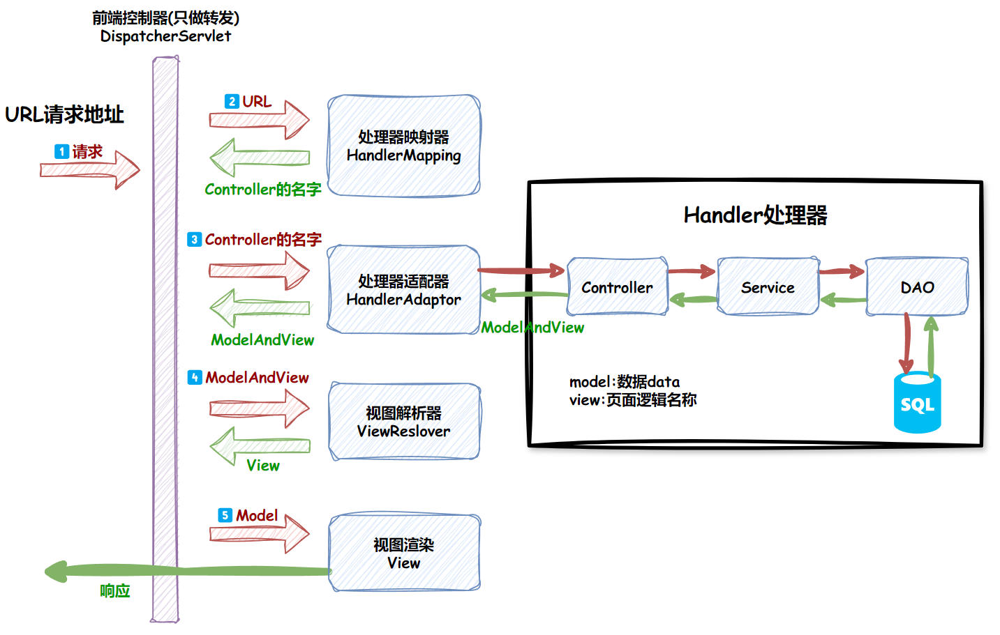

## 1.HashMap的线程不安全体现在什么地方，简述HashMap的扩容过程，jdk1.8中的ConcurrentHashMap是如何实现线程安全的？

## 2.Synchronized和ReentrantLock的区别？

## 3.简述自旋锁，偏向锁，轻量级锁，重量级锁的区别，锁是如何升级的？

!!! Warning ""
    <wavy>锁可以升级但不能降级,目的是为了提高获得锁和释放锁的效率.</wavy>

#### 〔自旋锁〕
自旋锁是当一个线程尝试获取一个已经被其他线程持有的锁时，它不会放弃处理器资源，而是循环等待，不断地检查锁是否已经可以被获取。

!!! Note "特点"
    - **优点**：<wavy>不会引起线程上下文切换</wavy>，因此在锁竞争不激烈的情况下性能较高。
    - **缺点**：如果锁的持有时间较长，<wavy>可能会导致 CPU 资源的浪费</wavy>。

#### 〔偏向锁〕
偏向锁是为了解决无竞争情况下的锁获取问题而设计的。<wavy>当一个线程首次访问同步块时，JVM 会偏向于该线程</wavy>，并在对象的 Mark Word 中记录线程 ID。

!!! Note "特点"
    - **优点**：加锁和解锁不需要额外的消耗，和执行非同步方法相比仅存在纳秒级的差距。
    - **缺点**：如果线程间存在锁竞争，会带来额外的锁撤销的消耗。
    - **快速获取**：如果后续仍然是同一个线程试图获取锁，则可以直接进入临界区而无需任何同步操作。
    - **撤销机制**：如果其他线程试图获取锁，则偏向锁会被撤销，并升级为轻量级锁。

#### 〔轻量级锁〕
轻量级锁使用 `CAS`（Compare And Swap）操作来尝试获取锁。当线程尝试获取锁时，它会在栈中创建一个锁记录空间，并将对象头中的 `Mark Word` 复制到锁记录中。然后使用 `CAS` 尝试将对象头中的 `Mark Word` 替换为指向锁记录的指针。

!!! Note "特点"
    - **优点**：竞争的线程不会阻塞，提高了程序的响应速度。
    - **缺点**：如果始终得不到索竞争的线程，使用自旋会消耗CPU。
    - **非阻塞**：如果 CAS 操作成功，则线程获得锁。如果失败，则线程自旋等待。
    - **升级机制**：如果自旋多次仍然无法获取锁，则锁会升级为重量级锁。

#### 〔重量级锁〕
重量级锁是使用 **操作系统互斥量**（Mutex）实现的锁。<wavy>当线程无法获取锁时，会被挂起，直到锁被释放</wavy>。

!!! Note "特点"
    - **优点**：线程竞争不使用自旋，不会消耗CPU。
    - **缺点**：线程阻塞，响应时间缓慢。
    - **阻塞**：重量级锁会阻塞线程，直到锁被释放。
    - **性能开销大**：重量级锁涉及线程的挂起和恢复，开销较大。

#### 〔升级过程〕
!!! Danger ""
    **偏向锁**：当第一个线程进入同步块时，会尝试获取偏向锁，当第二个线程尝试获取锁时，偏向锁会被撤销，转为轻量级锁。<br>
    **轻量级锁**：如果 CAS 多次尝试失败，轻量级锁会升级为重量级锁。<br>
    **自旋锁**：在轻量级锁阶段，如果 CAS 多次尝试失败，线程会继续自旋等待，如果自旋超过指定次数后仍未获取到锁，轻量级锁就会升级为重量级锁<br>
    **重量级锁**：无法再升级

## 4.阻塞队列的实现原理，简述AQS底层原理

## 5.redis常见数据类型以及对应的应用场景？

**String(字符串)**:Redis中最基础的数据类型，<wavy>key 是唯一标识，value 是具体的值，value其实不仅是字符串， 也可以是数字（整数或浮点数）</wavy>，value的最大长度可达512MB.

!!! Note ""
    应用场景:

    - **缓存**：由于字符串类型的灵活性，它经常被用来<wavy>缓存各种数据，如用户信息、商品详情等</wavy>，以减少对后端数据库的访问压力。
    - **计数器**：<wavy>利用`INC`R和`DECR`等命令可以实现计数器的功能</wavy>，如统计网站访问量、文章点赞数等。
    - **分布式锁**：<wavy>使用`SET`命令的`NX`选项（只有当键不存在时才设置值）和`EX`选项（设置过期时间）</wavy>，可以实现简单的分布式锁功能。

**Hash(哈希)**:是键值对(key - value)集合，形式如:`value=[{field1,value1},...{fieldN,valueN}]`,非常适合用来存储对象，如用户信息。

!!! Note ""
    应用场景：

    - **存储对象**：哈希类型非常适合存储具有多个属性的对象，如用户信息（用户名、密码、邮箱等）。
    - **部分数据变更**：适合存储那些经常变动的信息，如用户的偏好设置。

**List(列表)**:是一个简单的字符串列表，<wavy>按照插入顺序排序</wavy>，并支持从头部或尾部插入和删除操作。

!!! Note ""
    应用场景：

    - **消息队列**：利用List的`PUSH`操作将任务存储在List中，然后工作线程使用`POP`操作取出任务执行。
    - **最新列表**：使用`LPUSH`命令将最新数据插入到列表头部，`LTRIM`命令限制列表长度，从而实现最新N个元素的列表。

**Set(集合)**:是一个<wavy>无序并唯一的键值集合</wavy>，可以对集合执行交集、并集、差集等操作。

!!! Note ""
    应用场景：

    - **标签系统**：集合可以用来实现标签功能，一个用户可以对应多个标签，多个用户也可以对应同一个标签。
    - **唯一对象集合**：存储唯一对象的集合，如网站的唯一访客。

**ZSet(有序集合)**:与集合类似，保留了集合不能有重复成员的特性,但<wavy>每个成员都关联了一个score，用于排序</wavy>。

!!! Note ""
    应用场景：

    - **排行榜**：维护一个排行榜，如游戏中的得分排行。
    - **按分数排序**：根据时间和权重对元素进行排序，如新闻流的时间线。

**Bitmaps(位图)**:虽然不是一种独立的数据类型，但可以通过将字符串视为位图来实现高效的空间使用。

!!! Note ""
    应用场景：

    - **用户行为追踪**：记录哪些用户登录过。
    - **大规模数据统计**：估算某个时间段内的唯一访客数量。

**HyperLogLog**:一种专门用来估算大量数据的基数（不重复元素的数量）的数据结构。

!!! Note ""
    应用场景：

    - **唯一访客数估算**：在不过多消耗内存的情况下估算网站的唯一访客数。

**Streams(流)**:Redis 5.0引入的一种新的数据类型，<wavy>用于构建消息队列，支持持久化和消费</wavy>。

!!! Note ""
    应用场景：

    - **实时数据分析**：如日志处理。
    - **事件驱动机制**：构建微服务架构中的事件驱动机制。

[相关链接🔗](https://www.cnblogs.com/xiaolincoding/p/16370783.html)

## 6.MQ消息积压如何解决，如何保证消息消费的顺序性，如何保证消息不丢失，如何解决消息重复解决

## 7.jvm为什么会存在stw的问题？

## 8.从MVC角度解释不可重复读和幻读的区别？

## 9.什么情况下会产生表锁，复合索引失效的情况有哪几种？

### MySQL中产生表锁的情况
InnoDB存储引擎：

- **行级锁升级**：虽然InnoDB主要使用行级锁，但在某些情况下，如当锁定的行数量过多时，可能会升级为表锁。
如果查询的行数占总行数的比例较高（例如超过20%），MySQL可能会选择使用表锁以提高效率。
- **复合索引失效导致行锁变表锁**：如果复合索引失效，例如WHERE条件中的列没有索引，或者索引选择不当，可能会导致行锁升级为表锁。
- **显式锁定**：使用`SELECT ... FOR UPDATE`或`SELECT ... LOCK IN SHARE MODE`时，如果没有合适的索引，也可能导致表锁。
- **DDL操作**：类似于MyISAM，执行`ALTER TABLE`等DDL语句时，InnoDB也会使用表级锁。

### 复合索引失效的情况
**复合索引**（或联合索引）是指在多个列上创建的索引。当查询条件符合索引的最左侧字段时，索引才能被有效地利用。以下是一些可能导致复合索引失效的情况：

- **未按照索引列顺序使用**：如果查询条件中没有使用索引的第一个字段，那么索引将完全失效。
- **使用函数或表达式**：如果查询条件中包含了对索引列的函数调用或数学运算，那么索引可能不会被使用。
- **使用OR连接条件**：如果`WHERE`子句中包含`OR`操作，并且连接的列不在同一个索引上，或者没有按照索引的顺序使用，索引可能不会被使用。
- **LIKE操作符以%开头**：当LIKE操作符的模式以通配符%开头时，如`LIKE '%abc%'`，MySQL不能有效地使用索引。
- **隐式类型转换**：如果索引列是整型，而查询条件是字符串，MySQL需要做类型转换，这种情况下索引可能不会被使用。
- **范围查询**：如果查询条件中某个列使用了范围查询（如>或<），那么索引中该列之后的所有列都将失效。
- **使用IN或NOT IN**：当`IN`或`NOT IN`的参数较多时，MySQL可能会选择全表扫描而非使用索引。
- **使用!=或<>操作符**：使用!=或<>操作符时，索引可能不会被使用。
- **ORDER BY使用不当**：如果`ORDER BY`后面的列不是索引的一部分，或者没有正确使用索引，可能会导致索引失效。
- **数据分布不均**：如果索引列的数据分布不均匀，MySQL可能会认为全表扫描更快，从而不使用索引。

## 10.微服务的优缺点分别是什么？说一下你在项目开发中遇到的坑？

## 11.所知道的微服务技术栈？

## 12.给一个数组，其中有一个重复元素占半数以上，找出这个元素。

## 13.SpringBoot启动流程

### 第一部分: SpringApplication 初始化模块
配置一些基本的环境变量、资源、监听器、构造器；

### 第二部分: 实现应用具体的启动方案
包括流程的监听模块、加载配置环境模块以及创建上下文环境模块；

### 第三部分: 自动化配置模块
这个模块是实现SpringBoot的自动配置。

#### 启动过程:

每个SpringBoot程序都有一个主入口，即main方法。在这个方法里调用了`SpringApplication.run()`以启动整个SpringBoot程序。该方法所在的类有一个`@SpringBootApplication`注解，它是一个组合注解：

!!! Note ""
    1. `@EnableAutoConfiguration`: SpringBoot根据应用所声明的依赖来对Spring框架进行自动配置；
    2. `@SpringBootConfiguration` (内部为`@Configuration`): 标注这个类是一个配置类；
    3. `@ComponentScan`: 组件扫描，可自动发现和装配Bean，自动扫描并加载符合条件的组件（如`@Component`和`@Repository`等），并将这些bean定义加载到IoC容器中。

#### SpringBoot启动类

首先，进入`run`方法：

!!! Note ""
    - 创建了一个`SpringApplication`实例；
    - 使用`SpringFactoriesLoader`在应用的`META-INF/spring.factories`中查找并加载所有可用的`ApplicationContextInitializer`；
    - 使用`SpringFactoriesLoader`在应用的类路径中查找并加载所有可用的`ApplicationListener`；
    - 在构造方法内，调用了一个初始化的方法`initialize`。

该方法中实现了以下关键步骤：

!!! Note ""
    1. 创建了应用的监听器`SpringApplicationRunListeners`并开始监听；
    2. 加载SpringBoot配置环境(`ConfigurableEnvironment`)，如果是通过web容器发布，则会加载`StandardEnvironment`；
    3. 将配置环境(`Environment`)加入到监听器对象(`SpringApplicationRunListeners`)中；
    4. 创建`run`方法的返回对象：`ConfigurableApplicationContext`（应用配置上下文）；
    5. 回到`run`方法内，`prepareContext`方法将`listeners`、`environment`、`applicationArguments`、`banner`等重要组件与上下文对象关联；
    6. 接下来的`refreshContext(context)`方法是实现`sprin-boot-starter-*`（如mybatis、redis等）自动化配置的关键，包括`sprin.factories`的加载，bean的实例化等核心工作。

#### refresh方法

配置结束后，SpringBoot进行了一些基本的收尾工作，返回了应用环境上下文。回顾整个流程，<u>SpringBoot的启动主要包括创建 **配置环境**(`environment`)、**事件监听**(`listeners`)、**应用上下文**(`applicationContext`)，并在容器中开始 **实例化所需的Bean**</u>。至此，通过SpringBoot启动的程序已经构造完成。

-----

## 14.MySQL数据库索引作用和优缺点。如何创建索引
### **➊优缺点**

!!! Note ""
    1️⃣虽然索引可以大大<u>**提高数据的查询速度**</u>，但是提高查询速度的同时，将<u>**会降低INSERT、UPDATE、DELETE的速度**</u>，因为更新表时，MySQL不仅要保存数据，还要保存索引文件，这样如果索引滥用的话，就会大大降低数据库写入的速度。
    
    2️⃣建立索引<u>**会占用磁盘空间**</u>，一般情况这个问题不会很严重，但是如果你在一个大表上创建了多种索引，索引文件就会大大增加。索引只是提高效率的一个因素，如果你的MySQL有大数据量的表，就需要你花时间去建立最优秀的索引，或者优化查询语句，分表，或者分区。

### **➋索引创建**

建表时创建：

```sql
CREATE TABLE 表名(
字段名 数据类型 [完整性约束条件],
……，
[UNIQUE | FULLTEXT | SPATIAL] INDEX | KEY
索引名(字段名1 [(长度)] [ASC | DESC]) [USING 索引方法]
);
```

!!! Tip "参数说明:"
    `UNIQUE`：可选。表示索引为唯一性索引。</br>
    `FULLTEXT`：可选。表示索引为全文索引。</br>
    `SPATIAL`：可选。表示索引为空间索引。</br>

    `INDEX`和`KEY`：用于指定字段为索引，两者选择其中之一就可以了，作用是一样的。</br>
    索引名：可选。给创建的索引取一个新名称。</br>
    字段名1：指定索引对应的字段的名称，该字段必须是前面定义好的字段。</br>
    长度：可选。指索引的长度，必须是字符串类型才可以使用。</br>
    ASC：可选。表示升序排列。</br>
    DESC：可选。表示降序排列。

-----

## 15.threadlocal变量及作用

#### 介绍
<b>ThreadLocal是为了<u>线程隔离</u>，它使得每个线程都有自己独立的变量副本，从而避免了多线程环境下的数据竞争和线程安全问题</b>.

- `get()`: 获取当前线程的线程局部变量值。
- `set(T value)`: 设置当前线程的线程局部变量值。 
- `remove()`: 移除当前线程的线程局部变量值，防止内存泄漏。
- `initialValue()`: 返回一个初始值，这是一个受保护的方法，可以在子类中重写以提供初始值。

!!! Example "内存泄漏的原因"
    用ThreadLocalMap是来存entry,因为<b><u>key为弱引用，value为强引用，会存在内存泄漏问题</u></b>：ThreadLocal在保存的时候会把自己当做Key存在ThreadLocalMap中，正常情况应该是key和value都应该被外界强引用才对，但是现在key被设计成弱引用了。这就导致了一个问题，ThreadLocal在没有外部强引用时，发生GC时会被回收，如果创建ThreadLocal的线程一直持续运行，那么这个Entry对象中的value就有可能一直得不到回收，发生内存泄露。就比如线程池里面的线程，线程都是复用的，那么之前的线程实例处理完之后，出于复用的目的线程依然存活，所以，ThreadLocal设定的value值被持有，导致内存泄露。

    由于Thread中包含变量ThreadLocalMap，因此 <b>ThreadLocalMap与Thread的生命周期是一样长</b>，如果都没有手动删除对应key，都会导致内存泄漏。

    ​但是使用弱引用可以多一层保障：弱引用ThreadLocal不会内存泄漏，对应的value在下一次ThreadLocalMap调用set(),get(),remove()的时候会被清除。

    因此，ThreadLocal内存泄漏的根源是：<u><b>由于ThreadLocalMap的生命周期跟Thread一样长</b></u>，如果没有手动删除对应key就会导致内存泄漏，而不是因为弱引用。

#### 使用场景

- **线程安全的对象使用**：在多线程环境下，我们可能需要每个线程使用自己独立的对象实例，例如 `SimpleDateFormat`。`SimpleDateFormat` 不是线程安全的，使用 ThreadLocal 可以为每个线程提供一个独立的 `SimpleDateFormat` 实例。
- **数据库连接管理**：在基于线程的环境中（如 Web 应用），可以使用 ThreadLocal 来管理数据库连接，为每个线程提供独立的连接实例，以避免连接共享带来的线程安全问题。
- **日志记录**：在日志记录中，<b>ThreadLocal 可以用来存储当前线程的上下文信息，如用户 ID 或事务 ID</b>，以便在日志输出时提供更多的调试信息。
- **用户会话管理**：在 Web 应用中，<b>每个用户的会话数据可以使用 ThreadLocal 存储</b>，从而确保同一用户的多个请求在同一个线程中处理时能够访问到正确的会话数据。

!!! Warning "注意事项"
    1️⃣**内存泄漏**：如果线程不再需要使用该变量，但忘记调用 remove() 方法来清理，那么由于 ThreadLocalMap 中的 Entry 的 key 是对 Thread 的弱引用，所以 Thread 被回收后，Entry 的 key 会被置为 null，但 value 不会被回收，从而导致内存泄漏。因此，使用完 ThreadLocal 后，最好调用 remove() 方法来清理。
    !!! Success "解决方案"
        ①每次使用完ThreadLocal都调用它的 <u>remove() 方法清除数据</u></br>
        ②<u>将ThreadLocal变量定义成private static</u>，这样就一直存在ThreadLocal的强引用，也就能保证任何时候都能通过ThreadLocal的弱引用访问到Entry的value值，进而清除掉 。
    2️⃣**线程池中的使用**：在线程池中，线程可能会被复用。如果线程之前设置过 ThreadLocal 变量，但在使用后没有清理，那么下一个任务可能会读取到上一个任务设置的值。因此，在线程池中使用 ThreadLocal 时需要特别小心。</br>
    3️⃣**性能开销**：虽然 ThreadLocal 可以简化多线程编程，但是频繁的创建和销毁线程局部变量也会带来一定的性能开销。

------

## 16.spring框架bean对象的生命周期

1. **Bean 的创建**：当 Spring 容器启动时，根据配置文件中的定义创建 Bean 的实例。
2. **依赖注入**：为新创建的 Bean 注入其所需的属性（即依赖关系）。
3. **初始化**：执行任何必要的初始化工作，比如设置资源或者建立数据库连接等。
4. **运行时服务**：Bean 处于活动状态，提供服务。
5. **销毁**：容器决定销毁 Bean 时执行必要的清理工作。

## 17.SpringBoot框架中yml和properties文件哪个优先加载

yml->ymal->properties</br>
由里向外加载，所以最外层的最后被加载，会覆盖里层的属性

## 18.怎么理解多线程，你的项目中哪里用到了多线程

## 19.10000个数据包含字母和数字，用ASCLL码排序，怎么实现，comparator比较器怎么实现

## 20.什么是二叉树、红黑树、B+树

R-B Tree，全称是Red-Black Tree，又称为“红黑树”，它一种特殊的二叉查找树。
红黑树的每个节点上都有存储位表示节点的颜色，可以是红(Red)或黑(Black)。

!!! Note "红黑树的特性"

    1. 每个节点或者是黑色，或者是红色。
    2. 根节点是黑色。
    3. 每个叶子节点（NIL）是黑色。 [注意：这里叶子节点，是指为空(NIL或NULL)的叶子节点！]
    4. 如果一个节点是红色的，则它的子节点必须是黑色的。
    5. 从一个节点到该节点的子孙节点的所有路径上包含相同数目的黑节点。

红黑树的应用比较广泛，主要是用它来存储有序的数据，它的时间复杂度是O(lgn)，效率非常之高。
例如，Java集合中的TreeSet和TreeMap，C++ STL中的set、map，以及Linux虚拟内存的管理，都是通过红黑树去实现的。

## 21.JVM的内存结构介绍一下

堆、方法区、虚拟机栈、本地方法栈、程序计数器

------

## 22.HashMap和ConcurrentHashMap;底层实现原理等

底层的实现方式是<wavy>数组+链表+红黑树</wavy>(加红黑树为了解决二叉查找树的缺陷，因为二叉查找树可能会退化成线性结构)

#### ①HashMap基础知识

1. **数组结构**： <wavy>存储区间连续、内存占用严重、空间复杂度大</wavy><br>
**优点**：随机读取和修改效率高，原因是数组是连续的（随机访问性强，查找速度快）<br>
**缺点**：插入和删除数据效率低，因插入数据，这个位置后面的数据在内存中都要往后移动，且大小固定不易动态扩展。

2. **链表结构**：<wavy>存储区间离散、占用内存宽松、空间复杂度小</wavy><br>
**优点**：插入删除速度快，内存利用率高，没有固定大小，扩展灵活<br>
**缺点**：不能随机查找，每次都是从第一个开始遍历（查询效率低）

3. **哈希表结构**：<wavy>结合数组结构和链表结构的优点，从而实现了查询和修改效率高，插入和删除效率也高的一种数据结构</wavy>

!!! Note "常见的HashMap的数据结构"
    1️⃣HashMap底层是一个`Entry[ ]`数组,当存放数据时,会根据hash算法来计算数据的存放位置
    
    2️⃣算法:`hash(key)%n` , n就是数组的长度,其实也就是集合的容量
    
    3️⃣当计算的位置没有数据的时候,会直接存放数据
    
    4️⃣当计算的位置,有数据时,会发生 **hash冲突/hash碰撞** ,
    
    !!! Warning ""
        解决的办法就是<wavy>采用链表的结构,在对应的数据位置存放链表的头节点</wavy>,对于这个链表来说,每次新加的节点会从头部位置开始加入,也就是说,数组中的永远是新节点.

#### ②HashMap扩容

1️⃣、**加载因子**

```java
static final float DEFAULT_LOAD_FACTOR = 0.75f;
```

前面的讲述已经发现，当你空间只有仅仅为10的时候是很容易造成2个对象的hashcode所对应的地址是一个位置的情况。这样就造成2个对象会形成散列桶（链表）。

这时就有一个加载因子的参数，值默认为0.75 ，如果你hashmap的空间有100那么当你插入了75个元素的时候hashmap就需要扩容了，不然的话会<wavy>形成很长的散列桶结构</wavy>，对于查询和插入都会增加时间，因为它要一个一个的equals比较。

但又不能让加载因子很小，如0.01，这样显然是不合适的，<wavy>频繁扩容会大大消耗你的内存</wavy>。这时就存在着一个平衡，jdk中默认是0.75，当然负载因子可以根据自己的实际情况进行调整。

2️⃣、**为何随机增删、查询效率都很高的原因是？**
**原因**: 增删是在链表上完成的，而查询只需扫描部分，则效率高。(存在链表退化问题)

HashMap集合的key，会先后调用两个方法，hashCode and equals方法，这两个方法都需要重写

**JDK1.8后引入了红黑树**：当hash表的单一链表长度 **超过 8 个** 的时候，链表结构就会转为红黑树结构。好处就是避免在最极端的情况下链表变得很长很长，在查询的时候，效率会非常慢。红黑树是一种近似平衡的二叉查找树，其主要的优点就是“平衡“，即 **左右子树高度几乎一致** ，以此来防止树退化为链表

#### ③HashMap中的put()和get()的实现原理：

**1、map.put(k,v)实现原理**

> 1️⃣首先将k,v封装到Node对象当中（节点）。
>
> 2️⃣然后它的底层会调用K的hashCode()方法得出hash值。
>
> 3️⃣通过哈希表函数/哈希算法，将hash值转换成数组的下标，下标位置上如果没有任何元素，就把Node添加到这个位置上。如果说下标对应的位置上有链表，此时，就会拿着k和链表上每个节点的k进行equal。如果所有的equals方法返回都是false，那么这个新的节点将被添加到链表的末尾。如其中有一个equals返回了true，那么这个节点的value将会被覆盖。

**2、map.get(k)实现原理**

> 1️⃣先调用k的hashCode()方法得出哈希值，并通过哈希算法转换成数组的下标。
>
> 2️⃣通过上一步哈希算法转换成数组的下标之后，在通过数组下标快速定位到某个位置上。如果这个位置上什么都没有，则返回null。如果这个位置上有单向链表，那么它就会拿着K和单向链表上的每一个节点的K进行equals，如果所有equals方法都返回false，则get方法返回null。如果其中一个节点的K和参数K进行equals返回true，那么此时该节点的value就是我们要找的value了，get方法最终返回这个要找的value。

**3、实现原理决定HashMap存在线程安全问题：**[https://juejin.cn/post/6844903796225605640#heading-3](https://juejin.cn/post/6844903796225605640#heading-3)

> 1️⃣多线程的put可能导致元素的丢失
>
> 2️⃣put和get并发时，可能导致get为null
>
> 3️⃣JDK7中HashMap并发put会造成循环链表，导致get时出现死循环

#### ④ConcurrentHashMap的底层实现原理：

目前有如下一些方式可以获得线程安全的HashMap：

1️⃣Collections.synchronizedMap

2️⃣HashTable

3️⃣ConcurrentHashMap

前两种方式由于全局锁的问题，存在很严重的性能问题。针对HashTable会锁整个hash表的问题，ConcurrentHashMap提出了分段锁的解决方案。

-----------------------------------***JDK1.7***------------------------------

**1.分段锁** 的思想就是：<u>**锁的时候不锁整个hash表，而是只锁一部分**</u>。

如何实现呢？这就用到了ConcurrentHashMap中最关键的 **Segment** 。ConcurrentHashMap中维护着一个Segment数组，每个Segment可以看做是一个HashMap。而Segment本身继承了ReentrantLock，它本身就是一个锁。在Segment中通过HashEntry数组来维护其内部的hash表。每个HashEntry就代表了map中的一个K-V，用HashEntry可以组成一个链表结构，通过next字段引用到其下一个元素。


只要我们的hash值足够分散，那么每次put的时候就会put到不同的segment中去。 而segment自己本身就是一个锁，put的时候，当前segment会将自己锁住，此时其他线程无法操作这个segment， 但不会影响到其他segment的操作。这个就是锁分段带来的好处。

**2.线程安全的put**

**3.线程安全的扩容(Rehash)**

HashMap的线程安全问题大部分出在扩容(rehash)的过程中。**ConcurrentHashMap的扩容只针对每个segment中的HashEntry数组进行扩容**。由上述put的源码可知，ConcurrentHashMap在rehash的时候是有锁的，所以在rehash的过程中，其他线程无法对segment的hash表做操作，这就保证了线程安全。

----------------------------------**JDK1.8**-------------------------------

https://juejin.cn/post/6844903813892014087

-----

## 23.线程池的创建方式，底层原理(源码，理论)

!!! note
     - <u>**`newCachedThreadPool`**：创建一个可缓存线程池</u>，如果线程池长度超过处理需要，可灵活回收空闲线程，若无可回收，则新建线程。
     - <u>**`newFixedThreadPool`**：创建一个定长线程池</u>，可控制线程最大并发数，超出的线程会在队列中等待。
     - <u>**`newScheduledThreadPool`** ：创建一个定长线程池，支持定时及周期性任务执行</u>。
     - <u>**`newSingleThreadExecutor`**：创建一个单线程化的线程池</u>，它只会用唯一的工作线程来执行任务，保证所有任务按照指定顺序(FIFO, LIFO, 优先级)执行。

#### 线程数怎么设置一般看业务场景，分为IO密集型和CPU密集型场景

- ***CPU密集型场景***：理论上CPU核数和线程数一致最合适，实际工程上<u>线程数会设置成CPU核数+1，</u>
这样当线程因为因为额外的内存页失效或其他原因导致阻塞时，这个额外的线程可以顶上。

- ***IO密集型场景***：可以根据公式计算，一般可设置为2N，<br>
线程阻塞时间和线程忙碌时间可以通过压测与代码埋点统计获取,
比如本机R7-5800H 8核16线程CPU

!!! Abstract "公式"
    $$ 最佳线程数 = CPU核心数 · (1/CPU利用率) = CPU核心数 · (1 + (IO耗时/CPU耗时)) $$

手动创建线程池：

!!! Note "创建线程池的7个参数"
     - 1️⃣ **`corePoolSize`**：线程池的核心线程数
     - 2️⃣ **`maximumPoolSize`**：能容纳的最大线程数，最大线程池数量，当线程数>=corePoolSize，且任务队列已满时，线程池会创建新线程来处理任务；任务队列已满时, 且当线程数=maxPoolSize，，线程池会拒绝处理任务而抛出异常，也一样根据业务来,太大消耗资源,太小容易满
     - 3️⃣ **`keepAliveTime`**：空闲线程存活时间
     - 4️⃣ **`unit`**： 存活的时间单位
     - 5️⃣ **`workQueue`**： 存放提交但未执行任务的队列
     - 6️⃣ **`threadFactory`**：创建线程的工厂类
     - 7️⃣ **`handler`**： 等待队列满后的拒绝策略

#### 例子

```java
ThreadPoolExecutor executor = new ThreadPoolExecutor(
     5,
     10,
     60, 
     TimeUnit.SECONDS,
     new ArrayBlockingQueue<>(10000),
     threadFactory
);
```

新任务被提交后，会先进入到此工作队列中，任务调度时再从队列中取出任务。

#### jdk中提供了四种工作队列(这个也很重要,实际开发也需要很关注)：

!!! Info ""
    **1️⃣`ArrayBlockingQueue`**：<wavy>基于数组的有界阻塞队列，按FIFO排序</wavy>。新任务进来后，会放到该队列的队尾，有界的数组可以防止资源耗尽问题。当线程池中线程数量达到corePoolSize后，再有新任务进来，则会将任务放入该队列的队尾，等待被调度。如果队列已经是满的，则创建一个新线程，如果线程数量已经达到maxPoolSize，则会执行拒绝策略。

    **2️⃣`LinkedBlockingQueue`**：<wavy>基于链表的无界阻塞队列（其实最大容量为Integer.MAX），按照FIFO排序</wavy>。由于该队列的近似无界性，当线程池中线程数量达到corePoolSize后，再有新任务进来，会一直存入该队列，而不会去创建新线程直到maxPoolSize，因此使用该工作队列时，参数maxPoolSize其实是不起作用的。

    **3️⃣`SynchronousQueue`**：<wavy>一个不缓存任务的阻塞队列，生产者放入一个任务必须等到消费者取出这个任务</wavy>。也就是说新任务进来时，不会缓存，而是直接被调度执行该任务，如果没有可用线程，则创建新线程，如果线程数量达到maxPoolSize，则执行拒绝策略。

    **4️⃣`PriorityBlockingQueue`**：<wavy>具有优先级的无界阻塞队列</wavy>，优先级通过参数Comparator实现。

#### handler 拒绝策略

<wavy>​当工作队列中的任务已到达最大限制，并且线程池中的线程数量也达到最大限制</wavy>，这时如果有新任务提交进来，该如何处理呢。这里的拒绝策略，就是解决这个问题的，jdk中提供了4中拒绝策略：

!!! Info ""
    **1️⃣CallerRunsPolicy**：该策略下，在调用者线程中直接执行被拒绝任务的run方法，除非线程池shutdown，则直接抛弃任务

    **2️⃣AbortPolicy**：该策略下，直接丢弃任务，并抛出RejectedExecutionException异常。

    **3️⃣DiscardPolicy**：该策略下，直接丢弃任务，什么都不做。

    **4️⃣DiscardOldestPolicy**：该策略下，抛弃进入队列最早的那个任务，然后尝试把这次拒绝的任务放入队列

-----

## 24.nginx的配置方式有几种分别？轮询，权重，iphash分别什么场景使用(实操记重点)

#### **负载均衡策略:**

1. **轮询策略**：根据配置文件顺序依次访问服务器--默认策略 
2. **权重策略**：根据设定的权重大小挑选那台服务器有限访问，使用**weight**关键字定义权重
3. **IPHASH策略**：每个请求**按访问 ip 的 hash 结果分配**，这样每个访客固定访问一个后端服务器，可以解决 session 的问题。需要用户与服务器绑定，则使用该策略
4. **least_conn**：把请求转发给连接数较少的后端服务器。

IPHASH优先级比较高，会覆盖权重策略
    IPHASH算法原理：TODO

## 25.mybatis框架有几级缓存，默认开启几级？(按场景分析)

#### 二级缓存配置(默认只开启一级)

- ​**eviction**:缓存回收策略(默认是LRU)

    1. **LRU**-最近最少使用的：移除最长时间不被使用的对象
    2. **FIFO**-先进先出：按对象进入缓存的顺序移除它们
    3. **SOFT**-软引用：移除基于垃圾回收器状态和软引用的对象
    4. **WEAK**-弱引用：更积极的移除基于垃圾回收器状态和弱引用的对象

- ​**flushInterval**:**刷新间隔**，<wavy>单位毫秒，缓存多少时间清空一次，默认情况是不设置</wavy>，也就是没有间隔，缓存仅仅调用语句时刷新。
- ​**size**:**引用数目**：<wavy>正整数，代表缓存最多可以存储多少个对象</wavy>，太大容易导致内存溢出。
- ​**readOnly**:只读，true/false
    1. **true**:**只读缓存**，<wavy>会给所有调用者返回缓存对象的相同实例，因此这次对象不可以被修改,这提供了很重要的性能优势</wavy>，mybatis会认为所有从缓存中获取数据的操作都是只读操作,mybatis为了加快获取速度，直接就将缓存中的引用交给用户，不安全，速度快
    2. **false**:**读写缓存**，<wavy>会返回缓存对象的拷贝(通过序列化),性能稍差，但是安全，默认是false</wavy>,mybatis会认为获取的数据可能会被修改，就利用序列化&反序列化拷贝一份新的数据。

- ​**type**:指定自定义缓存的全类名，实现Cache接口即可。

### ①MyBatis一级缓存概述

<wavy>MyBatis 的一级缓存是 `SqlSession` 级别的，通过同一个 `SqlSession` 对象查询的数据会被缓存</wavy>，下次再查询相同的数据时，
就会从缓存中直接获取，不会从数据库重新访问； 一般我们说到 MyBatis 的一级缓存时，都是针对查询操作而言的；

### ②MyBatis 的一级缓存是默认开启的。

!!! Note "缓存失效的四种情况"
    1. 不同的 `SqlSession` 对象对应不同的一级缓存，即使查询相同的数据，也要重新访问数据库；
    2. 同一个 `SqlSession` 对象，但是查询的条件不同；
    3. 同一个 `SqlSession` 对象两次查询期间执行了任何的“增删改”操作，无论这些“增删改”操作是否影响到了缓存的数据；
    4. 同一个 `SqlSession` 对象两次查询期间手动清空了缓存（调用了 `SqlSession` 对象的 clearCache() 方法）。

### ③几种特殊情况

!!! Warning ""
    1. 如果在同一个 `SqlSession` 对象两次查询同一数据期间，我们使用另一个 `SqlSession` 对象修改了这个数据，那么这两次查询返回的结果依旧是相同的（说明 `SqlSession` 对象还是从一级缓存中获取了数据），即使数据已经发生了变化；
    2. 同理第一种情况，如果在同一个 `SqlSession` 对象两次查询同一数据期间，我们使用 Navicat、Mysql Workbench 等数据库管理工具修改了这一数据，那么这两次查询返回的结果依旧是相同的，即使数据已经发生了变化；
    3. 如果在同一个 `SqlSession` 对象两次查询同一数据期间，我们使用该对象“增删改”了与该数据无关的其它数据，并没有进行任何涉及该数据的操作， 数据也没有发生变化，那么 MyBatis 的一级缓存依旧会失效，这延伸自 2 中的第 3 种情况；
    4. 如果在同一个 `SqlSession` 对象两次查询同一数据期间，我们又多次查询了其它数据（期间没有进行任何的“增删改”操作），那么数据库中的该数据没有发生变化，MyBatis 也会顺利从一级缓存中获取到该数据。

------

### Mybatis二级缓存

### ①二级缓存开启条件

1. 在核心配置文件中,设置全局配置属性`cacheEnabled="true"`,默认为true,不需要设置 
2. 映射文件中必须设置 **`</cache>`** 标签 
3. 二级缓存必须在`SqlSession`提交关闭或提交后才会生效，范围是`SqlSessionFactory`
4. 查询的数据所转换的实体类类型必须实现序列化接口

### ②二级缓存失效情况

<wavy>**两次查询之间执行任意增删改,使一级和二级缓存同时失效**</wavy>

### ③mybatis缓存查询的顺序

1. 先查询二级缓存，因为二级缓存中可能会有其他程序已经查询出来的数据，可以直接哪来用
2. 如果二级缓存没有命中，在查询一级缓存
3. 如果一级缓存也没有命中，查询数据库
4. `SQLSession`关闭后，一级缓存中的数据会写入二级缓存

------

## 26.HashTable和HashMap的区别

#### 1.继承父类不同

Hashtable继承自Dictionary类，而HashMap继承自AbstractMap类；但 **二者都实现了Map接口** 。

#### 2.线程的安全性

1. **HashTable是同步**(方法中使用了Synchronized)的；**而HashMap是未同步**（方法中缺省Synchronized）的。
2. **Hashtable 线程安全**，因为它每个方法中都加入了Synchronize，在多线程并发的环境下，可以直接使用Hashtable，不需自己在加同步；
3. **HashMap线程不安全**，因为HashMap底层是一个Entry数组，当发生hashmap冲突的时候，hashmap是采用链表的方式来解决的，在对应的数组位置存放链表的头结点。对链表而言，新加入的节点会从头结点加入。

#### 3.是否有contains方法

1. HashTable有一个contains(Object value)方法，功能和containsValue方法(Object value)功能一样。
2. HashMap把Hashtable的contains方法去掉了，改成containsValue和containsKey。

#### 4.可否允许有null值

key、value都是对象，但是不能拥有重复key值，value值可以重复出现。

1. **Hashtable中，key和value都不允许出现null值。**
2. **HashMap允许null值(key和value都可以)，因为在HashMap中null可以作为健，而它对应的值可以有多个null。**

#### 5.遍历方式内部实现不同

HashTable使用Enumeration，HashMap使用Iterator。

#### 6.hash值不一样

1.HashTable直接使用对象的hashCode，如下：

```java
//hashCode是jdk根据对象的地址或者字符串或者数字算出来的int类型的数值
int hash = key.hashCode();
int index = (hash & 0x7FFFFFFF) % tab.length;
```

2.HashMap要重新计算key值和hash值，如下：

```java
int hash = hash(k);
int i = indexFor(hash, table.length);

static int hash(Object x) {
　　int h = x.hashCode();

　　h += ~(h << 9);
　　h ^= (h >>> 14);
　　h += (h << 4);
　　h ^= (h >>> 10);
　　return h;
}
static int indexFor(int h, int length) {
　　return h & (length-1);
}
```

#### 7.数组初始化和扩容不同

1.HashTable中hash数组默认大小是11，增加的方式是 arr*2+1。

2.HashMap中hash数组的默认大小是16，而且一定是2的指数。

## 27.BeanFactory和FactoryBean的区别

!!! Note "区别"
    **BeanFactory是个Factory**，也就是IOC容器或对象工厂，**FactoryBean是个Bean**。在Spring中，<u>所有的Bean都是由BeanFactory(也就是IOC容器)来进行管理的</u>。但对FactoryBean而言，这个Bean不是简单的Bean，<u>而是一个能生产或者修饰对象生成的工厂Bean</u>，它的实现与设计模式中的工厂模式和修饰器模式类似。

## 28.Java线程通信方式

**①、同步**

**②、while轮询的方式**

**③、wait/notify机制**

**④、管道通信** 就是使用java.io.PipedInputStream 和 java.io.PipedOutputStream进行通信

## 29.Spring依赖注入方式

## 30.springMVC执行流程



## 31.如何保证线程安全

## 32.mysql优化方式

## 33.MySQL引擎innodb优势

MySQL 有多种存储引擎，每种存储引擎有各自的优缺点，可以择优选择使用

!!! Note "有哪些引擎"
    MyISAM、InnoDB、MERGE、MEMORY(HEAP)、BDB(BerkeleyDB)、EXAMPLE、FEDERATED、ARCHIVE、CSV、BLACKHOLE

1. **事务支持：** InnoDB 提供了对事务的完整支持，包括 ACID（原子性、一致性、隔离性、持久性）属性。这使得 InnoDB 适用于需要高度数据一致性和可靠性的应用程序，如金融系统和在线交易系统。
2. **行级锁定：** <wavy>InnoDB 使用行级锁定来进行并发控制</wavy>，而不是表级锁定。这意味着多个事务可以同时操作同一表的不同行，提高了并发性和性能。行级锁定还减小了死锁的风险，相对于表级锁定更灵活。
3. **外键约束：** InnoDB 支持外键，这是关系型数据库中重要的特性之一。外键用于维护表与表之间的关系完整性，确保引用完整性和一致性。
4. **崩溃恢复：** InnoDB 提供了崩溃恢复机制，通过事务日志（transaction log）和重做日志（redo log）来确保数据库在发生故障或崩溃时可以恢复到一致的状态。
5. **自动增长列：** InnoDB 支持自动增长列，使得在插入数据时不必手动指定主键的值。这简化了开发人员的工作，并提高了应用程序的易用性。
6. **热备份：** InnoDB 支持热备份（Hot Backup），可以在数据库运行的同时进行备份，而不需要停止数据库服务。这有助于提高数据库的可用性和灵活性。
7. **MVCC（多版本并发控制）：** InnoDB 使用 MVCC 来支持并发控制，允许读取操作不被写入操作阻塞。每个事务在执行时都会创建一个快照，从而允许并发读取，而不会造成读取脏数据。
8. **自适应哈希索引和全文本索引：** <wavy>InnoDB 引擎支持自适应哈希索引</wavy>，这有助于提高查询性能。此外，它还支持全文本索引，用于进行全文搜索操作。

## 34.spring事务机制

## 35.数据库事务隔离

**`脏读`**：所谓的脏读，其实就是读到了别的事务回滚前的脏数据。比如事务B执行过程中修改了数据X，在未提交前，事务A读取了X，而事务B却回滚了，这样事务A就形成了脏读。也就是说，<wavy>**当前事务读到的数据是别的事务想要修改成为的但是没有修改成功的数据**</wavy>。

**`不可重复读`**：事务A首先读取了一条数据，然后执行逻辑的时候，事务B将这条数据改变了，然后事务A再次读取的时候，发现数据不匹配了，就是所谓的不可重复读了。也就是说，<wavy>**当前事务先进行了一次数据读取，然后再次读取到的数据是别的事务修改成功的数据，导致两次读取到的数据不匹配**</wavy>，也就照应了不可重复读的语义。

**`幻读`**：事务A首先根据条件索引得到N条数据，然后事务B改变了这N条数据之外的M条或者增添了M条符合事务A搜索条件的数据，导致事务A再次搜索发现有N+M条数据了，就产生了幻读。也就是说，<wavy>**当前事务读第一次取到的数据比后来读取到数据条目不一致**</wavy>。

## 36.什么是偏向锁，锁的升级过程

## TCP/IP三次握手四次挥手

### 三次握手

假设发送端为客户端，接收端为服务端。开始时客户端和服务端的状态都是CLOSED。


!!! Note ""
    - **第一次握手**：客户端向服务端发起建立连接请求，客户端会随机生成一个起始序列号x，客户端向服务端发送的字段中包含标志位SYN=1，序列号seq=x。第一次握手前客户端的状态为CLOSE，第一次握手后客户端的状态为SYN-SENT。此时服务端的状态为LISTEN。

    - **第二次握手**：服务端在收到客户端发来的报文后，会随机生成一个服务端的起始序列号y，然后给客户端回复一段报文，其中包括标志位SYN=1，ACK=1，序列号seq=y，确认号ack=x+1。第二次握手前服务端的状态为LISTEN，第二次握手后服务端的状态为SYN-RCVD，此时客户端的状态为SYN-SENT。（其中SYN=1表示要和客户端建立一个连接，ACK=1表示确认序号有效）

    - **第三次握手**：客户端收到服务端发来的报文后，会再向服务端发送报文，其中包含标志位ACK=1，序列号seq=x+1，确认号ack=y+1。第三次握手前客户端的状态为SYN-SENT，第三次握手后客户端和服务端的状态都为ESTABLISHED。

    - **此时连接建立完成**。

### 两次握手可以吗？

<wavy>第三次握手主要为了防止已失效的连接请求报文段突然又传输到了服务端，导致产生问题</wavy>。

- 比如客户端A发出连接请求，可能因为网络阻塞原因，A没有收到确认报文，于是A再重传一次连接请求。
- 连接成功，等待数据传输完毕后，就释放了连接。
- 然后A发出的第一个连接请求等到连接释放以后的某个时间才到达服务端B，此时B误认为A又发出一次新的连接请求，于是就向A发出确认报文段。
- 如果不采用三次握手，只要B发出确认，就建立新的连接了，此时A不会响应B的确认且不发送数据，则B一直等待A发送数据，浪费资源。

### 四次挥手


1. A的应用进程先向其TCP发出连接释放报文段（FIN=1，seq=u），并停止再发送数据，主动关闭TCP连接，进入FIN-WAIT-1（终止等待1）状态，等待B的确认。
2. B收到连接释放报文段后即发出确认报文段（ACK=1，ack=u+1，seq=v），B进入CLOSE-WAIT（关闭等待）状态，此时的TCP处于半关闭状态，A到B的连接释放。
3. A收到B的确认后，进入FIN-WAIT-2（终止等待2）状态，等待B发出的连接释放报文段。
4. B发送完数据，就会发出连接释放报文段（FIN=1，ACK=1，seq=w，ack=u+1），B进入LAST-ACK（最后确认）状态，等待A的确认。
5. A收到B的连接释放报文段后，对此发出确认报文段（ACK=1，seq=u+1，ack=w+1），A进入TIME-WAIT（时间等待）状态。此时TCP未释放掉，需要经过时间等待计时器设置的时间2MSL（最大报文段生存时间）后，A才进入CLOSED状态。B收到A发出的确认报文段后关闭连接，若没收到A发出的确认报文段，B就会重传连接释放报文段。 

### 第四次挥手为什么要等待2MSL？

**保证A发送的最后一个ACK报文段能够到达B**。这个ACK报文段有可能丢失，B收不到这个确认报文，就会超时重传连接释放报文段，然后A可以在2MSL时间内收到这个重传的连接释放报文段，接着A重传一次确认，重新启动2MSL计时器，最后A和B都进入到CLOSED状态，若A在TIME-WAIT状态不等待一段时间，而是发送完ACK报文段后立即释放连接，则无法收到B重传的连接释放报文段，所以不会再发送一次确认报文段，B就无法正常进入到CLOSED状态。

**防止已失效的连接请求报文段出现在本连接中**。A在发送完最后一个ACK报文段后，再经过2MSL，就可以使这个连接所产生的所有报文段都从网络中消失，使下一个新的连接中不会出现旧的连接请求报文段。

### 为什么是四次挥手？

因为当Server端收到Client端的SYN连接请求报文后，可以直接发送SYN+ACK报文。**但是在关闭连接时，当Server端收到Client端发出的连接释放报文时，很可能并不会立即关闭SOCKET**，所以Server端先回复一个ACK报文，告诉Client端我收到你的连接释放报文了。只有等到Server端所有的报文都发送完了，这时Server端才能发送连接释放报文，之后两边才会真正的断开连接。故需要四次挥手。

------

## 37.shiro中SSO实现过程

## 38.你负责的什么模块，怎么样的模块你可以胜任，你的技术长处优势是什么？就是你感觉自己的哪些技术是别人达不到的

## 39.MySQL底层的数据结构是什么，说一下？

B+树：

## 40.MySQL与Redis如何保证数据一致

当Redis和MySQL之间出现消息不一致的情况时，可以考虑以下几种解决方案： 

### 1️⃣只读缓存
在这种模式下，更新数据时先更新数据库，然后删除缓存中的对应条目。这样，当缓存被删除后，下次读取该数据时会触发缓存缺失，从而从数据库中重新加载数据。

!!! Note ""
    **优点：** 简单易实现。减少了缓存与数据库之间的一致性问题。

    **缺点：** 如果删除缓存失败，可能会导致数据不一致。可能会导致缓存穿透问题，即缓存中没有的数据却不断地被请求，导致每次都去数据库中查询。

!!! Info "解决策略"
    **延时双删**：<u>删除redis &#8611; 更新数据库 &#8611; 延时500毫秒 &#8611; 删除redis</u>。这可以确保数据库操作已经完成并持久化，从而减少数据不一致的风险。

    **消息队列+异步重试**：使用消息队列来异步更新缓存，可以减少对用户请求的影响。当数据库更新后，发送一条更新缓存的消息到消息队列，由另一个进程监听消息队列并更新缓存。

### 2️⃣读写缓存
在这种模式下，更新数据时同时更新数据库和缓存。这种方法要求更新操作具有原子性，以确保数据库和缓存同时被更新或同时失败。

!!! Note ""
    **优点：** 数据一致性更好。

    **缺点：** 实现复杂度较高。如果缓存更新失败，可能会导致数据不一致。

!!! Info "解决策略"
    **同步直写**：使用事务来保证缓存和数据库更新的原子性。

    **分布式锁**：在更新数据时，使用分布式锁来确保同一时间只有一个线程可以更新数据库和缓存。

### 3️⃣基于消息队列的异步更新
这种方法通过消息队列来异步更新缓存，可以减少对用户请求的影响。当数据库更新后，发送一条更新缓存的消息到消息队列，由另一个进程监听消息队列并更新缓存。

!!! Note ""
    **优点：** 可以减少对用户请求的影响。可以通过重试机制来保证数据的一致性。

    **缺点：** 需要确保消息不会因为网络等原因丢失。高并发情况下需要处理消息积压的问题。

### 4️⃣订阅 MySQL 的 Binlog
利用 MySQL 的 Binlog（二进制日志）来异步同步数据。这种方法可以减少数据不一致的时间窗口，但仍然存在极小的延迟。

!!! Note ""
    **优点：** 可以减少数据不一致的时间窗口。实现较为复杂，需要额外的维护成本。

    **缺点：** 实现较为复杂，需要额外的维护成本。可能存在一定的延迟。

!!! Example "简短一点好记"
    1. **数据同步机制**：可以通过定时任务或者触发器等方式，**定期将MySQL中的数据同步到Redis中**，确保数据的一致性。这种方式适用于数据量较小且对实时性要求不高的场景。(订阅binlog)
    2. **双写模式**：在写入MySQL数据时，同时写入Redis中，确保数据的一致性。这种方式可以在应用层面实现，但需要考虑并发写入的问题，如使用分布式锁来保证数据的一致性。
    3. **异步队列**：将MySQL的变更操作写入消息队列，然后由消费者异步处理并更新Redis中的数据。这种方式可以降低对MySQL的写入压力，并提高系统的可扩展性和容错性。
    4. **读写分离**：将读操作从Redis中获取数据，写操作则直接操作MySQL，通过将读写分离可以减少对Redis和MySQL之间的数据一致性要求。但需要注意同步问题，即写入MySQL后需要及时更新Redis中的数据。
    5. **使用分布式事务**：如果业务场景中需要保证强一致性，可以考虑使用<u>分布式事务</u>来确保Redis和MySQL的数据一致性。可以使用分布式事务框架，如Seata、TCC等来实现。
    6. **采用延迟双删策略**：<u>删除redis &#8611; 更新数据库 &#8611; 延时500毫秒 &#8611; 删除redis</u>
    7. **消息队列方式**

## 41.MySQL一二级缓存，和缓存实现

## 42.说一下线程池中的阻塞队列

## 43.数据库的复合索引

https://www.begtut.com/mysql/mysql-tutorial.html

## 44.怎么把一张表的数据插入到另一张表

## 45.你在项目中遇到过的最大的难点是什么

------

## 46.乐观锁和悲观锁的区别

**悲观锁**：悲观锁在操作数据时比较悲观，认为别人会同时修改数据。因此<wavy>**操作数据时直接把数据锁住，直到操作完成后才会释放锁；上锁期间其他人不能修改数据**</wavy>。**适合写操作比较多的场景，写可以保证写操作时数据正确**

!!! Note ""
    假定会发生并发冲突，屏蔽一切可违反数据完整性的操作，同一时刻只能有一个线程执行写操作

    悲观锁认为竞争总是会发生，因此每次对某资源进行操作时，都会持有一个独占的锁,就像synchronized,不管三七二十一，直接上了锁就操作资源了。

    例如：synchronized，Lock，WriteReadLock

**乐观锁**：乐观锁在操作数据时非常乐观，认为别人不会同时修改数据。因此<wavy>**乐观锁操作数据不会上锁，只是在执行更新的时候判断一下在此期间别人是否修改了数据：如果别人修改了数据则放弃操作，否则执行操作**</wavy>。**适合读操作比较多的场景，不加锁的特点可以使其读操作的性能大幅提升**

!!! Note ""
    假设不发生冲突，只在提交操作时检查是否违反数据完整性，多个线程可以并发执行写操作，但是只能有一个线程执行写操作成功。

    乐观锁认为竞争不总是会发生，因此它不需要持有锁，将”比较-替换”这两个动作作为一个原子操作尝试去修改内存中的变量，如果失败则表示发生冲突，那么就应该有相应的重试逻辑。

    例如：Java中的CAS算法(依赖硬件CPU)、AtomicInteger

------

## 47.volatile相关

**被volatile修饰的变量能够保证每个线程能够获取该变量的最新值，从而避免出现数据脏读的现象。**

一旦一个共享变量（类的成员变量、类的静态成员变量）被volatile修饰之后，那么就具备了两层语义：

#### ①、保证了不同线程对共享变量进行操作时的可见性(尤其是多核和多CPU场景下)，即一个线程修改了某个变量的值，这新值对其他线程来说是立即可见的。

!!! Note ""
    （1）当写一个volatile变量时，JMM会把该线程本地内存中的变量强制刷新到主内存中去；<br>
    （2）这个写会操作会导致其他线程中的volatile变量缓存无效。

#### ②、禁止进行指令重排序，可以保证步骤的执行顺序是一定的，即有序性。(例如count++底层会有三个步骤)JVM底层执行时会对指令进行重排序的优化。

重排序是指编译器和处理器为了优化程序性能而对指令序列进行排序的一种手段。重排序需要遵守一定规则：

 * （1）**<u>重排序操作不会对存在数据依赖关系的操作进行重排序。</u>**

   比如：a=1;b=a; 这个指令序列，由于第二个操作依赖于第一个操作，所以在编译时和处理器运行时这两个操作不会被重排序。

 * （2）**<u>重排序是为了优化性能，但是不管怎么重排序，单线程下程序的执行结果不能被改变</u>**

   比如：a=1;b=2;c=a+b这三个操作，第一步（a=1)和第二步(b=2)由于不存在数据依赖关系，所以可能会发生重排序，但是c=a+b这个操作是不会被重排序的，因为需要保证最终的结果一定是c=a+b=3。重排序在单线程下一定能保证结果的正确性，但是在多线程环境下，可能发生重排序，影响结果

#### ③、不保证原子性(例如不能保证一个线程执行完count++的所有指令后其它线程才能执行)

#### ④、volatile原理

volatile可以保证线程可见性且提供了一定的有序性，但是无法保证原子性。

在JVM底层volatile是采用"<u>内存屏障</u>"来实现的。观察加入volatile关键字和没有加入volatile关键字时所生成的汇编代码发现，**加入volatile关键字时，会多出一个lock前缀指令，lock前缀指令实际上相当于一个内存屏障（也成内存栅栏）**，内存屏障会提供3个功能;

!!! Note ""
    （1）它确保指令重排序时不会把其后面的指令排到内存屏障之前的位置，也不会把前面的指令排到内存屏障的后面;即在执行到内存屏障这句指令时，在它前面的操作已经全部完成;<br>
    （2）它会强制将对缓存的修改操作立即写入主存;<br>
    （3）如果是写操作，它会导致其他CPU中对应的缓存行无效。

------

## 48.*SQL语句优化(选择几条) 

遇到性能慢的sql语句，不要一上来就想着等价改写，<wavy>先通过索引进行优化，合理的索引能解决90%的性能问题</wavy>。如果索引都解决不了的情况下，才去尝试使用等价改写来进行优化sql，一般来说等价改写能解决剩下5%的问题。如果连等价改写都解决不了剩下的5%的性能问题话，就要尝试改业务，或者改数据库技术栈来解决问题了，这种通常来说成本会非常高。

!!! Danger "常考重要"
    1、Where 子句中：**where 表之间的连接必须写在其他 Where 条件之前**，那些可以过滤掉最大数量记录的条件必须写在 Where 子句的末尾.HAVING 最后<br>
    2、**用 `EXISTS` 替代 `IN`、用 `NOT EXISTS` 替代 `NOT IN`**<br>
    3、**避免在索引列上进行计算或使用函数，因为这将导致索引不被使用**<br>
    4、**避免在索引列上使用 `IS NULL` 和 `IS NOT NULL`**<br>
    5、对查询进行优化，应尽量避免全表扫描，首先应<u>**考虑在 where 及 order by 涉及的列上建立索引**</u><br>
    6、应尽量避免在 where 子句中对字段进行 null 值判断，否则将导致引擎放弃 使用索引而进行全表扫描<br>
    7、应尽量避免在 where 子句中对字段进行表达式操作，这将导致引擎放弃使用索引而进行全表扫描<br>
    8、**使用`连接（JOIN）`替代子查询**：子查询的性能较差，可以尝试使用连接（JOIN）来替代子查询，以提高查询性能。<br>
    9、**使用LIMIT限制结果集大小**：在查询时使用`LIMIT`来限制结果集的大小，避免返回过多的数据。<br>
    10、**避免使用`SELECT*`**<br>
    11、**避免过多的连接和嵌套查询**：过多的连接和嵌套查询会导致查询性能下降，可以考虑优化查询逻辑，减少连接和嵌套查询的使用。<br>
    12、**隐式类型转换造成不使用索引**<br>
    13、**尽量避免使用 `or`，会导致数据库引擎放弃索引进行全表扫描**<br>
    14、**尽量避免在字段开头模糊查询，会导致数据库引擎放弃索引进行全表扫描。**<br>
    ```sql
    SELECT ？？？ FROM 表名 WHERE username LIKE '%陈%'
    ```
    优化方式：尽量在字段后面使用模糊查询。如下：<br>
    ```sql
    SELECT ？？？ FROM 表名 WHERE username LIKE '陈%'
    ```

[相关链接🔗收藏!](https://juejin.cn/post/7379816515552641050)

### Mysql Explain使用分析


- ①【id】：查询的标识符，表示查询的执行顺序。
- ②【select_type】：查询类型，如 `SIMPLE`（简单查询），`PRIMARY`（主查询），`UNION`（联合查询的一部分），`SUBQUERY`（子查询）。
- ③【table】：查询涉及的表
- ④【type】：连接类型，表示MySQL如何查找行。常见类型按效率从高到低排列为：
    - `system`：表只有一行（常见于系统表）。
    - `const`：表最多有一个匹配行（索引为主键或唯一索引）。
    - `eq_ref`：对于每个来自前一个表的行，表中最多有一个匹配行。
    - `ref`：对于每个来自前一个表的行，表中可能有多个匹配行。
    - `range`：使用索引查找给定范围的行。
    - `index`：全表扫描索引。
    - `ALL`：全表扫描。
- ⑤【possible_keys】：查询中可能使用的索引。
- ⑥【key】：实际使用的索引。
- ⑦【key_len】：使用的索引键长度。
- ⑧【ref】：使用的列或常量，与索引比较。
- ⑨【rows】：MySQL 估计的要读取的行数。
- ⑩【filtered】：经过表条件过滤后的行百分比。
- ⑪【Extra】：额外的信息，如 `Using index`（覆盖索引），`Using where`（使用 WHERE 子句过滤），`Using filesort`（文件排序），`Using temporary`（使用临时表）。

------

## 49.聚簇索引与非聚簇索引

## 50.spring bean提供了哪些拓展接口

**FactoryBean、BeanPostProcessor、BeanFactoryPostProcessor、 InitialingBean和DisposableBean BeanNameAware、ApplicationContextAware和BeanFactoryAware、InstantiationAwareBeanPostProcessor**

[查看详细解释](https://www.cnblogs.com/xrq730/p/5721366.html)

------

## 51.消息队列(Kafka)的应用场景

传统的消息队列的主要应用场景：**<u>缓存/消峰、解耦和异步通信</u>**

> 1. **缓冲/消峰**：有助于控制和优化数据流经过系统的速度，解决生产消息和消费消息的处理速度不一致的情况。
> 2. **解耦**：允许你独立的扩展或修改两边的处理过程，只要确保它们遵守同样的接口约束
> 3. **异步通信**：允许用户把一个消息放入队列，但并不立即处理它，然后在需要的时候再去处理它们
>

------

## 52.消息队列的两种模式

**1. 点对点模式**：消费者主动拉取数据，消息收到后清除消息

**2. 发布/订阅模式**：

> - 可以有多个topic主题（`分期信息上送同步流水号至订单系统返回`、`调用订单系统保存申请编码`、`请求订单系统获取材料信息`、`银数影像上送`、`获取金融网关服务编码`）
> - 消费者消费数据之后，不删除数据
> - 每个消费者相互独立，都可以消费到数据
>

------

## 53.kafka消息堆积怎么解决

①、理论上：当Kafka消息堆积时，可能会导致消费者无法及时处理消息，影响系统的性能和可用性。以下是一些解决堆积问题的常见方法：

> 1. **增加消费者数量**：可以通过增加消费者的数量来提高消息的处理速度。每个消费者可以并行处理多个分区的消息，从而提高整体的消费能力。 
>
> 2. **调整分区数量**：可以根据消息的产生速率和消费能力调整Kafka的分区数量。增加分区数量可以增加消息的并行处理能力，减少单个分区的消息堆积。 
>
> 3. **提高消费者的处理能力**：可以优化消费者的处理逻辑，提高消费者的处理能力。例如，使用多线程或多进程来并行处理消息，优化消费者的算法和性能等。 
>
> 4. **增加Kafka的吞吐量和性能**：可以通过调整Kafka的配置参数来提高其吞吐量和性能。例如，增加Kafka的副本数量、调整消息的批处理大小、调整Kafka的缓冲区大小等。 
>
> 5. **设置适当的消息超时时间**：可以设置适当的消息超时时间，当消息在一定时间内没有被消费者处理时，可以进行重试或其他处理，避免消息长时间堆积。 
>
> 6. **监控和报警**：可以设置监控和报警机制，及时发现消息堆积的情况，并采取相应的措施进行处理。 需要根据具体的业务场景和需求来选择合适的解决方法。
>

同时，还需要综合考虑系统的**硬件资源、网络带宽、数据量**等因素，以及平衡消费者的处理能力和Kafka的吞吐量，以达到合理的消息处理效率。

②、根据生产经验：数据积压（消费者如何提高吞吐量）

> 1）如果是Kafka消费能力不足，则可以考虑 **增加Topic的分区数** ，并且同时提升消费组的消费者
>
> 2）如果是下游的数据处理不及时：**提高每批次拉取的数量**。批次拉取数据过少（拉取数据/处理时间 < 生产速度），使处理的数据小于生产的数据，也会造成数据积压。

------

## 54.kafka重复消费怎么解决

Kafka的重复消费问题是指消费者在处理消息时，由于一些原因（如消费者故障、网络问题等）导致消息被重复消费。以下是一些解决Kafka重复消费问题的方法： 

> 1. **设置消费者的消费位移提交方式（自动提交->手动提交）**：Kafka提供了两种消费位移提交方式，分别是自动提交和手动提交。如果使用自动提交方式，当消费者处理完消息后，Kafka会自动提交消费位移。但如果消费者在处理消息之后发生故障，可能会导致消息被重复消费。因此，建议使用手动提交方式，即消费者在处理完消息后手动提交消费位移，确保消息被正确处理。 
>
> 2. **设置消费者的消费位移存储方式**：Kafka支持将消费位移存储在ZooKeeper或者Kafka自身的__consumer_offsets主题中。如果使用ZooKeeper来存储消费位移，可以通过设置合适的ZooKeeper会话超时时间和心跳间隔来减少重复消费的可能性。 
>
> 3. **使用幂等消费**：Kafka 0.11版本及以上的版本支持幂等消费，即消费者可以通过设置enable.idempotence=true来确保消息的幂等性。这样即使消费者在处理消息时发生重试，也不会导致消息被重复消费。 
>
> 4. **使用唯一标识符进行消息去重**：在消费者处理消息时，可以为每条消息生成一个唯一的标识符，并将该标识符与已消费的消息进行比对，避免重复消费。
>
> 5. **使用消息的业务主键进行去重**：如果消息中包含有业务主键，可以通过在消费者端维护一个已处理的业务主键列表，避免重复消费相同的业务主键对应的消息。
>
> 6. **监控和报警**：可以设置监控和报警机制，及时发现重复消费的情况，并采取相应的措施进行处理。
>

需要根据具体的业务场景和需求来选择合适的解决方法，并综合考虑消息处理的幂等性、性能开销等因素。

------

## 55.Kafka消息乱序怎么办

当Kafka消息乱序时，可以采取以下几种方法来解决： 

> 1. **使用消息的时间戳**：在消息中添加时间戳，消费者可以根据时间戳来对消息进行排序和处理。这种方法适用于消息的时间戳与消息的顺序相关的场景。
>
> 2. **使用消息的序列号**：在消息中添加序列号，消费者可以根据序列号来对消息进行排序和处理。这种方法适用于消息的序列号与消息的顺序相关的场景。
>
> 3. **使用分区**：将消息分发到不同的分区中，每个分区只能由一个消费者进行消费。这样可以保证每个分区内的消息是有序的，但不同分区之间的消息可能是乱序的。
>
> 4. **使用全局顺序**：将所有消息发送到同一个分区中，这样可以保证所有消息的全局顺序。但是这种方法可能会导致性能瓶颈，因为只有一个消费者可以消费该分区。
>
> 5. **使用有序消息中间件**：使用支持有序消息的中间件，如RocketMQ等。这些中间件可以保证消息的有序性，但是需要引入新的中间件。
>

总之，根据具体的业务场景和需求，可以选择适合的方法来解决Kafka消息乱序的问题。

------

## 56.Kafka消息丢失怎么办

------

## 57.说说MySQL中的B+树

1. <wavy>**所有叶子节点包含数据**</wavy>：在 B+Tree 中，所有的数据都存储在叶子节点上，而非叶子节点仅用于索引和导航。
2. <wavy>**叶子节点通过指针相连**</wavy>：这使得范围查询更加高效，因为可以沿着指针遍历叶子节点。
3. <wavy>**多路平衡查找树**</wavy>：每个节点可以拥有多个子节点，这减少了树的高度，从而减少了磁盘 I/O 的次数。
4. <wavy>**自平衡**</wavy>：在插入或删除节点时，B+树会通过分裂或合并节点来保持树的平衡。

!!! Note "B+树的优点"
    - **减少磁盘 I/O**：B+树的每个节点可以存储更多的键值对，从而减少了树的高度，进而减少了磁盘 I/O 次数。
    - **范围查询高效**：叶子节点之间的链接使得范围查询非常高效。
    - **自平衡**：B+树通过分裂和合并节点保持平衡，从而保证了查询效率。


#### InnoDB 存储引擎中的B+树

在 MySQL 的 InnoDB 存储引擎中，B+树主要用于实现各种索引，包括主键索引、唯一索引和普通索引等。

!!! Note ""
    **主键索引**：InnoDB 表的<wavy>主键索引是一个B+树，存储了表中的所有行</wavy>。在 InnoDB 中，主键索引也被称为聚集索引，因为数据行实际存储在主键索引的叶子节点上。<br>
    **辅助索引**：除了主键索引外，InnoDB 还可以创建其他索引，这些索引称为辅助索引或二级索引（Secondary Indexes）。辅助索引的叶子节点存储了主键值和索引列的值。

------

## 58.Redis缓存击穿、穿透、雪崩概念及解决方案

### 缓存击穿的概念

<wavy>​缓存击穿是指一个请求要访问的数据，**缓存中没有，但数据库中有**</wavy>。

<wavy>这种情况一般来说就是缓存过期了</wavy>。但是这时由于并发访问这个缓存的用户特别多，**这是一个热点key**，这么多用户的请求同时过来，在缓存里面都没有取到数据，所以又同时去访问数据库取数据，引起数据库流量激增，压力瞬间增大，直接崩溃给你看。

​所以一个数据有缓存，每次请求都从缓存中快速的返回了数据，但是某个时间点缓存失效了，某个请求在缓存中没有请求到数据，这时候我们就说这个请求就"击穿"了缓存。


### 缓存击穿的解决方案

#### 1、方案一 互斥锁

 互斥锁方案的思路就是如果从redis中没有获取到数据，就让一个线程去数据库查询数据，然后构建缓存，其他的线程就等着，过一段时间后再从redis中去获取。


 伪代码如下:

```java
String get(String ycf) {
   String music = redis.get(ycf);
   if (music == null) {
   //nx的方式设置一个key=ycf_lock,
   //value=y_lock的数据，60秒后过期
    if (redis.set("ycf_lock", "y_lock","nx",60)) {
        //从数据库里获取数据
        music = db.query(ycf);
        //构建数据,24*60*60s后过期
        redis.set(ycf, music,24*60*60);
        //构建成功，可以删除互斥锁
        redis.delete("ycf_lock");
    } else {
        //其他线程休息100ms后重试
        Thread.sleep(100);
        //再次获取数据，如果前面在100ms内设置成功,则有数据
        music = redis.get(ycf);
    }
  }
}
```

这个方案能解决问题，但是一个线程构建缓存的时候，另外的线程都在睡眠或者轮询。

而且在这个四处宣讲高并发,低延时的时代，你居然让你的用户等待了宝贵的100ms。有可能别人比你快100ms，就抢走了大批用户。

#### 2、方案二 后台续命

后台续命方案的思想就是，**后台开一个定时任务，专门主动更新即将过期的数据。**

比如程序猿设置jay这个热点key的时候，同时设置了过期时间为60分钟，那后台程序在第55分钟的时候，会去数据库查询数据并重新放到缓存中，同时再次设置缓存为60分钟。

#### 3、方案三 永不过期

这个方案就有点简单粗暴了。

见名知意，如果结合实际场景你用脚趾头都能想到这个key是一个热点key，会有大量的请求来访问这个数据。对于这样的数据你还设置过期时间干什么？直接放进去，永不过期。


但是具体情况具体分析，没有一套方案走天下的。

​比如，如果这个key是属于被各种"自来水"活生生的炒热的呢？就像哪吒一样，你预想不到这个key会闹出这么大的动静。这种情况你这么处理？

​所以，具体情况，具体分析。但是思路要清晰，最终方案都是常规方案的组合或者变种。

## 二、缓存穿透

### 缓存穿透的概念

 缓存穿透是指一个请求要访问的数据，**缓存和数据库中都没有**，而用户短时间、高密度的发起这样的请求，每次都打到数据库服务上，给数据库造成了压力。一般来说这样的请求属于恶意请求。


 根据图片显示的，缓存中没有获取到数据，然后去请求数据库，没想到数据库里面也没有。

### 缓存穿透的解决方案

#### 1、方案一 缓存空对象

 缓存空对象就是在数据库即使查到的是空对象，我们也把这个空对象缓存起来。


缓存空对象，下次同样请求就会命中这个空对象，缓存层就处理了这个请求，不会对数据库产生压力。

​这样实现起来简单，开发成本很低。但这样随之而来的问题必须要注意一下：

!!! Question "第一个问题"
    **如果在某个时间，缓存为空的记录，在数据库里面有值了，你怎么办？**

​我知道三个解决方法：

!!! Note ""
    解决方法一：设置缓存的时候，同时设置一个过期时间，这样过期之后，就会重新去数据库查询最新的数据并缓存起来。<br>
    解决方法二：如果对实时性要求非常高的话，那就写数据库的时候，同时写缓存。这样可以保障实时性。<br>
    解决方法三：如果对实时性要求不是那么高，那就写数据库的时候给消息队列发一条数据，让消息队列再通知处理缓存的逻辑去数据库取出最新的数据。

!!! Question "第二个问题"
    **对于恶意攻击，请求的时候key往往各不相同，且只请求一次，那你要把这些key都缓存起来的话，因为每个key都只请求一次，那还是每次都会请求数据库，没有保护到数据库呀？**

​    这个时候，你就告诉他:"布隆过滤器，了解一下"。

#### 2、方案二  布隆过滤器

!!! Question "​什么是布隆过滤器?""
    <wavy>本质上布隆过滤器是一种数据结构</wavy>，比较巧妙的概率型数据结构，特点是高效地插入和查询，可以用来告诉你 “某样东西一定不存在或者可能存在”。<br>
    相比于传统的 List、Set、Map 等数据结构，<wavy>它更高效、占用空间更少，但是缺点是其返回的结果是概率性的，而不是确切的</wavy>。


!!! Danger ""
    <wavy>**当布隆过滤器说某个值存在时，这个值可能不存在；当它说不存在时，那就肯定不存在。**</wavy>

​所以布隆过滤器返回的结果是概率性的，所以它能缓解数据库的压力，并不能完全挡住，这点必须要明确。<br>
​guava组件可以开箱即用的实现一个布隆过滤器，但是guava是基于内存的，所以不太适用于分布式环境下。<br>
​要在分布式环境下使用布隆过滤器，那还得redis出马，redis可以用来实现布隆过滤器。<br>
看到了吗，redis不仅仅是拿来做缓存的。这就是一个知识点呀。

## 三、缓存雪崩

### 缓存雪崩的概念

​缓存雪崩是指缓存中**大多数的数据**在同一时间到达过期时间，而查询数据量巨大，这时候，又是**缓存中没有，数据库中有**的情况了。请求都打到数据库上，引起数据库流量激增，压力瞬间增大，直接崩溃给你看。

​和前面讲的缓存击穿不同的是，<wavy>缓存击穿指大量的请求并发查询同一条数据。</wavy>

​<wavy>缓存雪崩是不同数据都到了过期时间，导致这些数据在缓存中都查询不到，</wavy>


或是缓存服务直接挂掉了，所以缓存都没有了。


### 缓存雪崩的解决方案

#### 1、方案一 加互斥锁

​如果是大量缓存在同一时间过期的情况，那么我们可以加互斥锁。<br>
​等等，互斥锁不是前面介绍过了吗？<br>
​是的，缓存雪崩可以看成多个缓存击穿，所以也可以使用互斥锁的解决方案，这里就不再赘述。

#### 2、方案二 "错峰"过期

​如果是大量缓存在同一时间过期的情况，我们还有一种解决方案就是在设置key过期时间的时候，在加上一个短的随机过期时间，这样就能避免大量缓存在同一时间过期，引起的缓存雪崩。<br>
比如设置一类key的过期时间是10分钟，在10分钟的基础上再加上60秒的随机事件，就像这样：

```java
redis.set(key,value,10*60+RandomUtils.nextInt(0, 60),TimeUnit.SECONDS)
```

#### 3、方案三  缓存集群

​如果对于缓存服务挂掉的情况，大多原因是单点应用。那么我们可以引入redis集群，使用主从加哨兵。用Redis Cluster部署集群很方便的，可以了解一下。<br>
当然这是属于一种事前方案，在使用单点的时候，你就得考虑服务宕机后引起的问题。所以，事前部署集群，提高服务的可用性。

#### 4、方案四   限流器+本地缓存

​那你要说如果Cluster集群也挂了怎么办呢？其实这就是对服务鲁棒性的考虑：

!!! Note inline end ""
    **鲁棒性**（robustness）就是<wavy>系统的健壮性</wavy>。它是指一个程序中对可能导致程序崩溃的各种情况都充分考虑到，并且作相应的处理，在程序遇到异常情况时还能正常工作，而不至于死机。

​这个时候，可以考虑一下 **引入限流器**，比如 **Hystrix**，然后实现服务降级。
​假设你的限流器设置的一秒钟最多5千个请求，那么这个时候来了8千个请求，多出来的3000个就走降级流程，对用户进行友好提示。
​进来的这5000个请求，如果redis挂了，还是有可能会干翻数据库的，那么这个时候我们在加上如果redis挂了，
就查询类似于echcache或者guava cache本地缓存的逻辑，则可以帮助数据库减轻压力，挺过难关。

#### 5、方案五  尽快恢复

​这个没啥说的了吧?大哥，你服务挂了诶？赶紧恢复服务啊。

## 59.Redis持久化机制

### 1️⃣RDB
#### RDB优点

!!! Note ""
    1. **体积更小**：相同的数据量rdb数据比aof的小，因为rdb是紧凑型文件。
    2. **恢复更快**：因为rdb是数据的快照，基本上就是数据的复制，不用重新读取再写入内存。
    3. **性能更高**：父进程在保存rdb时候只需要fork一个子进程，无需父进程的进行其他io操作，也保证了服务器的性能。

#### RDB缺点

!!! Note ""
    1. **故障丢失**：因为rdb是全量的，我们一般是使用shell脚本实现30分钟或者1小时或者每天对redis进行rdb备份，（注，也可以是用自带的策略），但是最少也要5分钟进行一次的备份，所以当服务死掉后，最少也要丢失5分钟的数据。
    2. **耐久性差**：相对aof的异步策略来说，因为rdb的复制是全量的，即使是fork的子进程来进行备份，当数据量很大的时候对磁盘的消耗也是不可忽视的，尤其在访问量很高的时候，fork的时间也会延长，导致cpu吃紧，耐久性相对较差。

### 2️⃣AOF
#### AOF的优点

!!! Note ""
    1. **数据保证**：我们可以设置fsync策略，一般默认是everysec，也可以设置每次写入追加，所以即使服务死掉了，也最多丢失一秒数据
    2. **自动缩小**：当aof文件大小到达一定程度的时候，后台会自动的去执行aof重写，此过程不会影响主进程，重写完成后，新的写入将会写到新的aof中，旧的就会被删除掉。但是此条如果拿出来对比rdb的话还是没有必要算成优点，只是官网显示成优点而已。

#### AOF缺点

!!! Note ""
    1. **性能相对较差**：它的操作模式决定了它会对redis的性能有所损耗。
    2. **体积相对更大**：尽管是将aof文件重写了，但是毕竟是操作过程和操作结果仍然有很大的差别，体积也毋庸置疑的更大。
    3. **恢复速度更慢**：AOF 在过去曾经发生过这样的 bug： 因为个别命令的原因，导致 AOF 文件在重新载入时，无法将数据集恢复成保存时的原样。测试套件里为这种情况添加了测试： 它们会自动生成随机的、复杂的数据集， 并通过重新载入这些数据来确保一切正常。 虽然这种 bug 在 AOF 文件中并不常见， 但是对比来说， RDB 几乎是不可能出现这种 bug 的。

## 60.JVM内存模型 常见参数设置

方法区、堆、虚拟机栈、本地方法栈、程序计数器


```shell
-Xmx4096m // 设置堆内存最大值
-Xms4096m // 初始化堆内存大小
-Xmn512m  // 新生代内存配置
-Xss256k // 每个线程堆栈最大值
-XX:NewRatio=4 // 设置年轻代与年老代的比值。设置为4，则年轻代与年老代所占比值为1：4
-XX:MaxDirectMemorySize=1G //直接内存，报java.lang.OutOfMemoryError: Direct buffer memory异常可以上调这个值
```

## 61.MySQL最左匹配原则
MySQL 的最左匹配原则是指在<wavy>使用复合索引（即由多个列组成的索引）进行查询时，MySQL 会从索引的最左边开始匹配条件</wavy>。这一原则是基于 B+Tree 索引的特性而来的，因为 B+Tree 是按顺序存储数据的，因此最左边的列决定了索引的“入口”。

#### B+Tree 索引结构
在 MySQL 中，索引通常使用 B+Tree 结构来实现。B+Tree 的特点是<wavy>**所有叶子节点都包含数据，并且通过指针链接在一起。每个非叶子节点包含指向子节点的指针，并且每个节点的键按照顺序存储**</wavy>。

#### 复合索引
<wavy>复合索引是指由多个列组成的索引</wavy>。例如，一个复合索引 (col1, col2, col3) 表示索引包含三个列，按照从左到右的顺序存储数据。<wavy>在 B+Tree 中，索引的构建是从最左边的列开始的，因此最左边的列决定了索引的“入口”</wavy>。

假设有一个复合索引 `(col1, col2, col3)`，那么

!!! Note "1️⃣有效的使用"

    ```sql title="这个查询可以有效地使用索引 (col1, col2, col3)，因为它是从最左边的列 col1 开始匹配。"
    SELECT * FROM table WHERE col1 = 'value';
    ```

    ```sql title="这个查询也可以有效地使用索引 (col1, col2, col3)，因为它从最左边的列 col1 开始匹配，并且向右延伸到了第二列 col2"
    SELECT * FROM table WHERE col1 = 'value' AND col2 = 'value2';
    ```

    ```sql title="这个查询同样可以有效地使用索引 (col1, col2, col3)，因为它从最左边的列 col1 开始匹配，并且向右延伸到了第三列 col3"
    SELECT * FROM table WHERE col1 = 'value' AND col2 = 'value2' AND col3 = 'value3';
    ```

!!! Note "2️⃣部分使用"

    ```sql title="这个查询可以部分地使用索引 (col1, col2, col3)，因为它从最左边的列 col1 开始匹配，但是没有使用中间的 col2 列。尽管如此，MySQL 仍然可以使用索引的前两列来加速查询。"
    SELECT * FROM table WHERE col1 = 'value' AND col3 = 'value3';
    ```

!!! Note "3️⃣无效使用"

    ```sql title="这个查询无法有效地使用索引 (col1, col2, col3)，因为它没有从最左边的列 col1 开始匹配。MySQL 优化器可能会选择全表扫描或者其他索引（如果有适用的单列索引的话）。"
    SELECT * FROM table WHERE col2 = 'value2' AND col3 = 'value3';
    ```

-----

## 62.SpringBoot事务什么情况下会失效

[文章讲解](https://mp.weixin.qq.com/s?__biz=MzkwNjMwMTgzMQ==&mid=2247490414&idx=1&sn=b232e8931fbc754a255bde93a5a810e5&chksm=c0ebc386f79c4a9079f096acc8e5836cab99746689309c293900488a538b7489dc7d64b0ae0a&token=751314179&lang=zh_CN#rd)


-----

## 63.spring事务隔离级别

1. **DEFAULT（默认）**：使用数据库默认的隔离级别。对于大多数数据库而言，通常是 READ_COMMITTED（读已提交）。
2. **READ_UNCOMMITTED（读未提交）**：最低的隔离级别，允许一个事务读取另一个事务尚未提交的数据。这可能导致脏读、不可重复读和幻读问题。
3. **READ_COMMITTED（读已提交）**：确保一个事务只能读取另一个事务已提交的数据。这样可以避免脏读，但仍可能出现不可重复读和幻读问题。
4. **REPEATABLE_READ（可重复读）**：确保一个事务执行期间多次读取相同记录的数据时，得到的结果是一致的。这可以避免脏读和不可重复读，但仍可能出现幻读问题。
5. **SERIALIZABLE（串行化）**：最高的隔离级别，确保事务之间的执行是串行化的，完全隔离了事务。这可以避免脏读、不可重复读和幻读，但性能开销较高。

-----

## 64.spring事务特性

- **原子性**：一个事务中的所有操作，要么全部成功，要么全部失败，没有中间状态。
- **一致性**：事务执行结束后，数据库的完整性约束没有被破坏，事务执行的前后都是合法的数据状态，这是事务追求的最终状态，可以说其他的三个特性都是为了保证事务的一致性。
- **隔离性**：事务内部的操作与其他事务是隔离的，并发执行的各个事务之间不能互相干扰，严格的隔离性对应了串行化执行，但是实际操作中很少会用到串行化的隔离级别，一般来说可以分两个方面来保证隔离性。
    - A事务写对B事务写的影响：通过锁来保证
    - A事务写对B事务读的影响：通过MVCC来保证
- **持久性**：事务一旦提交，对数据库的影响应该是永久性的。

-----

## 65.spring中@Transactional注解失效的情况

1. **未被 Spring 管理的类中使用**：如果 `@Transactional` 注解被用在一个未被 Spring 管理的类或方法上，它将无效，因为 Spring 无法拦截并管理这些方法的事务。
2. **对自身类内部调用**：在同一个类中的一个 `@Transactional` 注解的方法调用另一个 `@Transactional` 注解的方法，事务可能无法正常工作。这是因为 Spring 通过代理实现事务管理，对于自身类内部的方法调用，代理可能不会被触发。
3. **异常未被正确捕获**：如果在事务方法中抛出的异常被捕获并处理而不再抛出，事务可能不会回滚。确保异常能够正确地传播出去以触发事务回滚。
4. **运行时异常未标记为回滚异常**：默认情况下，`@Transactional` 注解仅对抛出的未检查异常（继承自 RuntimeException）进行回滚。如果自定义异常未标记为回滚异常（通过 `@Transactional(rollbackFor = YourException.class)`），事务可能不会回滚。
5. **同类中调用非 public 方法**：如果在同一类中调用另一个非 public 的方法，Spring 的代理可能无法截获该方法调用，导致事务失效。

-----

## 66.Spring事务传播机制

1. `PROPAGATION_REQUIRED`：Spring的默认传播级别，如果上下文中存在事务则加入当前事务，如果不存在事务则新建事务执行。
2. `PROPAGATION_SUPPORTS`：如果上下文中存在事务则加入当前事务，如果没有事务则以非事务方式执行。
3. `PROPAGATION_MANDATORY`：该传播级别要求上下文中必须存在事务，否则抛出异常。
4. `PROPAGATION_REQUIRES_NEW`：每次执行都会创建新事务，并同时将上下文中的事务挂起，执行完当前线程后再恢复上下文中事务。
5. `PROPAGATION_NOT_SUPPORTED`：当上下文中有事务则挂起当前事务，执行完当前逻辑后再恢复上下文事务。
6. `PROPAGATION_NEVER`：该传播级别要求上下文中不能存在事务，否则抛出异常。
7. `PROPAGATION_NESTED`：嵌套事务，如果上下文中存在事务则嵌套执行，如果不存在则新建事务

-----

## 67.分布式锁相关

## 68.索引失效场景

[https://cloud.tencent.com/developer/article/1992920](https://cloud.tencent.com/developer/article/1992920)  看文章，文章会全一些

!!! Note ""
    1. 联合索引不满足最左匹配原则
    2. 使用了select *
    3. 索引列参与运算
    4. 索引列参使用了函数
    5. 错误的Like使用：字段开头模糊查询
    6. 类型隐式转换
    7. 使用OR操作
    8. 两列做比较：如果两个列数据都有索引，但在查询条件中对两列数据进行了对比操作，则会导致索引失效。
    9. 不等于比较
    10. is not null
    11. not in和not exists
    12. order by导致索引失效
    13. 参数不同导致索引失效

-----

## 69.SQL什么时候会锁表
