> # Arch Linux使用archinstall安装
>

官网：[https://wiki.archlinuxcn.org/wiki/%E9%A6%96%E9%A1%B5](https://wiki.archlinuxcn.org/wiki/%E9%A6%96%E9%A1%B5)

安装指南：[https://wiki.archlinuxcn.org/wiki/%E5%AE%89%E8%A3%85%E6%8C%87%E5%8D%97](https://wiki.archlinuxcn.org/wiki/%E5%AE%89%E8%A3%85%E6%8C%87%E5%8D%97)

建议看完再实践

## 先下载ISO文件,官网有磁力链接和种子

[https://archlinux.org/download/](https://archlinux.org/download/)

​	磁力链接/种子因技术问题，可能存在传输中被篡改的安全性问题，实在怕的话可以用校验一下，官网都有校验步骤(这个不是重点)

​	下载好后就是制作启动盘，[Rufus](https://rufus.ie/zh/)、[Ventoy](https://www.ventoy.net/cn/index.html)、[深度启动盘制作工具](https://www.deepin.org/zh/original/deepin-boot-maker/)等，都可以满足要求

## 开始进入BIOS

​	不同的笔记本进入BIOS的方式不一样，例如我的是联想R9000P，开机后一直按F2，出现BIOS，之后将USB的启动顺序调整到第一位，我这台机子要 <span style="text-decoration: underline wavy; color: #CC9052">**关闭独显直连**</span> ，不然进入就是黑屏，盲猜有这个功能的机子应该都是要关闭的，采用集显或混合模式可以进入。(我这里显示acpi bios error，是主板不支持acpi，但是可以正常进入系统，应该无关紧要)

​	等待后就是如图的场景，可能若干年后未来的你就不一样了。


## 联网

​	安装过程要下载很多东西，网络是必须的。但是默认网卡是禁用的，所以要开网卡，只能用Wi-Fi的机子还要开Wi-Fi。

先是查看网络接口

```shell
ip link
```

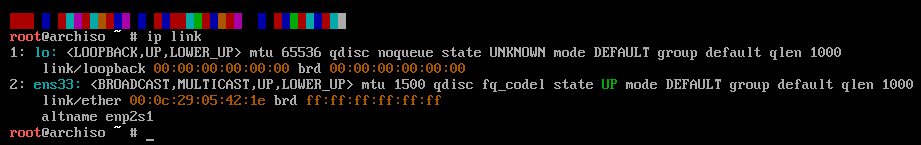

​	这个是虚拟机里面的截图，没有真实的网卡，而且虚拟机还一进去就是联网的。一般的物理机子的网卡名字都是wlan0，放个图只是给个印象。要是搞不懂自己网卡的名字什么的，只能先搞清楚先，也可以iwctl里面device list看看。

​	然后就是命令先激活后开启。

```shell
rfkill unblock wifi   #取消禁用Wi-Fi设备
ip link set <network name> up  #开启网卡接口,如ip link set wlan0 up
```

​	后面按照wlan0举例，然后就是

```shell
iwctl #敲击后终端不一样
device list #看看是否已经开启网卡，开启就是up
station wlan0 scan
station wlan0 get-networks #获取网卡能连接的网络，这里会跳出列表，还是实时刷新的
station wlan0 connect [wifi名字] #之后就是输入Wi-Fi密码
exit #退出iwctl
ping www.baidu.com #测试网络连接
```

​	要是出问题，不行，可以再试试看上面的步骤，百度一下arch安装中的联网过程，我也没有失败的经验，没法贴出来意见。

## 换源

​	一般内置的源根据地区来，速度都行的，但是我还是把清华的源加一下。[官方教程](https://mirrors.tuna.tsinghua.edu.cn/help/archlinux/)

```shell
nano /etc/pacman.d/mirrorlist
```


​	把下面这一行加入到第一位


```txt
Server = https://mirrors.tuna.tsinghua.edu.cn/archlinux/$repo/os/$arch
```

​	保存后更新一下缓存，如果执行结果是要更新，就更新一下

```shell
sudo pacman -Syyu
```

## archinstall开始安装

​	其实所有的现代操作的安装，都差不多，无非就是键盘布局、地区/时区、语言、系统引导、root和普通用户的创建、声音、分区(自动手动)等，要会这些多少还是要操作系统的一些前置知识的。

```shell
archinstall #要等一会加载，物理机还是快的
```

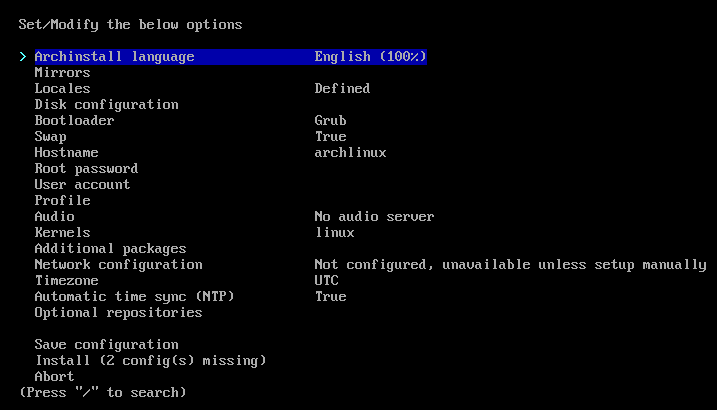

​	等一会出来就是如上图的样子。然后就是设置好保存重启就行，虽然没有如其它的桌面Linux的图形化安装引导，但是archinstall已经让Arch Linux的安装变得简单了。

### 先是设置语言

就是默认的英文，可别进去设置中文，默认的终端字体是没有中文字符的，要是设置了就全是乱码

### 镜像

先进入Mirrors，再选中Mirror region后进入，选择China按空格选中，按enter确认返回上一级


要是想自定义就自定义，选择custom mirrors开始。

### Locales地区默认就行

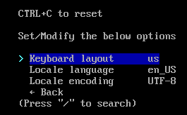

​	键盘布局一般都是选择美式键盘，英式键盘少一些；对应的地区就是美国，UTF-8国际化的编码

### 分区(Disk configuration)

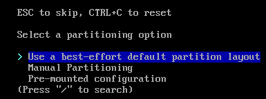

#### 自动

​	第一个是自动分区(介绍使用了个best-effort，好不好因人而异，root区只有20G，对你的日常使用需求好不好，就要看情况了),下面的图是自动分区的样子，是一块致钛1TB的固态

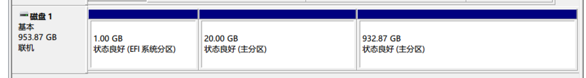

#### 手动

​	第二个是手动分区，要自己手动分区就要先了解Linux的目录结构，哪些是必须的，哪些区的作用这些，不然其实默认的就行。选择Manual Partitioning。

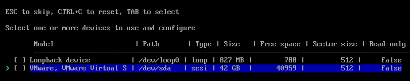

这里之后就会出现你计算机上面的几块盘，选择你要安装arch的盘，进入

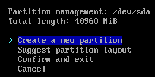

​	第一个是创建新分区，第二个是使用建议的分区布局，其次确认加退出，最后是取消，要手动分区，之前的archinstall是不支持的，现在支持了但是我感觉也不好用。

第一个手动分区，先创建一个，选择create a new partition，文件系统选fat32


​	之后就是选择扇区，开始在哪，结束在哪，挂载点什么的，这里没有相应的知识储备，可能会看不懂，需要额外学习。

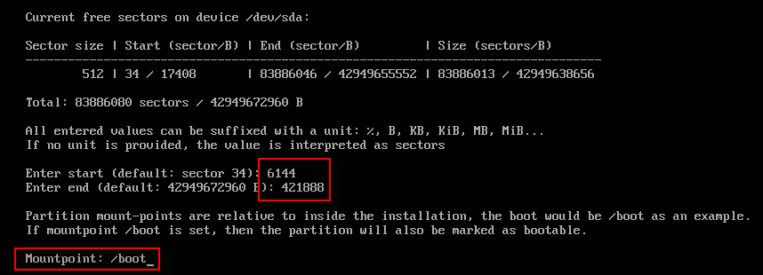

​	之后再按照同样的步骤创建出如下的分区。可别照搬照抄，盘的大小等，要根据自己的计算机实际情况定制，这个不大好做记录，而且这个工具在手动分区这里个人感觉真的不好用，**设置不了什么EFI、Swap这些**，大小都指定不了，指定不了就不能正常安装，会报分区错误，可能是我自己没有搞明白，真的建议要自己分区就命令行分区安装，之后自己在archinstall里面选择一下你的分区方案就行了。

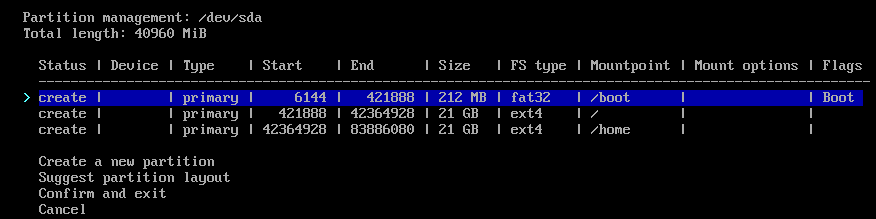

第三个是使用已经分好的区。

TODO 自己分好区后在archinstall里面选择

### 硬盘加密

这个有需求可以自己做

### bootloader

这个也是看需求，选择默认的，GRUB还是什么

### Swap

交换分区也是看情况，也是根据硬盘情况设置开关，默认开启。交换分区其实就是虚拟内存，在内存不够的情况下，操作系统先把内存中暂时不用的数据，存到硬盘的交换空间，腾出内存来让别的程序运行。

### hostname

自己设置自己相应的名字

### Root password

设置root密码，linux输入密码都是看不到具体输入的。

### 添加用户

选择add a user，设置用户名密码这些，设置是否为root用户


添加好就Confirm and exit

### profiles

进入Type，选择Desktop，选择想要的桌面环境

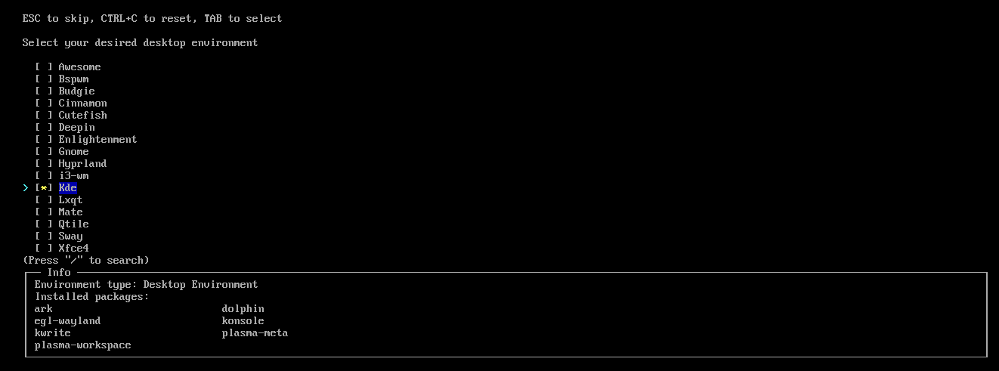

确认后就会展示桌面环境要安装的包

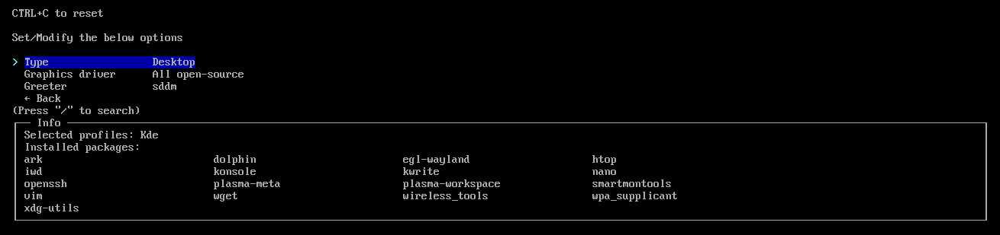

同时显示显卡设置需求，按照需求选择，也可以先默认，安装完操作系统，之后再自己安装

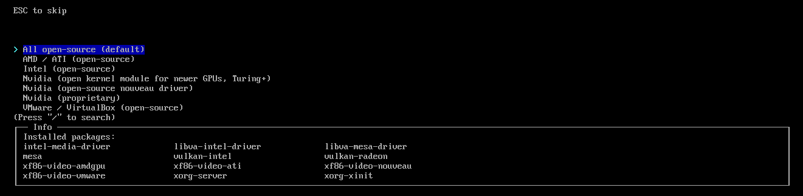

### Audio

设置声音多媒体框架，不设置应该不至于没有声音吧？

### 内核

选择Linux内核，没有特殊需求就默认

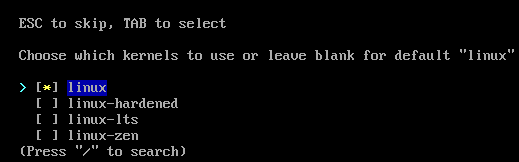

### 网络设置

选择第二个，手动设置少一些

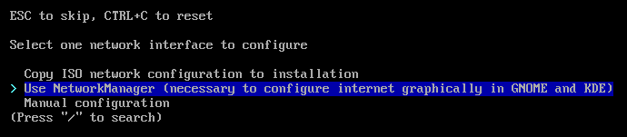

### 时区

进入 /shanghai 搜索出来选择即可

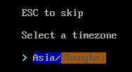

### 时间同步

要开启自动时间同步功能

### 可选择的源

可以选一下

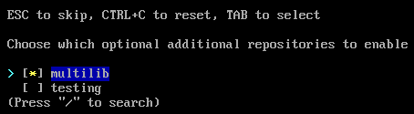

### 安装

最后开始安装，要确认好每一个设置

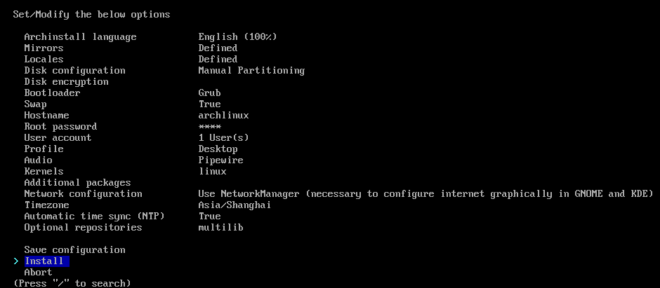

点击后它会展示配置文件的每一项设置来供你确认，确认好就开始安装，[官方默认配置](https://archinstall.archlinux.page/installing/guided.html)


-----